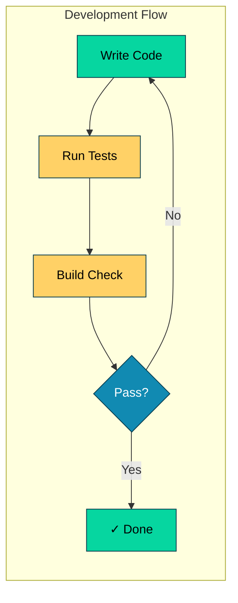
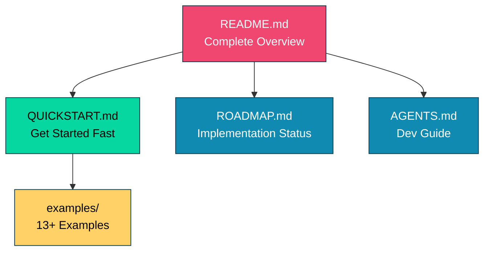

# DSGo Development Guide

## Quick Reference



## Testing Commands
- **Everything**: `make test` (runs race detector + coverage + examples + summary)
- Single test: `go test -run TestName`
- Run example: `go run examples/sentiment/main.go`
- Lint: `make lint` (requires golangci-lint)
- Full check: `make check` (fmt, vet, build)
- Complete: `make all` (clean, check, test, eof-check)

## Current Test Coverage
- **Core**: 61.9% (target: 75%+)
- **Module**: 84.2% ✅
- **OpenAI Provider**: 94.4% ✅
- **OpenRouter Provider**: 94.7% ✅

## Architecture

Go port of DSPy (Declarative Self-improving Language Programs).

### Core Files (Root Directory)
- `signature.go` - I/O field definitions (Field, Signature types)
- `lm.go` - LM interface (Message, GenerateOptions, GenerateResult)
- `module.go` - Base Module interface
- `prediction.go` - Prediction wrapper with metadata
- `history.go` - Conversation history management
- `example.go` - Few-shot learning support
- `tool.go` - Tool/function calling support

### Module Implementations (`module/`)
- `predict.go` - Basic prediction
- `chain_of_thought.go` - Reasoning module
- `react.go` - Tool-using agent
- `refine.go` - Iterative refinement
- `best_of_n.go` - Multiple sampling
- `program_of_thought.go` - Code generation
- `program.go` - Module composition

### Providers (`providers/`)
- `openai/` - OpenAI LM provider
- `openrouter/` - OpenRouter LM provider

### Examples (`examples/`)
- 13+ working examples from basic to advanced
- See QUICKSTART.md for recommended learning path

## Code Style
- Standard Go: `gofmt` formatting, exported types/funcs have doc comments
- Naming: PascalCase exports, camelCase internals, FieldType* constants
- Error handling: Return `error` as last value, wrap with `fmt.Errorf("context: %w", err)`, always check returned errors
- Interfaces: Small, composable (Module, LM)
- Tests: Table-driven with subtests (`t.Run(tt.name, ...)`)
- No external deps except godotenv for examples (use stdlib)
- Linting: All code must pass `golangci-lint` (errcheck, staticcheck, unused, govet, ineffassign)

## Development Workflow
- Always run `go build ./...` and `go test ./...` during development
- Run `make check` locally (fmt, vet, build); CI handles lint separately
- Use `go test -race` when working with concurrency (e.g., BestOfN parallel)
- Pre-commit hook automatically runs `make all` (tests + checks) when installed via `make install-hooks`
- **Install golangci-lint v2.6.0** (required for linting):
  ```bash
  curl -sSfL https://raw.githubusercontent.com/golangci/golangci-lint/master/install.sh | sh -s -- -b $(go env GOPATH)/bin v2.6.0
  ```
  Note: `go install` only installs v1.x; v2.x requires binary installation
- No temporary UPPER_CASE.md files (SUMMARY.md, CHANGES.md, etc.) - update existing docs only
- Keep responses concise
- Ask user for feedback/choices at important checkpoints
- Never create .md files unless user told you so. Always update git included documentation files.
- If any issue, error, or unexpected result detected, always add it to test cases, then fix the codebase, and
    make sure that all success.
- Always execute examples/ to one-by-one and scan for unexpected behaviors, errors, problematic results etc. If any issue encountered, plan for adding them to test cases and fixing it.
    execute examples from top-level dir since the .env loading is designed in that way.
- run `make all` when you're done


## Known Issues & Warnings

⚠️ **BestOfN Parallel Safety**: When using `WithParallel(true)`, ensure modules are stateless or use N independent instances. Modules with History cause data races.

⚠️ **Concurrency**: History is not thread-safe. Use separate instances for parallel execution.

See [CODEBASE_ANALYSIS_REPORT.md](CODEBASE_ANALYSIS_REPORT.md) for complete issue list and fixes.

## Documentation Structure



- **README.md** - Main entry point, features, architecture, examples
- **QUICKSTART.md** - Fast onboarding, core concepts, common patterns
- **ROADMAP.md** - Implementation progress, future features
- **AGENTS.md** - Development guide, testing, code style (this file)


## API Conventions

When writing code or examples:
- Modules return `*dsgo.Prediction`, not `map[string]any`
- Access outputs via `result.GetString("field")`, `result.GetInt("field")`, etc.
- BestOfN scorer signature: `func(inputs map[string]any, pred *dsgo.Prediction) (float64, error)`
- Few-shot examples use `module.WithDemos([]dsgo.Example{...})`, not `Signature.WithExamples()`
