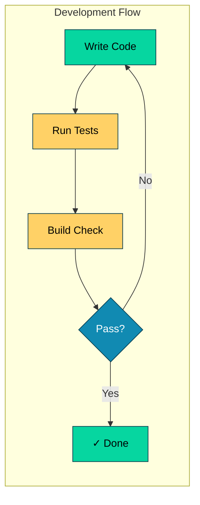
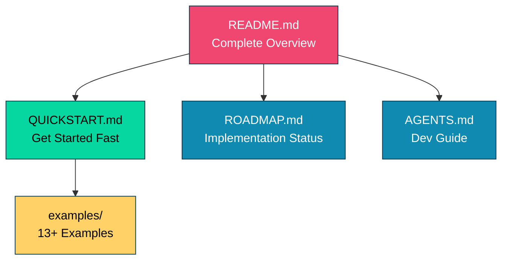

# DSGo Development Guide

## Quick Reference



## Testing Commands
- **Everything**: `make test` (runs race detector + coverage + summary)
- **Examples Quick**: `make test-matrix-quick` (single model, fast)
- **Examples Sample**: `make test-matrix-sample N=3` (3 random models)
- **Examples Full**: `make test-matrix` (all models, comprehensive)
- **Lint**: `make lint` (requires golangci-lint)
- **Full check**: `make check` (fmt, vet, build)
- **Complete**: `make all` (clean, check, test, eof-check)
- Advanced: `go test -run TestName` (single test by name)

## Current Test Coverage
- **Total**: 91.8% ✅
- **Core**: 94.0% ✅ (up from 34.1%)
- **Module**: 89.0% ✅ (up from 52.9%)
- **jsonutil**: 88.8% ✅ (up from 9.3%)
- **retry**: 87.2% ✅ (up from 80.9%)
- **OpenAI Provider**: 92.9% ✅ (up from 13.4%)
- **OpenRouter Provider**: 88.8% ✅ (up from 13.8%)

## Architecture

Go port of DSPy (Declarative Self-improving Language Programs).

### Core Files (Root Directory)
- `signature.go` - I/O field definitions (Field, Signature types, ValidationDiagnostics)
- `lm.go` - LM interface (Message, GenerateOptions, GenerateResult)
- `module.go` - Base Module interface
- `prediction.go` - Prediction wrapper with metadata + parse diagnostics
- `history.go` - Conversation history management
- `example.go` - Few-shot learning support
- `tool.go` - Tool/function calling support
- `adapter.go` - Adapter interface + implementations (JSON, Chat, TwoStep, Fallback)

### Module Implementations (`module/`)
- `predict.go` - Basic prediction
- `chain_of_thought.go` - Reasoning module
- `react.go` - Tool-using agent
- `refine.go` - Iterative refinement
- `best_of_n.go` - Multiple sampling
- `program_of_thought.go` - Code generation
- `program.go` - Module composition

### Internal Utilities (`internal/`)
- `jsonutil/` - JSON extraction and repair (RepairJSON, ExtractJSON)
  - Handles malformed JSON from models
  - 100% test coverage

### Providers (`providers/`)
- `openai/` - OpenAI LM provider
- `openrouter/` - OpenRouter LM provider

### Examples (`examples/`)
- 13+ working examples from basic to advanced
- See QUICKSTART.md for recommended learning path

## Code Style
- Standard Go: `gofmt` formatting, exported types/funcs have doc comments
- Naming: PascalCase exports, camelCase internals, FieldType* constants
- Error handling: Return `error` as last value, wrap with `fmt.Errorf("context: %w", err)`, always check returned errors
- Interfaces: Small, composable (Module, LM)
- Tests: Table-driven with subtests (`t.Run(tt.name, ...)`)
- No external deps except godotenv for examples (use stdlib)
- Linting: All code must pass `golangci-lint` (errcheck, staticcheck, unused, govet, ineffassign)

## Development Workflow

1. **Build and Test**: Run `make test` and `make check` during development
2. **New Features**: All new code requires corresponding unit tests
3. **Local Checks**: Run `make check` locally (fmt, vet, build)
4. **Concurrency**: Use `make test` (includes race detector) when working with concurrency (e.g., BestOfN parallel)
5. **Pre-commit**: Install pre-commit hook via `make install-hooks` to automatically run checks
6. **Lint Setup**: Install golangci-lint v2.6.0 (required for linting):
   ```bash
   curl -sSfL https://raw.githubusercontent.com/golangci/golangci-lint/master/install.sh | sh -s -- -b $(go env GOPATH)/bin v2.6.0
   ```
   Note: `go install` only installs v1.x; v2.x requires binary installation
7. **Test Examples**: Run `make test-matrix-quick` for fast verification or `make test-matrix-sample N=3` for broader coverage
8. **Final Check**: Run `make all` before committing (clean, check, test, eof-check)
9. **Post-Development**: Always run `make all` after development to ensure everything is clean and tested
10. **Coverage**: Maintain unit test coverage above 92%
11. **Documentation**: Update all git-included docs when making changes that affect them. Always reflect new features and fixes to examples/ - add new examples for new features, update or remove examples for fixes/removals.


## Production-Grade Robustness Features

✅ **Automatic JSON Repair** - Models often emit malformed JSON; DSGo fixes it automatically:
- Single quotes → double quotes: `{'key': 'val'}` → `{"key": "val"}`
- Unquoted keys: `{key: "val"}` → `{"key": "val"}`
- Trailing commas: `{"a": 1,}` → `{"a": 1}`
- Smart quotes normalization
- Tracked with `__json_repair` metadata

✅ **Partial Output Validation** - For training/optimization:
- `ValidateOutputsPartial()` returns diagnostics instead of failing
- Missing fields set to `nil` with detailed tracking
- `ParseDiagnostics` attached to predictions for telemetry

✅ **Class/Enum Normalization** - Flexible matching:
- Case-insensitive: `"POSITIVE"` → `"positive"`
- Configurable aliases: `"pos"` → `"positive"`
- Applied automatically in validation

✅ **Smart Numeric Extraction** - From text descriptions:
- `"High (95%)"` → `95`
- `"Medium"` → `0.7` (qualitative mapping)

## Known Issues & Warnings

⚠️ **BestOfN Parallel Safety**: When using `WithParallel(true)`, ensure modules are stateless or use N independent instances. Modules with History cause data races.

⚠️ **Concurrency**: History is not thread-safe. Use separate instances for parallel execution.

## Documentation Structure



- **README.md** - Main entry point, features, architecture, examples
- **QUICKSTART.md** - Fast onboarding, core concepts, common patterns
- **ROADMAP.md** - Implementation progress, future features
- **AGENTS.md** - Development guide, testing, code style (this file)


## API Conventions

When writing code or examples:
- Modules return `*dsgo.Prediction`, not `map[string]any`
- Access outputs via `result.GetString("field")`, `result.GetInt("field")`, etc.
- BestOfN scorer signature: `func(inputs map[string]any, pred *dsgo.Prediction) (float64, error)`
- Few-shot examples use `module.WithDemos([]dsgo.Example{...})`, not `Signature.WithExamples()`
