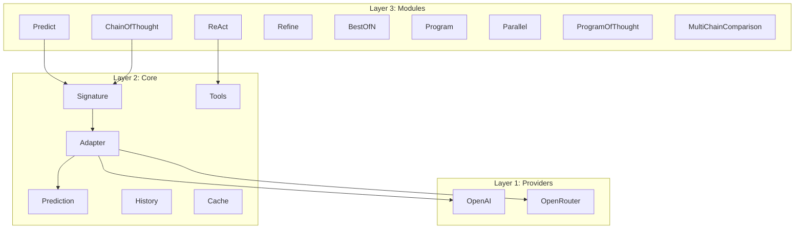
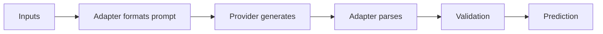
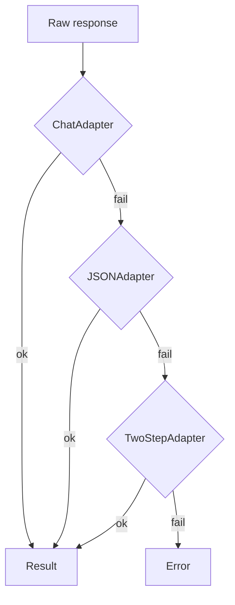
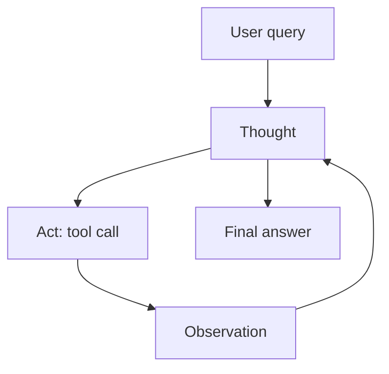
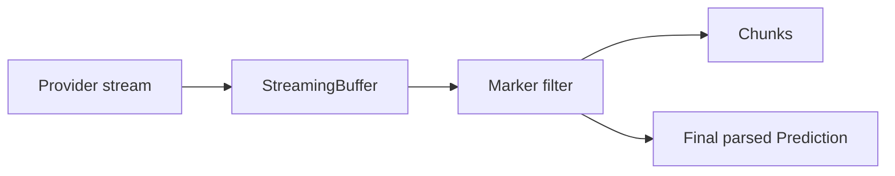

# ARCHITECTURE

DSGo is a 3-layer framework for building structured LLM applications.

## Layers

- Public API lives in `dsgo` (see `dsgo.go`).
- Implementations live under `internal/*`.

Links:
- Core: [`internal/core/README.md`](internal/core/README.md)
- Modules: [`internal/module/README.md`](internal/module/README.md)
- MCP: [`internal/mcp/README.md`](internal/mcp/README.md)

## Modules

DSGo modules are higher-level behaviors built on top of the core `Signature` + `Adapter` + `LM` primitives.

- **Predict**: Basic structured input → output prediction.
- **ChainOfThought**: Adds a reasoning step and stores it in `Prediction.Rationale` (plus any explicit `reasoning` output fields).
- **ReAct**: A tool-calling loop agent (think → act → observe), suitable for external integrations.
- **Refine**: Iteratively improves a prediction when `inputs["feedback"]` (or a custom refinement field) is provided.
- **BestOfN**: Runs a wrapped module `N` times and selects the best result using a scorer; can parallelize and optionally return all completions.
- **Program**: Sequential pipeline; merges previous outputs into the next step's inputs.
- **Parallel**: Runs the wrapped module concurrently across expanded inputs; stores per-item outputs in `Prediction.Completions`.
- **ProgramOfThought**: Generates code-first solutions; execution is disabled by default and, when enabled, runs local `python3`/`node` under a timeout (no tool loop).
- **MultiChainComparison**: Synthesizes a final answer from `inputs["completions"]` (multiple attempts) and prepends a `rationale` output.

## Request lifecycle

## Adapter fallback

## Tool calling (ReAct loop)

## Streaming pipeline

