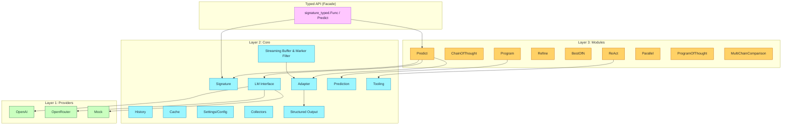
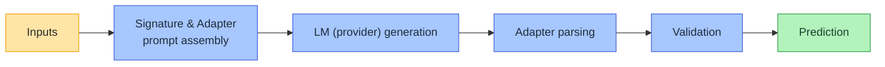
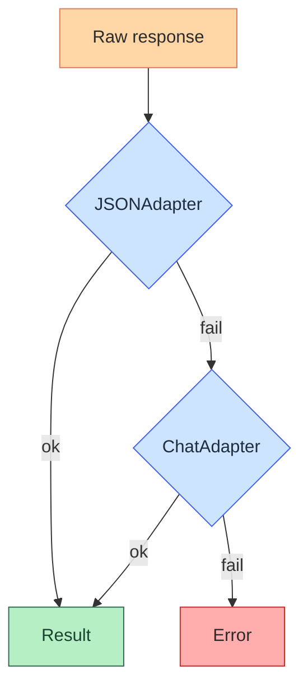
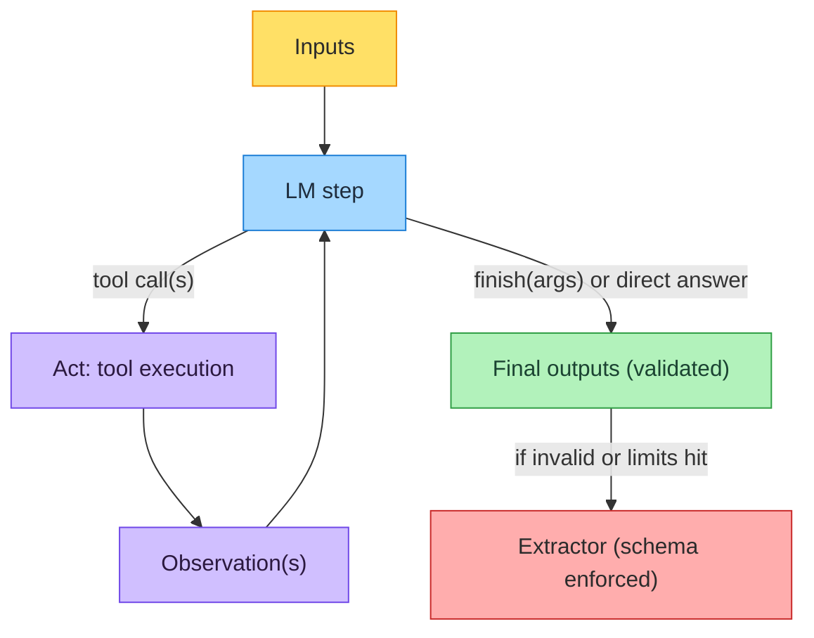
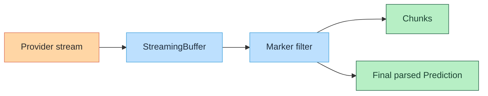

# ARCHITECTURE

DSGo is a 3-layer framework for building structured LLM applications.

## Layers

- Public API is package-per-concern (e.g., `core`, `module`, `provider/*`).
- Internal helpers live under `internal/*` (jsonutil, retry, ids, env).

Links:
- Core: [`core/README.md`](core/README.md)
- Modules: [`module/README.md`](module/README.md)
- MCP: [`mcp/README.md`](mcp/README.md)

## Modules

DSGo modules are higher-level behaviors built on top of the core `Signature` + `Adapter` + `LM` primitives.

- **Predict**: Basic structured input → output prediction.
- **ChainOfThought**: Adds a reasoning step and stores it in `Prediction.Rationale` (plus any explicit `reasoning` output fields).
- **ReAct**: A native tool-calling loop agent with an auto-injected `finish` tool and a post-loop extractor fallback to produce signature-valid outputs.
- **Refine**: Iteratively improves a prediction when `inputs["feedback"]` (or a custom refinement field) is provided.
- **BestOfN**: Runs a wrapped module `N` times and selects the best result using a scorer; can parallelize and optionally return all completions.
- **Program**: Sequential pipeline; merges previous outputs into the next step's inputs.
- **Parallel**: Runs the wrapped module concurrently across expanded inputs; stores per-item outputs in `Prediction.Completions`.
- **ProgramOfThought**: Generates code-first solutions; execution is disabled by default and, when enabled, runs local `python3`/`node` under a timeout (Go execution is not supported yet; no tool loop).
- **MultiChainComparison**: Synthesizes a final answer from `inputs["completions"]` (multiple attempts) and prepends a `rationale` output.

## Request lifecycle

## Adapter fallback

Notes:
- The default `FallbackAdapter` chain is JSON → Chat.
- `TwoStepAdapter` is opt-in for specialized workflows.

## Tool calling (ReAct loop)

Notes:
- DSGo auto-injects a synthetic `finish` tool that mirrors the output `Signature`.
- If the loop can’t produce a valid final output (or exceeds limits), DSGo runs an extraction step over the full trajectory to salvage a schema-valid answer.

## Streaming pipeline

