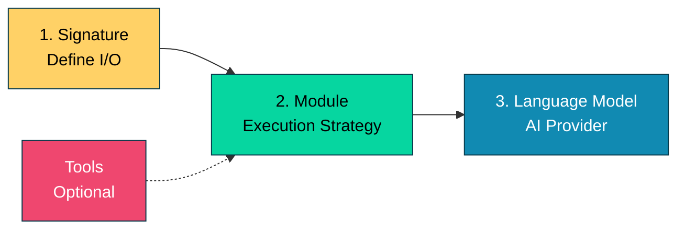
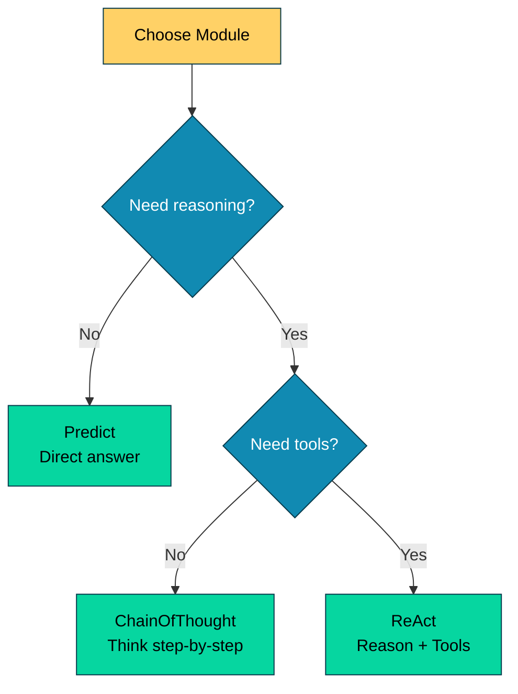
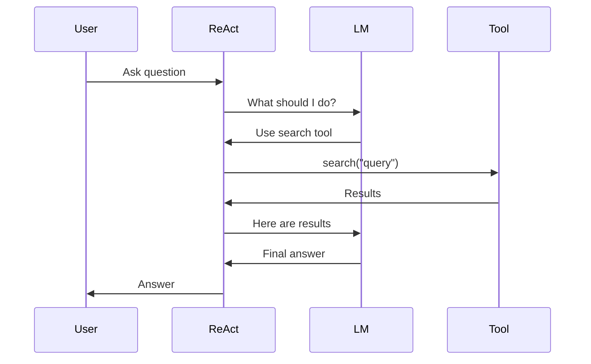

# DSGo Quick Start Guide

Get started with DSGo in under 1 minute. Build LM-powered apps with structured signatures and composable modules.

## Install & Run (30 seconds)

```bash
# 1. Get the package
go get github.com/assagman/dsgo

# 2. Set your API key
export OPENROUTER_API_KEY=sk-or-your-key-here # or OPENAI_API_KEY

# 3. Run an example
go run examples/sentiment/main.go
```

## Your First Program (2 minutes)

```go
package main

import (
    "context"
    "fmt"
    "log"

    "github.com/assagman/dsgo"
    "github.com/assagman/dsgo/module"
    "github.com/assagman/dsgo/providers/openai"
)

func main() {
    // 1. Define what you want (Signature)
    sig := dsgo.NewSignature("Classify the sentiment").
        AddInput("text", dsgo.FieldTypeString, "Text to analyze").
        AddClassOutput("sentiment", []string{"positive", "negative", "neutral"}, "Sentiment")

    // 2. Choose your LM
    lm := openai.NewOpenAI("gpt-4")

    // 3. Create a module
    predict := module.NewPredict(sig, lm)

    // 4. Run it
    result, err := predict.Forward(context.Background(), map[string]interface{}{
        "text": "I love this framework!",
    })

    if err != nil {
        log.Fatal(err)
    }

    fmt.Printf("Sentiment: %s\n", result.GetString("sentiment"))
}
```

## Core Concepts (5 minutes)

DSGo uses three main building blocks:



### 1. Signatures = I/O Definition

Define what you want the LM to do:

```go
sig := dsgo.NewSignature("Task description").
    AddInput("input_name", FieldType, "description").
    AddOutput("output_name", FieldType, "description")
```

**Available Types**: String, Int, Float, Bool, JSON, Class, Image, Datetime

### 2. Modules = Execution Strategy

Choose how the LM should approach the task:



```go
// Simple - Direct answer
predict := module.NewPredict(sig, lm)

// Reasoning - Think step-by-step
cot := module.NewChainOfThought(sig, lm)

// With tools - Reason and act
react := module.NewReAct(sig, lm, tools)
```

### 3. Tools = Superpowers

Give your LM agent the ability to take actions:

```go
tool := dsgo.NewTool("search", "Search the web",
    func(ctx context.Context, args map[string]interface{}) (interface{}, error) {
        query := args["query"].(string)
        return search(query), nil
    },
).AddParameter("query", "string", "Search query", true)
```

**Flow with Tools:**



## Common Patterns

### Classification

```go
sig := dsgo.NewSignature("Classify").
    AddInput("text", dsgo.FieldTypeString, "Input").
    AddClassOutput("category", []string{"A", "B", "C"}, "Category")
```

### Reasoning

```go
sig := dsgo.NewSignature("Solve problem").
    AddInput("problem", dsgo.FieldTypeString, "Problem").
    AddOutput("answer", dsgo.FieldTypeString, "Answer")

cot := module.NewChainOfThought(sig, lm)
```

### Agent with Tools

```go
tools := []dsgo.Tool{searchTool, calculatorTool}
react := module.NewReAct(sig, lm, tools).WithVerbose(true)
```

### Complex Inputs/Outputs

```go
sig := dsgo.NewSignature("Research topic").
    AddInput("topic", dsgo.FieldTypeString, "Topic").
    AddInput("depth", dsgo.FieldTypeInt, "Depth level").
    AddInput("detailed", dsgo.FieldTypeBool, "Include details").
    AddOutput("summary", dsgo.FieldTypeString, "Summary").
    AddOutput("score", dsgo.FieldTypeInt, "Quality score").
    AddClassOutput("confidence", []string{"high", "low"}, "Confidence")
```

## Examples by Use Case

### Need to classify something?
→ `examples/sentiment/` - Classification with Predict

### Need step-by-step reasoning?
→ `examples/sentiment/` - Chain of Thought

### Need to use external APIs/tools?
→ `examples/react_agent/` - ReAct with tools

### Building production research tool?
→ `examples/research_assistant/` - Complete example

### Need logging and tracing?
→ `examples/logging_tracing/` - Request ID propagation & observability

## Debugging

### Enable verbose mode (see what the agent is thinking)

```go
react := module.NewReAct(sig, lm, tools).
    WithVerbose(true).  // ← See all iterations
    WithMaxIterations(10)
```

### Check errors

```go
result, err := module.Forward(ctx, inputs)
if err != nil {
    log.Printf("Error: %v", err)  // Always check errors!
}
```

### Validate before running

```go
// Signature validates inputs automatically
err := sig.ValidateInputs(inputs)

// And outputs
err := sig.ValidateOutputs(outputs)
```

## Next Steps

1. **Run Examples** - Explore `examples/` directory:
   - `sentiment/` - Basic Predict and ChainOfThought
   - `react_agent/` - ReAct with tools
   - `fewshot_conversation/` - Few-shot learning
   - `composition/` - Module pipelines
2. **Read Docs** - Check README.md for complete overview
3. **Build!** - Start with a simple Predict module and expand

## Cheat Sheet

| Want to... | Use this |
|------------|----------|
| Get a quick answer | `module.NewPredict(sig, lm)` |
| Show reasoning steps | `module.NewChainOfThought(sig, lm)` |
| Use external tools | `module.NewReAct(sig, lm, tools)` |
| Classify text | `sig.AddClassOutput(name, []string{...}, desc)` |
| Make field optional | `sig.AddOptionalOutput(name, type, desc)` |
| Debug agent | `.WithVerbose(true)` |
| Limit iterations | `.WithMaxIterations(n)` |
| Few-shot examples | Use `Example` with `module.WithDemos([]dsgo.Example{...})` |

## Common Errors

### "missing required input field"
→ Check you provided all inputs defined in signature

### "failed to parse JSON output"
→ LM didn't return valid JSON (enable verbose to see output)

### "invalid class value"
→ LM returned value not in your class list (adjust options or list)

### "API request failed with status 401"
→ Check your `OPENAI_API_KEY` environment variable

## Full Documentation

- **README.md** - Complete overview and architecture
- **ROADMAP.md** - Implementation status and future plans
- **AGENTS.md** - Development and testing guide

## Questions?

- Check the examples: `examples/*/main.go`
- Read the docs: `*.md` files
- Check inline comments: All public APIs documented
- Look at tests: `*_test.go` files

---

**You're ready!** Start with `examples/sentiment/main.go` and build from there. 🚀
