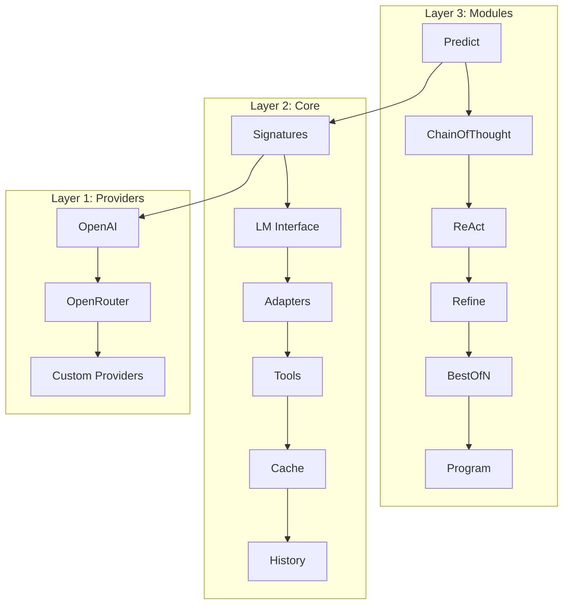
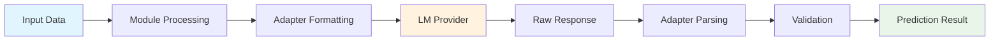
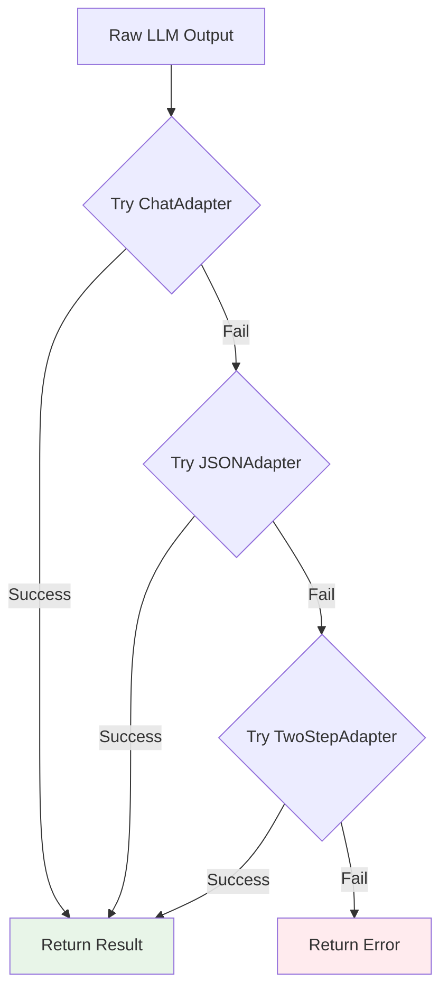
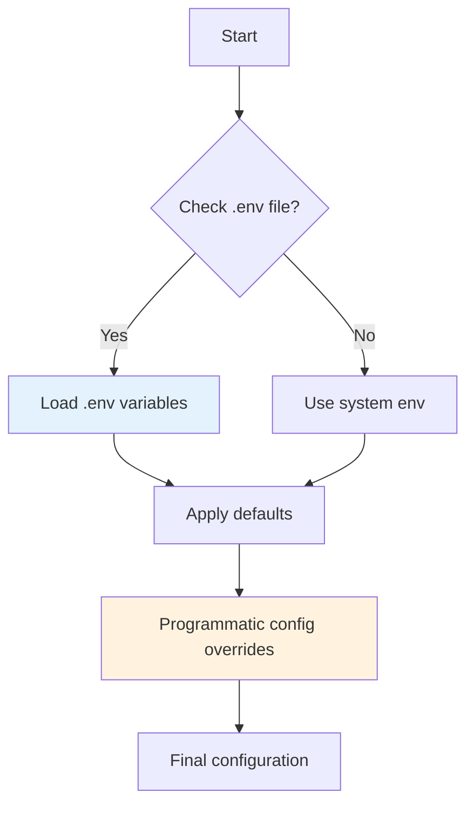

# DSGo

**Experimental LLM orchestration framework for Go** — Build and explore structured AI applications with composable modules.

[](https://pkg.go.dev/github.com/assagman/dsgo)
[](https://goreportcard.com/report/github.com/assagman/dsgo)
[](https://github.com/assagman/dsgo/actions/workflows/ci.yml)
[](https://codecov.io/gh/assagman/dsgo)
[](https://opensource.org/licenses/MIT)
[](https://github.com/assagman/dsgo)
[](https://github.com/assagman/dsgo/releases)

---

## 🎯 What is DSGo?

DSGo is a **Go framework for building structured LLM applications**. It's an unofficial implementation of DSPy.

**Core Philosophy:**
- 🧩 **Composable** - Build complex behaviors from simple modules
- 🎯 **Structured** - Define inputs/outputs, get validated results
- 🛡️ **Resilient** - Handles messy LLM outputs automatically
- 📊 **Observable** - Built-in cost tracking, logging, monitoring

---

## 🚀 Quick Start

### Installation

```bash
# Full framework (recommended)
go get github.com/assagman/dsgo
```

### Your First DSGo App

#### Step 1: Set up Environment

Create a `.env` file in your project directory:

```bash
# .env
DSGO_PROVIDER=openai
DSGO_MODEL=gpt-4o-mini
OPENAI_API_KEY=sk-your-api-key-here
```

DSGo automatically loads `.env` files from your working directory.

#### Step 2: Create Your App

```go
package main

import (
    "context"
    "fmt"
    "log"

    "github.com/assagman/dsgo"
    "github.com/assagman/dsgo/module"
)

func main() {
    // 1️⃣ Create LM instance (uses env vars automatically)
    lm, err := dsgo.NewLM(context.Background(), "gpt-4o-mini")
    if err != nil {
        log.Fatal(err)
    }

    // 2️⃣ Define input/output structure
    sig := dsgo.NewSignature("Classify sentiment").
        AddInput("text", dsgo.FieldTypeString, "Text to classify").
        AddClassOutput("sentiment", []string{"positive", "negative", "neutral"},
            "Sentiment classification")

    // 3️⃣ Create and run module
    classifier := module.NewPredict(sig, lm)
    result, err := classifier.Forward(context.Background(), map[string]any{
        "text": "I love this product!",
    })
    if err != nil {
        log.Fatal(err)
    }

    // 4️⃣ Use results
    fmt.Printf("Sentiment: %s\n", result.GetString("sentiment"))
    fmt.Printf("Cost: $%.6f, Tokens: %d\n", result.Usage.Cost, result.Usage.TotalTokens)
}
```

**That's it!** You now have a production-ready sentiment classifier with:
- ✅ Structured input/output validation
- ✅ Automatic error handling and retries
- ✅ Cost tracking and token counting
- ✅ Built-in caching and observability

---

## 🏗️ Architecture Overview

DSGo has three clear layers:



### Layer Responsibilities

| Layer | Purpose | Components |
|-------|---------|------------|
| **Modules** | High-level behaviors | Predict, ChainOfThought, ReAct, Refine, BestOfN, Program |
| **Core** | Foundational primitives | Signatures, LM interface, Adapters, Tools, Cache, History |
| **Providers** | LLM API implementations | OpenAI, OpenRouter, Custom providers |

---

## 🧩 Framework Modules

### Module Workflow



### Available Modules

#### 1. **Predict** - Basic Structured Output
```go
// Simple input → structured output
predictor := module.NewPredict(sig, lm)
result, _ := predictor.Forward(ctx, map[string]any{"text": "Hello"})
```

#### 2. **ChainOfThought** - Step-by-Step Reasoning
```go
// Adds reasoning before final answer
cot := module.NewChainOfThought(sig, lm)
result, _ := cot.Forward(ctx, inputs)
fmt.Println("Reasoning:", result.GetString("rationale"))
```

#### 3. **ReAct** - Tool-Using Agent
```go
// Reason + Act loop for autonomous agents
tools := []dsgo.Tool{searchTool, calculatorTool}
agent := module.NewReAct(sig, lm, tools)
result, _ := agent.Forward(ctx, map[string]any{"query": "What's 2+2?"})
```

#### 4. **Refine** - Iterative Improvement
```go
// Improve outputs through feedback
refiner := module.NewRefine(sig, lm)
result, _ := refiner.Forward(ctx, map[string]any{
    "draft": "Initial answer",
    "feedback": "Make it more detailed",
})
```

#### 5. **BestOfN** - Multiple Sampling
```go
// Generate N options, pick the best
bestof := module.NewBestOfN(sig, lm).WithN(5).WithParallel(true)
result, _ := bestof.Forward(ctx, inputs)
```

#### 6. **Program** - Module Composition
```go
// Chain modules together
program := module.NewProgram().
    Add(classifier).      // Step 1: Classify
    Add(responder).        // Step 2: Generate response
    Add(refiner)          // Step 3: Refine response

result, _ := program.Forward(ctx, inputs)
```

---

## 🔧 Core Functionality

### Signatures - Type-Safe I/O

Define exactly what your module accepts and returns:

```go
sig := dsgo.NewSignature("Answer questions with context").
    // Required inputs
    AddInput("question", dsgo.FieldTypeString, "Question to answer").
    AddInput("context", dsgo.FieldTypeString, "Background context").
    // Required outputs
    AddOutput("answer", dsgo.FieldTypeString, "Short answer").
    // Optional outputs
    AddOptionalOutput("confidence", dsgo.FieldTypeFloat, "Confidence 0-1").
    AddOptionalOutput("sources", dsgo.FieldTypeJSON, "Source references")
```

#### Signature Definition Patterns

**Method-based Definition (Current)**
```go
// Build signature with method chaining
sig := dsgo.NewSignature("Classify text").
    AddInput("text", dsgo.FieldTypeString, "Text to classify").
    AddClassOutput("sentiment", []string{"positive", "negative"}, "Sentiment")
```

**Future: Struct-based Definition (Planned)**
```go
// Planned: Define with struct tags for compile-time safety
type QuestionAnswer struct {
    Question   string `dsgo:"question,required,The question to answer"`
    Context    string `dsgo:"context,required,Background context"`
    Answer     string `dsgo:"answer,required,Short answer"`
    Confidence float64 `dsgo:"confidence,optional,Confidence 0-1"`
}

// Convert struct to signature (coming soon)
// sig := dsgo.NewSignatureFromStruct[QuestionAnswer]("Q&A with context")
```

**Current Best Practices:**
- **Method chaining**: Flexible and dynamic, great for prototyping
- **Reusable signatures**: Create common signatures once, reuse across modules
- **Validation**: Leverage built-in type validation and class normalization

#### Supported Field Types

| Type | Description | Example |
|------|-------------|---------|
| `FieldTypeString` | Text data | `"Hello world"` |
| `FieldTypeInt` | Integer numbers | `42` |
| `FieldTypeFloat` | Decimal numbers | `3.14` |
| `FieldTypeBool` | Boolean values | `true` |
| `FieldTypeJSON` | Structured data | `{"key": "value"}` |
| `FieldTypeClass` | Enum/classification | `"positive"` |
| `FieldTypeImage` | Image data (URL/base64) | `"data:image/..."` |
| `FieldTypeDatetime` | Date/time values | `"2024-01-01T12:00:00Z"` |

### Adapters - Robust Parsing

DSGo uses adapters to handle messy LLM outputs gracefully:



#### Adapter Types

| Adapter | How it Works | Best For |
|---------|--------------|----------|
| **ChatAdapter** | Field markers `[[ ## field ## ]]` | General purpose, robust fallbacks |
| **JSONAdapter** | JSON schema + auto-repair | Structured data, APIs |
| **TwoStepAdapter** | Reason first, extract second | Complex reasoning tasks |
| **FallbackAdapter** | Chains multiple adapters | Maximum reliability (>95% success) |

### Tools - Function Calling

Define tools for agent modules:

```go
searchTool := dsgo.NewTool(
    "web_search",
    "Search the web for current information",
    func(ctx context.Context, args map[string]interface{}) (string, error) {
        query := args["query"].(string)
        return performWebSearch(query), nil
    },
).AddParameter("query", "string", "Search query", true)

// Use with ReAct agent
agent := module.NewReAct(sig, lm, []dsgo.Tool{*searchTool})
```

---

## 🌍 Environment Variables

### Configuration Loading Process



### All Environment Variables

#### 🔑 Provider Configuration
```bash
# Primary provider
DSGO_PROVIDER=openai              # openai, openrouter, custom
DSGO_MODEL=gpt-4                   # Model name

# API Keys (provider-specific)
OPENAI_API_KEY=sk-...             # OpenAI API key
OPENROUTER_API_KEY=sk-or-v1-...   # OpenRouter API key
```

#### ⚙️ Runtime Options
```bash
DSGO_TIMEOUT=30s                  # Request timeout
DSGO_MAX_RETRIES=3                 # Max retry attempts
DSGO_TRACING=true                  # Enable tracing
DSGO_CACHE_SIZE=1000              # LRU cache size
DSGO_CACHE_TTL=1h                  # Cache TTL
```

#### 🐛 Debugging & Development
```bash
DSGO_DEBUG_PARSE=1                 # Show parsing attempts
DSGO_SAVE_RAW_RESPONSES=1          # Save raw LM outputs
DSGO_DEBUG_MARKERS=1               # Show field markers in streaming
DSGO_LOG=pretty                    # Logging: none, pretty, events
```

#### 📊 Observability
```bash
DSGO_COLLECTOR=memory              # Default collector
DSGO_REQUEST_ID_HEADER=X-Request-ID # Header for request IDs
```

### Loading Priority

1. **`.env` file** (if present in working directory)
2. **System environment variables**
3. **Programmatic configuration** (highest priority)

---

## 📊 Observability & Experimentation Features

### Built-in Tracking

Every prediction includes rich metadata:

```go
result, _ := predictor.Forward(ctx, inputs)

// Usage statistics
fmt.Printf("Cost: $%.6f\n", result.Usage.Cost)
fmt.Printf("Tokens: %d total (%d prompt, %d completion)\n",
    result.Usage.TotalTokens, result.Usage.PromptTokens, result.Usage.CompletionTokens)
fmt.Printf("Latency: %dms\n", result.Usage.Latency)

// Adapter information
fmt.Printf("Adapter used: %s\n", result.AdapterUsed)
fmt.Printf("Parse attempts: %d\n", result.ParseAttempts)
fmt.Printf("Fallback used: %v\n", result.FallbackUsed)
```

### Request Logging

```go
type MyCollector struct{}

func (c *MyCollector) Collect(entry core.HistoryEntry) {
    // Log complete request/response cycle
    log.Printf("Request to %s: %d tokens, $%.6f, %dms",
        entry.Provider, entry.Usage.TotalTokens, entry.Usage.Cost, entry.Usage.Latency)

    // Access full request/response if needed
    // fmt.Printf("Request: %s\n", entry.Request)
    // fmt.Printf("Response: %s\n", entry.Response)
}

dsgo.Configure(dsgo.WithCollector(&MyCollector{}))
```

### Streaming Support

```go
predictor := module.NewPredict(sig, lm)

// Start streaming
chunks, finalPred, errCh := predictor.Stream(ctx, inputs)

// Process chunks as they arrive
for chunk := range chunks {
    fmt.Print(chunk.Content) // Clean content (no internal markers)
}

// Get final result
result := <-finalPred
if err := <-errCh; err != nil {
    log.Fatal(err)
}

fmt.Printf("\nFinal: %s\n", result.GetString("answer"))
```

---

## 🗂️ Project Structure

```
dsgo/
├── 📁 core/                    # Core primitives
│   ├── signature.go           # I/O definitions
│   ├── lm.go                  # Language model interface
│   ├── adapter.go             # Output parsing
│   ├── tool.go                # Function calling
│   ├── cache.go               # LRU caching
│   ├── history.go             # Conversation management
│   └── prediction.go          # Result wrapper
│
├── 📁 module/                  # High-level behaviors
│   ├── predict.go             # Basic prediction
│   ├── chain_of_thought.go    # Reasoning
│   ├── react.go               # Tool-using agent
│   ├── refine.go              # Iterative improvement
│   ├── best_of_n.go           # Multiple sampling
│   ├── program.go             # Module composition
│   └── parallel.go            # Concurrent execution
│
├── 📁 providers/               # LLM implementations
│   ├── openai/                # OpenAI API
│   └── openrouter/            # OpenRouter API
│
├── 📁 internal/                # Internal utilities
│   ├── cost/                  # Pricing tables
│   ├── jsonutil/              # JSON repair
│   ├── retry/                 # Retry logic
│   └── ids/                   # UUID generation
│
├── 📁 examples/                # Working examples
│   ├── 01-hello-chat/         # Basic chat
│   ├── 02-agent-tools-react/  # ReAct agent
│   ├── 03-quality-refine-bestof/ # Quality modules
│   └── 04-structured-programs/ # Module composition
│
└── 📁 logging/                 # Observability
    ├── logger.go              # Structured logging
    └── collectors/            # Data collectors
```

---

## 🚀 Getting Started Guide

### Step 1: Installation & Setup

```bash
# Install DSGo
go get github.com/assagman/dsgo

# Set up environment (optional, can use code config)
export OPENAI_API_KEY="sk-..."
export DSGO_MODEL="gpt-4o-mini"
```

### Step 2: Choose Your Use Case

#### 🎯 Simple Classification
```go
sig := dsgo.NewSignature("Classify text").
    AddInput("text", dsgo.FieldTypeString, "Text to classify").
    AddClassOutput("category", []string{"work", "personal", "spam"}, "Category")

classifier := module.NewPredict(sig, lm)
```

#### 🤔 Reasoning Tasks
```go
sig := dsgo.NewSignature("Solve math problems").
    AddInput("problem", dsgo.FieldTypeString, "Math problem").
    AddOutput("answer", dsgo.FieldTypeString, "Final answer").
    AddOutput("steps", dsgo.FieldTypeString, "Step-by-step solution")

solver := module.NewChainOfThought(sig, lm)
```

#### 🛠️ Tool-Using Agents
```go
sig := dsgo.NewSignature("Research assistant").
    AddInput("query", dsgo.FieldTypeString, "Research query").
    AddOutput("answer", dsgo.FieldTypeString, "Research findings")

tools := []dsgo.Tool{*searchTool, *calculatorTool}
agent := module.NewReAct(sig, lm, tools)
```

### Step 3: Run & Monitor

```go
result, err := module.Forward(ctx, inputs)
if err != nil {
    log.Fatal(err)
}

// Access results
answer := result.GetString("answer")
confidence := result.GetFloat("confidence")

// Monitor usage
fmt.Printf("Cost: $%.6f, Tokens: %d\n", result.Usage.Cost, result.Usage.TotalTokens)
```

---

## 🧪 Testing & Development

### Development Commands

```bash
# Run all tests with coverage
make test

# Format and lint code
make check

# Complete validation
make all

# Test examples quickly
make test-matrix-quick

# Test with multiple models
make test-matrix-sample N=3
```

### Test Coverage

- **Total**: 91.8% ✅
- **Core**: 94.0% ✅
- **Modules**: 89.0% ✅
- **Providers**: 90%+ ✅

---

## 📚 Examples & Tutorials

### Working Examples

| Example | Description | Key Concepts |
|---------|-------------|--------------|
| **[01-hello-chat](examples/01-hello-chat/)** | Basic chat interaction | Signatures, Predict module |
| **[02-agent-tools-react](examples/02-agent-tools-react/)** | ReAct agent with tools | Tools, ReAct module |
| **[03-quality-refine-bestof](examples/03-quality-refine-bestof/)** | Output quality improvement | Refine, BestOfN modules |
| **[04-structured-programs](examples/04-structured-programs/)** | Module composition | Program module |
| **[05-resilience-observability](examples/05-resilience-observability/)** | Production patterns | Caching, logging, error handling |
| **[06-parallel](examples/06-parallel/)** | Concurrent processing | Parallel module |

### Running Examples

```bash
cd examples/01-hello-chat
go run main.go

# With custom model
EXAMPLES_DEFAULT_MODEL="gpt-4o-mini" go run main.go

# With verbose logging
DSGO_LOG=pretty go run main.go
```

---

## 🔧 Advanced Configuration

### Custom Providers

```go
// Implement LM interface
type MyProvider struct {
    model string
    // ... other fields
}

func (p *MyProvider) Generate(ctx context.Context, messages []core.Message, options *core.GenerateOptions) (*core.GenerateResult, error) {
    // Your implementation
}

// Register provider
func init() {
    core.RegisterLM("myprovider", func(ctx context.Context, model string, options *core.GenerateOptions) (core.LM, error) {
        return NewMyProvider(model, options), nil
    })
}
```

### Custom Adapters

```go
type MyAdapter struct{}

func (a *MyAdapter) FormatPrompt(sig *core.Signature, inputs map[string]any, examples []core.Example) (string, error) {
    // Custom prompt formatting
}

func (a *MyAdapter) ParseResponse(sig *core.Signature, response string) (map[string]any, error) {
    // Custom response parsing
}
```

### Middleware & Hooks

```go
// Custom collector for observability
type AuditCollector struct {
    logFile *os.File
}

func (c *AuditCollector) Collect(entry core.HistoryEntry) {
    json.NewEncoder(c.logFile).Encode(entry)
}

// Configure with custom collector
dsgo.Configure(dsgo.WithCollector(&AuditCollector{logFile: auditLog}))
```

---

## 🎯 Best Practices

### ✅ Do's

- **Use structured signatures** - Define clear input/output contracts
- **Choose appropriate modules** - Predict for simple, ChainOfThought for reasoning
- **Monitor costs** - Check `result.Usage.Cost` in production
- **Handle errors gracefully** - All modules return errors for retry logic
- **Use streaming for long responses** - Better user experience

### ❌ Don'ts

- **Don't ignore errors** - Always check returned errors
- **Don't share History instances** - Not thread-safe, use separate instances
- **Don't forget context** - Pass context.Context for cancellation
- **Don't assume perfect LLM output** - Use adapters for robustness

---

## 🤝 Contributing

We welcome contributions! See [AGENTS.md](AGENTS.md) for detailed guidelines. It's for both humans and robots.

### Quick Contribution Checklist

1. **Fork and clone** the repository
2. **Create a feature branch** (`git checkout -b feature/amazing-feature`)
3. **Write tests** for your changes (target >90% coverage)
4. **Run validation** (`make all`)
5. **Submit a pull request** with clear description

### Development Setup

```bash
# Install development tools
make install-hooks

# Run pre-commit checks
make check

# Run full test suite
make test
```

---

## 📖 Documentation

| Document | Purpose |
|----------|---------|
| **[README.md](README.md)** | This file - complete reference |
| **[QUICKSTART.md](QUICKSTART.md)** | Step-by-step tutorials |
| **[AGENTS.md](AGENTS.md)** | Development guide for contributors |
| **[ROADMAP.md](ROADMAP.md)** | Implementation status and plans |
| **[llms.txt](llms.txt)** | LLM-friendly documentation |

---

## 🗺️ Roadmap

### ✅ Completed (v1.0)
- [x] Core modules (Predict, ChainOfThought, ReAct, Refine, BestOfN, Program)
- [x] Robust adapters with fallbacks
- [x] OpenAI & OpenRouter providers
- [x] Tool calling support
- [x] Streaming and caching
- [x] Production observability

### 📋 Next
- [ ] Distributed execution
- [ ] Advanced caching strategies
- [ ] Performance optimization
- [ ] Additional tool integrations
- [ ] New providers
- [ ] Advanced optimization modules

---

## 📄 License

MIT License - see [LICENSE](LICENSE) file for details.

---

## 🤔 Questions?

- **For AI agents**: Use [llms.txt](llms.txt) for technical details
- **Issues**: Open an issue on GitHub
- **Examples**: See [examples/](examples/) directory
- **Quick help**: Check [QUICKSTART.md](QUICKSTART.md)
