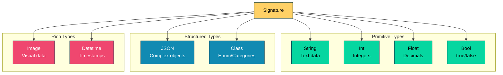
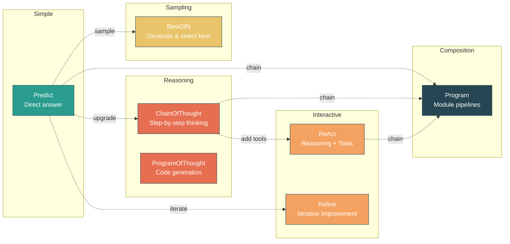
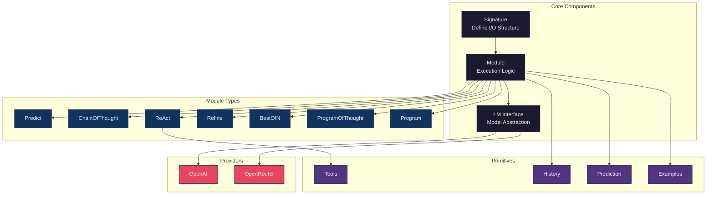
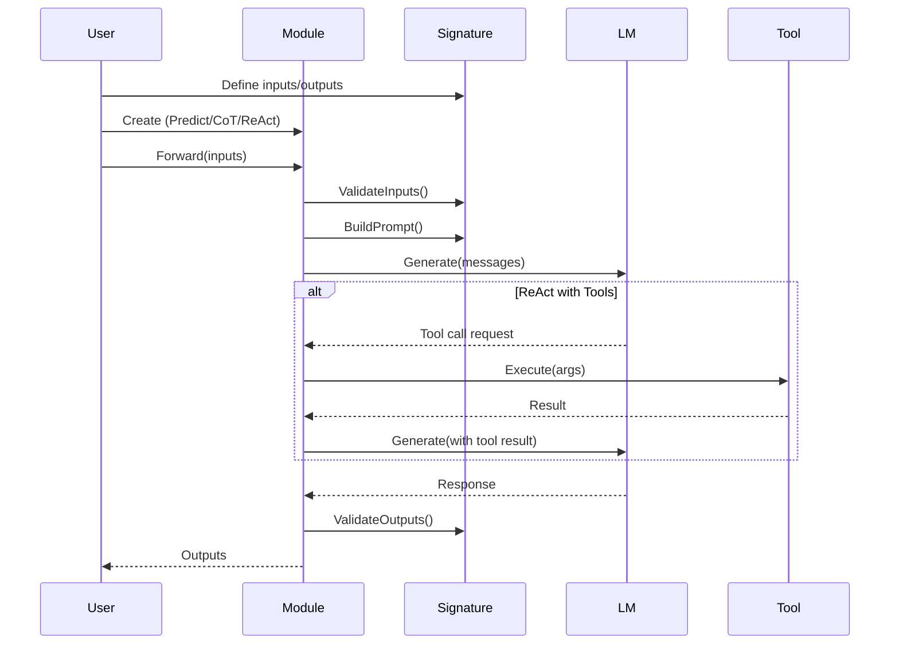

# DSGo - DSPy for Go

[](https://pkg.go.dev/github.com/assagman/dsgo)
[](https://goreportcard.com/report/github.com/assagman/dsgo)
[](https://github.com/assagman/dsgo/actions/workflows/ci.yml)
[](https://codecov.io/gh/assagman/dsgo)
[](https://opensource.org/licenses/MIT)
[](https://github.com/assagman/dsgo)
[](https://github.com/assagman/dsgo/releases)

> **Status**: Core modules complete ✅ | Experimentation-ready ✅ | Infrastructure utilities in progress 🚧
>
> See [ROADMAP.md](ROADMAP.md) for detailed progress

DSGo is a Go implementation of the [DSPy framework](https://github.com/stanfordnlp/dspy) for programming language models. Build production-ready LM applications with type-safe signatures, composable modules, and robust parsing.

**Quick Links:**
- [Get Started in 30 Seconds](QUICKSTART.md)
- [Development Guide](AGENTS.md)
- [Implementation Roadmap](ROADMAP.md)

## Features

- ✅ **Signatures**: Define structured inputs and outputs for LM calls
- ✅ **Type Safety**: Strong typing with validation for inputs and outputs
- ✅ **Production-Grade Robustness**:
  - **JSON Repair**: Automatic fixing of malformed JSON (`{key: 'value'}` → `{"key": "value"}`)
  - **Partial Outputs**: Validation diagnostics for training/optimization loops
  - **Class Normalization**: Case-insensitive + alias matching (`"POSITIVE"` → `"positive"`)
  - **Smart Extraction**: Numeric values from text (`"High (95%)"` → `95`)
- ✅ **Robust Adapters**: Multiple parsing strategies with automatic fallback
  - `JSONAdapter`: Structured JSON with repair + schema validation
  - `ChatAdapter`: Field marker format `[[ ## field ## ]]` with heuristics
  - `TwoStepAdapter`: Two-stage for reasoning models (o1/o3/gpt-5)
  - `FallbackAdapter`: Automatic retry chain (Chat → JSON) with >95% parse success
- ✅ **Modules**: Composable building blocks for LM programs
  - `Predict`: Basic prediction module
  - `ChainOfThought`: Step-by-step reasoning
  - `ReAct`: Reasoning and Acting with tool support
  - `Refine`: Iterative refinement of predictions
  - `BestOfN`: Generate N solutions and select the best
  - `ProgramOfThought`: Code generation and execution for reasoning
  - `Program`: Compose modules into pipelines
- ✅ **LM Abstraction**: Easy integration with different language models
- ✅ **Tool Support**: Define and use tools in ReAct agents
- ✅ **Structured Outputs**: JSON-based structured responses with validation
- ✅ **Observability**: Adapter metrics tracking (parse success, fallback usage, repair usage)

## Quick Start

### Installation

```bash
go get github.com/assagman/dsgo
```

### Basic Example: Sentiment Analysis

```go
package main

import (
    "context"
    "fmt"
    "log"

    "github.com/assagman/dsgo"
    "github.com/assagman/dsgo/module"
    "github.com/assagman/dsgo/providers/openai"  // or providers/openrouter
)

func main() {
    // Create signature
    sig := dsgo.NewSignature("Analyze the sentiment of the given text").
        AddInput("text", dsgo.FieldTypeString, "The text to analyze").
        AddClassOutput("sentiment", []string{"positive", "negative", "neutral"}, "The sentiment").
        AddOutput("confidence", dsgo.FieldTypeFloat, "Confidence score")

    // Create language model
    lm := openai.NewOpenAI("gpt-4")

    // Create Predict module
    predict := module.NewPredict(sig, lm)

    // Execute
    ctx := context.Background()
    inputs := map[string]interface{}{
        "text": "I love this product!",
    }

    result, err := predict.Forward(ctx, inputs)
    if err != nil {
        log.Fatal(err)
    }

    fmt.Printf("Sentiment: %v (Confidence: %v)\n",
        result.GetString("sentiment"), result.GetFloat("confidence"))
}
```

### Chain of Thought Example

```go
sig := dsgo.NewSignature("Solve the math word problem").
    AddInput("problem", dsgo.FieldTypeString, "The problem").
    AddOutput("answer", dsgo.FieldTypeFloat, "The answer").
    AddOutput("explanation", dsgo.FieldTypeString, "Step-by-step solution")

lm := openai.NewOpenAI("gpt-4")
cot := module.NewChainOfThought(sig, lm)

result, err := cot.Forward(ctx, map[string]interface{}{
    "problem": "If John has 5 apples and gives 2 away, how many does he have?",
})
// Access outputs: result.GetFloat("answer"), result.GetString("explanation")
```

### ReAct Agent with Tools

```go
// Define a search tool
searchTool := dsgo.NewTool(
    "search",
    "Search for information",
    func(ctx context.Context, args map[string]interface{}) (interface{}, error) {
        query := args["query"].(string)
        return performSearch(query), nil
    },
).AddParameter("query", "string", "Search query", true)

// Create ReAct module
sig := dsgo.NewSignature("Answer questions using available tools").
    AddInput("question", dsgo.FieldTypeString, "The question").
    AddOutput("answer", dsgo.FieldTypeString, "The answer")

lm := openai.NewOpenAI("gpt-4")
react := module.NewReAct(sig, lm, []dsgo.Tool{searchTool}).
    WithMaxIterations(5).
    WithVerbose(true)

result, err := react.Forward(ctx, map[string]interface{}{
    "question": "What is DSPy?",
})
// Access result: result.GetString("answer")
```

### Advanced: Custom Signatures with Multiple Types

```go
// Complex signature with diverse input/output types
sig := dsgo.NewSignature("Research and analyze a topic").
    // Multiple input types
    AddInput("topic", dsgo.FieldTypeString, "Research topic").
    AddInput("depth_level", dsgo.FieldTypeInt, "Depth: 1-3").
    AddInput("include_stats", dsgo.FieldTypeBool, "Include statistics").
    // Multiple output types with constraints
    AddOutput("summary", dsgo.FieldTypeString, "Executive summary").
    AddOutput("key_findings", dsgo.FieldTypeString, "Main discoveries").
    AddClassOutput("confidence", []string{"high", "medium", "low"}, "Confidence").
    AddOutput("sources_count", dsgo.FieldTypeInt, "Number of sources").
    AddOptionalOutput("statistics", dsgo.FieldTypeString, "Stats if requested")

// Use with ReAct and multiple tools
tools := []dsgo.Tool{searchTool, statsTool, factCheckTool}
react := module.NewReAct(sig, lm, tools).WithMaxIterations(7)

result, err := react.Forward(ctx, map[string]interface{}{
    "topic":         "AI in software development",
    "depth_level":   2,
    "include_stats": true,
})
// Access: result.GetString("summary"), result.GetInt("sources_count"), etc.
```

## Core Concepts

### Signatures

Signatures define the structure of your LM program's inputs and outputs:

```go
sig := dsgo.NewSignature("Description of the task").
    AddInput("field_name", dsgo.FieldTypeString, "Field description").
    AddOutput("result", dsgo.FieldTypeString, "Result description").
    AddClassOutput("category", []string{"A", "B", "C"}, "Classification")
```

**Supported Field Types:**



**Field Types:**
- `FieldTypeString` - Text data
- `FieldTypeInt` - Integer values
- `FieldTypeFloat` - Decimal numbers
- `FieldTypeBool` - Boolean (true/false)
- `FieldTypeJSON` - Complex structured data
- `FieldTypeClass` - Enum/classification (constrained choices)
- `FieldTypeImage` - Image data (URLs or base64) *[partial support]*
- `FieldTypeDatetime` - Timestamps and dates

### Modules

Modules are composable building blocks that implement different execution strategies:



**Module Descriptions:**

- **Predict**: Direct prediction based on signature
- **ChainOfThought**: Encourages step-by-step reasoning before answering
- **ReAct**: Combines reasoning with tool usage in iterative cycles
- **Refine**: Iteratively improve predictions with feedback
- **BestOfN**: Generate multiple candidates and select the best (supports early stopping with threshold)
- **ProgramOfThought**: Generate and execute code for reasoning tasks (with timeout enforcement)
- **Program**: Chain modules into pipelines for complex workflows

### Language Models

Implement the `LM` interface to add support for different providers:

```go
type LM interface {
    Generate(ctx context.Context, messages []Message, options *GenerateOptions) (*GenerateResult, error)
    Name() string
    SupportsJSON() bool
    SupportsTools() bool
}
```

**Thread Safety**: All modules automatically copy `GenerateOptions` before mutation to prevent race conditions and unexpected side effects when sharing options across goroutines.

```go
// Safe to share options across modules
opts := dsgo.DefaultGenerateOptions()
opts.Temperature = 0.8

predict1 := module.NewPredict(sig1, lm).WithOptions(opts)
predict2 := module.NewPredict(sig2, lm).WithOptions(opts)
// Each module gets its own copy internally
```

**Included Providers:**
- **OpenAI** - GPT-3.5, GPT-4, GPT-4 Turbo
- **OpenRouter** - Access to 100+ models

### Tools

Define tools for ReAct agents with automatic argument validation:

```go
tool := dsgo.NewTool(
    "tool_name",
    "Description of what the tool does",
    func(ctx context.Context, args map[string]interface{}) (interface{}, error) {
        // Tool implementation
        return result, nil
    },
).AddParameter("param", "string", "Parameter description", true)  // Required parameter
 .AddEnumParameter("mode", "Operation mode", []string{"fast", "accurate"}, false)  // Optional enum

// Validation happens automatically before execution
result, err := tool.Execute(ctx, args)  // Returns error if required params missing or enum invalid
```

**Validation Features**:
- Required parameters are checked automatically
- Enum parameters validated against allowed values
- Clear error messages for validation failures

## Architecture

DSGo follows the DSPy philosophy of declarative, modular programming with language models:



### Design Principles

1. **Declarative**: Define what you want, not how to prompt
2. **Modular**: Compose complex behaviors from simple modules
3. **Type-Safe**: Strong typing with validation
4. **Tool-Enabled**: Easy integration with external tools

### Execution Flow



## Project Structure

```
dsgo/
├── signature.go             # Signature system (Field, Signature types)
├── lm.go                    # Language Model interface
├── module.go                # Module interface
├── prediction.go            # Prediction wrapper with metadata
├── history.go               # Conversation history management
├── example.go               # Few-shot learning support
├── tool.go                  # Tool/function definitions
├── adapter.go               # Adapter interface + implementations
├── cache.go                 # LRU caching layer
├── *_test.go                # Unit tests
├── internal/
│   └── jsonutil/            # JSON extraction/repair utilities
├── logging/                 # Structured logging and tracing
│   └── README.md            # Logging documentation
├── module/
│   ├── predict.go           # Basic Predict module
│   ├── chain_of_thought.go  # ChainOfThought module
│   ├── react.go             # ReAct module with tool support
│   ├── refine.go            # Refine module for iterative improvement
│   ├── best_of_n.go         # BestOfN module for multiple sampling
│   ├── program_of_thought.go # ProgramOfThought module for code generation
│   └── program.go           # Program structure for module composition
├── providers/
│   ├── openai/              # OpenAI LM provider
│   └── openrouter/          # OpenRouter LM provider
├── scripts/
│   └── test_examples_matrix/ # Unified example testing
├── examples/                 # 20+ working examples
│   ├── shared/              # Shared provider utilities
│   ├── sentiment/           # Basic prediction & chain-of-thought
│   ├── chat_predict/        # Multi-turn conversation
│   ├── react_agent/         # ReAct agent with tools
│   ├── research_assistant/  # Complex signatures + multiple tools
│   ├── logging_tracing/     # Request ID propagation & observability
│   ├── fewshot_conversation/ # Few-shot learning
│   ├── composition/         # Module pipelines
│   ├── caching/             # LRU cache usage
│   ├── streaming/           # Real-time streaming
│   └── ...                  # 10+ more examples
├── QUICKSTART.md            # Get started in 30 seconds
├── AGENTS.md                # Development guide
├── ROADMAP.md               # Implementation roadmap
└── README.md                # This file
```

## Roadmap

**Current Status**: ~75% feature parity with DSPy core (see [ROADMAP.md](ROADMAP.md) for details)

**Completed** ✅:
- Core modules (Predict, ChainOfThought, ReAct, Refine, BestOfN, ProgramOfThought, Program)
- Robust adapters (JSON, Chat, TwoStep, Fallback)
- Production robustness (JSON repair, partial validation, class normalization)
- Logging and caching infrastructure
- 20+ working examples

**In Progress** 🚧:
- Streaming enhancements
- Advanced retry mechanisms
- Disk-backed cache persistence

**Planned**:
- Additional LM providers (Anthropic, Google, Ollama)
- Evaluation framework
- Optimizer framework (future)

## Advanced Features

### BestOfN with Early Stopping

Generate multiple solutions and select the best, with optional early stopping when a threshold is met:

```go
// Scorer function signature: func(inputs, prediction) (score, error)
scorer := func(inputs map[string]any, pred *dsgo.Prediction) (float64, error) {
    confidence := pred.GetFloat("confidence")
    return confidence, nil
}

bestOfN := module.NewBestOfN(predict, 5).
    WithScorer(scorer).
    WithThreshold(0.9).  // Stop early if score >= 0.9
    WithParallel(true).  // Generate in parallel (requires stateless modules!)
    WithReturnAll(true)  // Include all scores in metadata

result, err := bestOfN.Forward(ctx, inputs)
// Returns early if any result scores >= 0.9
// Access metadata: result.Score, result.Completions
```

**Scoring Functions**:
- `DefaultScorer()` - Prefers longer outputs
- `ConfidenceScorer(field)` - Uses a confidence field from outputs
- Custom function: `func(inputs map[string]any, prediction *dsgo.Prediction) (float64, error)`

### ProgramOfThought with Timeout Enforcement

Generate and execute code with guaranteed timeout enforcement:

```go
pot := module.NewProgramOfThought(sig, lm, "python").
    WithAllowExecution(true).
    WithExecutionTimeout(10)  // 10 second timeout, enforced via context

result, err := pot.Forward(ctx, inputs)
// Code execution is cancelled after 10 seconds
// Timeout error returned in result["execution_error"]
```

**Features**:
- Context-based timeout enforcement (prevents hanging)
- Supports Python, JavaScript, Go (limited)
- Captures both stdout and stderr
- Safe by default (execution disabled)

### Few-Shot Learning with Random Sampling

Use examples to guide LM behavior with random sampling support:

```go
examples := dsgo.NewExampleSet("sentiment examples")
examples.AddPair(
    map[string]any{"text": "Love it!"},
    map[string]any{"sentiment": "positive"},
).AddPair(
    map[string]any{"text": "Terrible experience"},
    map[string]any{"sentiment": "negative"},
)

// Get random subset of examples
randomExamples := examples.GetRandom(3)  // Returns 3 random examples
formatted, _ := examples.FormatExamples(signature)
```

**ExampleSet Methods**:
- `Add(example)` - Add a single example
- `AddPair(inputs, outputs)` - Quick add with maps
- `Get()` - Get all examples
- `GetN(n)` - Get first n examples
- `GetRandom(n)` - Get n random examples (useful for diverse sampling)
- `Len()`, `IsEmpty()`, `Clear()`, `Clone()`

### Thread-Safe Options

All modules automatically copy `GenerateOptions` to prevent mutation:

```go
// Original options remain unchanged
opts := dsgo.DefaultGenerateOptions()
opts.Temperature = 0.8

predict := module.NewPredict(sig, lm).WithOptions(opts)
// Module internally calls opts.Copy() - original opts unchanged

// Manual copy
optsCopy := opts.Copy()  // Deep copy including slices
```

## Documentation

- **[QUICKSTART.md](QUICKSTART.md)** - Get started in 30 seconds
- **[AGENTS.md](AGENTS.md)** - Development and testing guide
- **[ROADMAP.md](ROADMAP.md)** - Implementation progress and roadmap
- **[logging/README.md](logging/README.md)** - Logging and request tracing

## Contributing

Contributions are welcome! This is an early-stage implementation.

### Development Setup

Install golangci-lint v2.6.0 (required for linting):
```bash
curl -sSfL https://raw.githubusercontent.com/golangci/golangci-lint/master/install.sh | sh -s -- -b $(go env GOPATH)/bin v2.6.0
```

Note: `go install` only installs v1.x; v2.x requires binary installation.

### Running Tests

```bash
# Run all tests
make test

# Run tests with coverage
make test-cover

# Run tests with race detector
make test-race

# Run checks (fmt, vet, build)
make check

# Run checks and lint (requires golangci-lint v2.6.0)
make check-lint
```

## License

MIT License

## Inspiration

- [DSPy](https://github.com/stanfordnlp/dspy) - Original Python implementation
- [ax](https://github.com/ax-llm/ax) - TypeScript variant
- [dspy.rb](https://github.com/vicentereig/dspy.rb) - Ruby variant

## References

- [DSPy Documentation](https://dspy.ai/)
- [DSPy API Reference](https://dspy.ai/api/)
