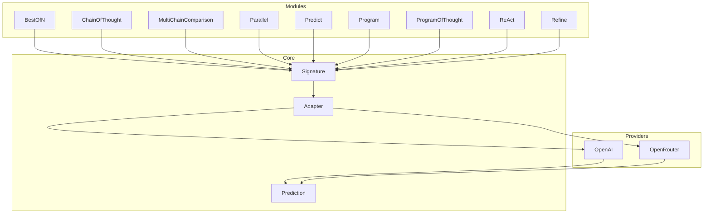
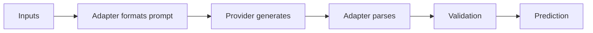

# DSGo

Go framework for building structured LLM applications with DSPy-style composable modules.

## Architecture (3 layers)


```mermaid
graph TB
  subgraph "Providers"
    P1[OpenAI]
    P2[OpenRouter]
  end

  subgraph "Core"
    C1[Signature]
    C2[Adapter]
    C3[Prediction]
  end

  subgraph "Modules"
    M1[BestOfN]
    M2[ChainOfThought]
    M3[MultiChainComparison]
    M4[Parallel]
    M5[Predict]
    M6[Program]
    M7[ProgramOfThought]
    M8[ReAct]
    M9[Refine]
  end

  M1 --> C1
  M2 --> C1
  M3 --> C1
  M4 --> C1
  M5 --> C1
  M6 --> C1
  M7 --> C1
  M8 --> C1
  M9 --> C1

  C1 --> C2
  C2 --> P1
  C2 --> P2
  P1 --> C3
  P2 --> C3
```

## Request lifecycle


```mermaid
flowchart LR
  A[Inputs] --> B[Adapter formats prompt]
  B --> C[Provider generates]
  C --> D[Adapter parses]
  D --> E[Validation]
  E --> F[Prediction]
```

## Start here

| Topic | Link |
|---|---|
| Hands-on tutorial | [`QUICKSTART.md`](QUICKSTART.md) |
| Deep dive | [`ARCHITECTURE.md`](ARCHITECTURE.md) |
| Tables / quick reference | [`REFERENCE.md`](REFERENCE.md) |
| Contributor workflow | [`DEVELOPMENT.md`](DEVELOPMENT.md) |
| Runnable examples | Not included in this layout |

## 3-minute example

```go
package main

import (
	"context"
	"fmt"
	"log"

	"github.com/assagman/dsgo/core"
	"github.com/assagman/dsgo/module"
	_ "github.com/assagman/dsgo/provider/openai"
)

func main() {
	ctx := context.Background()

	if err := core.Configure(); err != nil {
		log.Fatal(err)
	}

	lm, err := core.NewLM(ctx, "openai/gpt-4o-mini")
	if err != nil {
		log.Fatal(err)
	}

	sig := core.NewSignature("Classify sentiment").
		AddInput("text", core.FieldTypeString, "Text to classify").
		AddClassOutput("sentiment", []string{"positive", "negative", "neutral"}, "Sentiment")

	predict := module.NewPredict(sig, lm)
	pred, err := predict.Forward(ctx, map[string]any{"text": "I love this product"})
	if err != nil {
		log.Fatal(err)
	}

	fmt.Println("Sentiment:", pred.GetString("sentiment"))
	fmt.Printf("Cost: $%.6f, Tokens: %d\n", pred.Usage.Cost, pred.Usage.TotalTokens)
}
```

## Environment Variables

DSGo supports several environment variables for configuration. At least one API key env var is required; `core.Configure()` returns an error if none are set.

```bash
# API Keys
OPENAI_API_KEY=sk-...              # OpenAI API key
OPENROUTER_API_KEY=sk-or-...       # OpenRouter API key

# Logging
DSGO_LOG=pretty                    # Logging: none, pretty, events
DSGO_LOG_COLOR=auto                # Color: auto, always, never
# Auto behavior: Colors enabled when stdout is a TTY and TERM is not "dumb"
```

See [`AGENTS.md`](AGENTS.md) for a complete list of environment variables.
