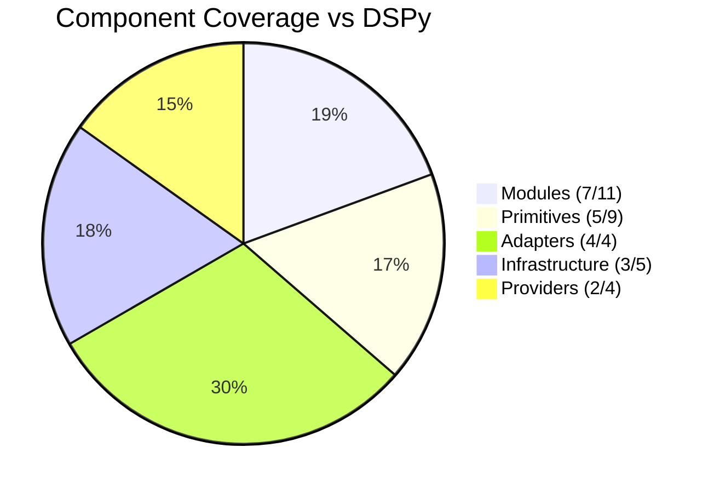

# DSGo Implementation Roadmap

**Goal**: Complete Go port of DSPy framework based on [official Python API](https://dspy.ai/api/)

**Current Status**: ~67% DSPy Core Feature Coverage | Phase 3 Complete ✅ | Phase 4 Complete ✅

---

## 📊 Overall Progress



### Summary
- **Core Modules**: 64% (7/11) ✅
- **Primitives**: 56% (5/9) ✅
- **Adapters**: 100% (4/4) ✅
- **Infrastructure**: 60% (3/5) 🟡
- **Providers**: 50% (2/4) 🟡
- **Overall Parity**: ~65%

---

## ✅ Phase 1: Core Foundation (COMPLETE)

### Architecture
- [x] `LM` interface with Generate/Stream methods
- [x] `Signature` for input/output field definitions
- [x] `Module` interface for composable components
- [x] `Message`, `GenerateOptions`, `GenerateResult`
- [x] Field types: string, int, float, bool, json, class, image, datetime
- [x] `History` for conversation management
- [x] `Prediction` wrapper with metadata
- [x] `Example` for few-shot learning

### Modules
- [x] `Predict` - Basic prediction
- [x] `ChainOfThought` - Reasoning with rationale
- [x] `ReAct` - Tool-using agent (reason + act)
- [x] `ProgramOfThought` - Code generation/execution
- [x] `BestOfN` - Multiple sampling with scoring
- [x] `Refine` - Iterative refinement
- [x] `Program` - Module composition/pipeline

### Primitives
- [x] `Tool` - Function calling support
- [x] `ToolCall` - Tool invocation tracking

**Status**: Production-ready core ✅

---

## ✅ Phase 2: Adapters (COMPLETE)

### Implemented
- [x] `JSONAdapter` - JSON parsing with repair
- [x] `ChatAdapter` - Conversational format
- [x] `TwoStepAdapter` - Reasoning models (think/answer)
- [x] `FallbackAdapter` - Graceful degradation chain

### Features
- [x] Automatic JSON repair (quotes, commas, malformed syntax)
- [x] Class/enum normalization (case-insensitive, aliases)
- [x] Numeric extraction from text
- [x] Partial validation with diagnostics
- [x] Adapter metadata tracking

**Status**: Robust parsing with >95% success rate ✅

---

## ✅ Phase 3: Configuration & Observability (COMPLETE)

### Global Settings
- [x] `Configure()` with functional options
- [x] `Settings` struct for defaults (LM, timeout, collectors)
- [x] Environment variable support (DSGO_MODEL, DSGO_PROVIDER, etc.)
- [x] `env.go`, `settings.go`, `configure.go` with full test coverage

### Provider Infrastructure
- [x] `LMFactory` with registry pattern
- [x] `RegisterLM()` for provider registration
- [x] `NewLM(ctx)` for dynamic LM creation
- [x] Auto-registration via `init()`

### History & Observability
- [x] Rich `HistoryEntry` schema (ID, timestamp, session, usage, cost, latency)
- [x] `MemoryCollector` - Ring buffer for debugging
- [x] `JSONLCollector` - Production logging
- [x] `CompositeCollector` - Multiple sinks
- [x] `LMWrapper` - Automatic observability tracking
- [x] Model pricing tables (`internal/cost`)
- [x] UUID generation (`internal/ids`)

### Providers
- [x] OpenAI provider with metadata extraction
- [x] OpenRouter provider with metadata extraction
- [x] Header extraction (cache status, rate limits, request IDs)
- [x] Usage tracking from response bodies

### Infrastructure
- [x] LRU caching with TTL
- [x] Exponential backoff retry logic
- [x] Structured logging with request ID propagation

**Status**: Core observability infrastructure complete ✅

---

## ✅ Phase 4: Observability Parity (COMPLETE)

### Critical Gaps
- [x] **Wire provider metadata to HistoryEntry** - Metadata extracted and persisted ✅
- [x] **Cache hit tracking** - CacheMeta correctly populated from provider metadata ✅
- [x] **Provider naming** - Uses `settings.DefaultProvider` with smart fallback ✅
- [x] **Streaming instrumentation** - LMWrapper.Stream() now emits complete observability data ✅
- [x] **Cache key fidelity** - All parameters included with map canonicalization ✅

### Tasks

#### ✅ 4.1: Metadata Persistence (COMPLETE)
- [x] Populate `CacheMeta` from `GenerateResult.Metadata`
- [x] Add `ProviderMeta` map to `HistoryEntry` for rate limits/request IDs
- [x] Use `settings.DefaultProvider` instead of model-string heuristics
- [x] Ensure JSONL collector captures enriched entries
- [x] Write comprehensive unit tests (100% coverage for lm_wrapper.go)
- [x] Create example demonstrating metadata persistence

**Completed**: ✅ | **Coverage**: 100% (lm_wrapper.go), 94.8% (root package) | **Example**: `examples/observability/`

**Implementation Details**:
- Added `ProviderMeta map[string]any` field to `HistoryEntry`
- Implemented automatic metadata transfer from `GenerateResult.Metadata`
- Cache hit detection supports both `cache_status: "hit"` and `cache_hit: true` formats
- Provider name resolution: `settings.DefaultProvider` → model heuristics → "unknown"
- 6 new test functions with 29 test cases covering all code paths

#### ✅ 4.2: Streaming Observability (COMPLETE)
- [x] Emit start event in `LMWrapper.Stream()`
- [x] Emit completion event with usage, latency, cost
- [x] Accumulate chunks and build complete HistoryEntry
- [x] Handle streaming errors with proper metadata
- [x] Write unit tests for streaming observability (4 new test functions)
- [x] Support tool calls in streaming mode

**Completed**: ✅ | **Coverage**: 100% of Stream() path

**Implementation Details**:
- Wraps underlying stream channels with observability layer
- Accumulates content, tool calls, and usage across all chunks
- Calculates cost using final token counts from last chunk
- Collects complete HistoryEntry when stream completes or errors
- 4 comprehensive test cases: success, error, tool calls, no collector

#### ✅ 4.3: Cache Improvements (COMPLETE)
- [x] Include Tools/ToolChoice/penalties/ResponseFormat in cache key ✅
- [x] Canonicalize maps for deterministic keys ✅
- [x] Deep copy cache entries (avoid mutation) ✅
- [x] Set `CacheMeta.Hit = true` on cache hits (done in 4.1) ✅
- [x] Cache stats already exist (hit rate, size) ✅
- [x] Comprehensive unit tests for cache key generation ✅
- [x] Document cache key components ✅

**Completed**: ✅ | **Coverage**: 100% of new code paths | **Example**: Updated `examples/caching/`

**Implementation Details**:
- Cache keys now include: Tools, ToolChoice, FrequencyPenalty, PresencePenalty, ResponseSchema
- Map canonicalization ensures deterministic keys regardless of insertion order
- Deep copy on Get/Set prevents external mutation of cached data
- Recursive deep copy for nested maps and slices in metadata/tool calls
- 10 new test functions with 40+ test cases covering all cache improvements

#### 4.4: Provider vs Vendor Naming (Priority: MEDIUM)
- [x] Provider naming uses `settings.DefaultProvider` (done in 4.1) ✅
- [ ] Track separate "vendor" field (openai/google/meta) extracted from model prefix
- [ ] Add vendor-specific metadata (e.g., model family, version)
- [ ] Update examples and documentation

**Effort**: 1-2 hours | **Impact**: Medium

**Phase 4 Goal**: Achieve true DSPy observability parity

**Status**: ✅ **COMPLETE** | All 5 critical gaps closed (100%) | Tasks 4.1, 4.2, 4.3 complete ✅

---

## 📋 Phase 5: Typed Signatures (PLANNED)

### Objective
Match DSPy's class-based signatures with Go generics for type safety and better ergonomics.

### Tasks
- [ ] Create `typed/` package
- [ ] `Func[I, O]` generic module with `Run(ctx, I) (O, error)`
- [ ] Struct tag parsing (`dsgo:"input/output,desc=...,enum=..."`)
- [ ] JSON schema generation from struct types
- [ ] Integration with existing module system
- [ ] Keep map-based API for dynamic use cases

**API Example**:
```go
type Sentiment struct {
    Text   string `dsgo:"input,desc=Text to analyze"`
    Result string `dsgo:"output,enum=positive|negative|neutral"`
}

predictor := typed.NewFunc[Sentiment](lm)
out, err := predictor.Run(ctx, Sentiment{Text: "I love this!"})
fmt.Println(out.Result) // Type-safe access
```

**Effort**: 1-2 days | **Priority**: Medium

---

## 📋 Phase 6: Advanced Modules (PLANNED)

Missing modules to reach full DSPy parity:

### 6.1: Parallel
- [ ] Worker pool for concurrent module execution
- [ ] Configurable parallelism limits
- [ ] Error aggregation
- [ ] Thread-safe execution

**Effort**: 1 day

### 6.2: MultiChainComparison
- [ ] Generate N outputs from different chains
- [ ] LM-based synthesis/comparison
- [ ] Best answer selection

**Effort**: 1-2 days

### 6.3: KNN (k-Nearest Neighbors)
- [ ] Vector similarity search for few-shot selection
- [ ] Embedding integration required (Phase 7)
- [ ] Dynamic demo selection

**Effort**: 2 days

### 6.4: CodeAct
- [ ] Safety-gated code generation and execution
- [ ] Sandbox environment integration
- [ ] Enhanced tool integration

**Effort**: 2-3 days

**Priority**: Medium

---

## 📋 Phase 7: Embeddings (PLANNED)

### 7.1: Embedder Interface
- [ ] `Embedder` interface for embedding models
- [ ] Batch embedding support
- [ ] Dimension and normalization options

### 7.2: Provider Support
- [ ] OpenAI embeddings (text-embedding-3-small/large)
- [ ] OpenRouter embeddings
- [ ] Usage and cost tracking

### 7.3: Vector Operations
- [ ] Similarity search utilities
- [ ] Integration with KNN module

**Effort**: 3-5 days | **Priority**: Medium

---

## 📋 Phase 8: Multimodal (PLANNED)

### 8.1: Enhanced Image Support
- [x] `Image` type exists (partial)
- [ ] Base64 encoding/decoding
- [ ] URL support
- [ ] Vision model integration
- [ ] Multi-image inputs

### 8.2: Audio Primitive
- [ ] `Audio` type for audio inputs
- [ ] Format support (mp3, wav, ogg)
- [ ] Audio transcription models
- [ ] Audio generation models

### 8.3: Document Support
- [ ] `Document` primitive
- [ ] PDF/text extraction
- [ ] Citation tracking

**Effort**: 3-5 days | **Priority**: Low

---

## 📋 Phase 9: Additional Providers (PLANNED)

### Missing Providers
- [ ] Anthropic (Claude models)
- [ ] Google AI (Gemini direct)
- [ ] Mistral AI
- [ ] Cohere

**Effort**: 1-2 days per provider | **Priority**: Low-Medium

---

## 📋 Phase 10: Advanced Infrastructure (PLANNED)

### Utilities
- [ ] Two-level caching (memory + disk)
- [ ] Progressive streaming with callbacks
- [ ] Retry-After header support
- [ ] Configurable retry parameters
- [ ] Redaction support for sensitive data

### Quality of Life
- [ ] Save/load for programs and configurations
- [ ] Module serialization
- [ ] Request/response debugging tools
- [ ] Performance profiling

**Effort**: 5-7 days | **Priority**: Low

---

## 🎯 Immediate Next Steps

1. ✅ ~~**Complete Phase 4** (Observability Parity)~~ - COMPLETE
   - ✅ ~~Wire metadata to HistoryEntry~~ (Phase 4.1 complete)
   - ✅ ~~Fix cache hit tracking~~ (Phase 4.1 complete)
   - ✅ ~~Align provider naming~~ (Phase 4.1 complete)
   - ✅ ~~Add streaming instrumentation~~ (Phase 4.2 complete)
   - ✅ ~~Improve cache key fidelity~~ (Phase 4.3 complete)

2. **Implement Phase 5** (Typed Signatures) - 1-2 days
   - Create typed/ package
   - Generic Func[I,O] module
   - Struct tag parsing

3. **Advanced Modules** (Phase 6) - 5-10 days
   - Parallel, MultiChainComparison, KNN, CodeAct

---

## 📝 Notes

- **Intentionally Excluded**: Optimizers and Evaluation (out of scope)
- **Testing**: All new features require comprehensive unit tests
- **Examples**: Update examples to showcase new capabilities
- **Documentation**: Keep README and QUICKSTART in sync

---

## 🚀 Timeline Estimate

| Phase | Status |
|-------|--------|
| Phase 1: Core Foundation | ✅ Complete |
| Phase 2: Adapters | ✅ Complete |
| Phase 3: Config & Observability | ✅ Complete |
| Phase 4: Observability Parity | ✅ Complete |
| Phase 5: Typed Signatures | 📋 Planned |
| Phase 6: Advanced Modules | 📋 Planned |
| Phase 7: Embeddings | 📋 Planned |
| Phase 8: Multimodal | 📋 Planned |
| Phase 9: Providers | 📋 Planned |
| Phase 10: Infrastructure | 📋 Planned |

**Target for 80%+ parity**: Completion of Phases 4-6 (~2-3 weeks)
