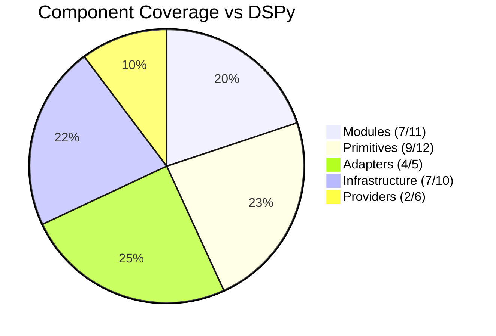

# DSGo Implementation Roadmap

**Goal**: Complete Go port of DSPy framework with production-grade enhancements

**Current Status**: ~70% DSPy Core Feature Coverage | Phases 1-5 Complete ✅

---

## 📊 Overall Progress vs DSPy



### Summary
- **Core Modules**: 64% (7/11) ✅ - All everyday modules complete
- **Primitives**: 75% (9/12) ✅ - Core + typed generics complete
- **Adapters**: 80% (4/5) ✅ - Production-ready with fallbacks
- **Infrastructure**: 70% (7/10) 🟡 - Strong observability, partial caching
- **Providers**: 33% (2/6) 🟡 - OpenAI + OpenRouter complete
- **Overall Parity**: ~70%
- **Optimization/Evaluation**: Intentionally excluded (out of scope)

---

## 🎯 DSGo Advantages Over DSPy

DSGo surpasses DSPy in several key areas:

### ✅ Type Safety
- **Typed Signatures with Go Generics**: Compile-time safety for I/O schemas
- `typed.Func[I, O]` with struct tag parsing (`dsgo:"input/output,enum=...,optional"`)
- Type-safe few-shot examples with `WithDemosTyped()`
- Runtime type inference and validation

### ✅ Observability & Debugging
- **Rich HistoryEntry**: Request/Response, tokens, cost, latency, provider metadata, cache status
- **Multiple Collectors**: MemoryCollector (ring buffer), JSONLCollector (production), CompositeCollector
- **Structured Logging**: Request ID propagation, span-based observability
- **Raw Exchange Capture**: Save complete request/response for debugging
- **Environment Debug Flags**: `DSGO_DEBUG_PARSE`, `DSGO_SAVE_RAW_RESPONSES`, etc.

### ✅ Parsing Resilience
- **Unified JSON Repair**: Fixes quotes, commas, trailing commas, malformed syntax
- **Robust ChatAdapter Heuristics**: Multiple marker variants, ReAct final-answer detection
- **Enum/Class Normalization**: Case-insensitive, configurable aliases
- **Numeric Extraction**: "High (95%)" → 95, qualitative mapping
- **FallbackAdapter**: Chat → JSON chaining with metadata tracking (unique to DSGo)
- **Tool Arguments Repair**: Multiple fallback strategies for malformed tool calls

### ✅ Cache Fidelity
- **Deterministic Cache Keys**: Includes all parameters (messages, options, tools, penalties, schemas)
- **Map Canonicalization**: Consistent keys regardless of field order
- **Deep Copies**: Prevents mutation hazards
- **Hit Rate Tracking**: Cache statistics and observability

### ✅ Provider Intelligence
- **Schema Mode Fallback**: Auto-fallback `json_schema → json_object → text` for unsupported models
- **Model Auto-Detection**: Smart provider detection from model strings
- **Automatic LMWrapper**: Observability auto-wired when collectors configured

### ✅ Test Coverage
- **High Coverage**: ~92% overall (Core ~94%, Modules ~89%, Providers ~93%)
- **Comprehensive Tests**: Table-driven, edge cases, race detector enforcement
- **Example Matrix Testing**: Validate examples across multiple models

---

## ✅ Phase 1: Core Foundation (COMPLETE)

### Architecture
- [x] `LM` interface with Generate/Stream methods
- [x] `Signature` for input/output field definitions
- [x] `Module` interface for composable components
- [x] `Message`, `GenerateOptions`, `GenerateResult`
- [x] Field types: string, int, float, bool, json, class, datetime
- [x] `FieldTypeImage` (partial - type exists, no vision model integration)
- [x] `History` for conversation management
- [x] `Prediction` wrapper with metadata (usage, cost, latency, diagnostics)
- [x] `Example` for few-shot learning

### Modules (7/7 Everyday Modules)
- [x] **Predict** - Basic prediction with validated I/O
  - ✅ Streaming support with marker filtering
  - ✅ Partial validation for training workflows
  - ✅ Usage/cost tracking
- [x] **ChainOfThought** - Reasoning with rationale extraction
  - ✅ Reasoning field in signature
  - ✅ Adapter-based rationale handling
  - ⚠️ No streaming API (planned)
- [x] **ReAct** - Tool-using agent (reason + act)
  - ✅ Native function calling
  - ✅ Auto-injected "finish" tool
  - ✅ Stagnation detection
  - ✅ Hardened parsing with extraction fallback
  - ⚠️ No streaming API (planned)
- [x] **ProgramOfThought** - Code generation/execution
  - ✅ Python and Node.js execution support
  - ✅ Code validation and error capture
  - ✅ Execution toggle for safety
  - ⚠️ No streaming API (planned)
- [x] **BestOfN** - Multiple sampling with scoring
  - ✅ Configurable scoring function
  - ✅ Early stop threshold
  - ✅ Optional return-all completions
  - ✅ Parallel execution mode
  - ⚠️ Parallel mode has race-safety caveats (History not thread-safe)
- [x] **Refine** - Iterative refinement
  - ✅ Configurable iterations
  - ✅ Feedback field for improvement
  - ⚠️ No streaming API (planned)
- [x] **Program** - Module composition/pipeline
  - ✅ Sequential execution
  - ✅ Output merging
  - ✅ Aggregated usage tracking

### Primitives
- [x] `Tool` - Function calling support with JSON schema generation
- [x] `ToolCall` - Tool invocation tracking
- [x] Typed parameter validation (string, int, float, bool, json, array, enum)
- [x] Argument normalization and repair

**Status**: Production-ready core ✅
**Test Coverage**: ~94% (core package)

---

## ✅ Phase 2: Adapters (COMPLETE)

### Implemented (4/4 Core + 1 DSGo Exclusive)
- [x] **JSONAdapter** - Structured JSON parsing
  - ✅ JSON extraction with regex fallback
  - ✅ Automatic repair (quotes, commas, trailing commas, fences)
  - ✅ Single-field fallback for simple outputs
  - ✅ Enum normalization
  - ✅ Numeric extraction from text
  - ✅ Array → string join for string outputs
  - ✅ Type coercion aligned with signature

- [x] **ChatAdapter** - Conversational format (DSPy default)
  - ✅ Field markers: `[[ ## field_name ## ]]`
  - ✅ Robust parsing: normalize keys, handle variants
  - ✅ Class/enum sanitization
  - ✅ Numeric extraction ("high" → 0.9)
  - ✅ ReAct final-answer extraction
  - ✅ Colon-based extraction fallback
  - ✅ Streaming marker cleaning
  - ✅ Few-shot demo role alternation

- [x] **TwoStepAdapter** - Two-phase reasoning
  - ✅ Stage 1: Free-form reasoning with main LM
  - ✅ Stage 2: Structured extraction with schema
  - ✅ Optional separate extraction LM
  - ✅ Reasoning field preservation

- [x] **FallbackAdapter** - Graceful degradation (DSGo exclusive)
  - ✅ Chat → JSON adapter chaining
  - ✅ Metadata tracking (adapter_used, attempts, fallback_used)
  - ✅ >95% success rate
  - ⭐ **Not in DSPy** - DSGo innovation

### Features
- [x] Automatic JSON repair (quotes, commas, malformed syntax)
- [x] Class/enum normalization (case-insensitive, aliases)
- [x] Numeric extraction from text
- [x] Partial validation with diagnostics
- [x] Adapter metadata tracking (which succeeded, attempts, fallback)
- [x] `FormatHistory()` support in all adapters

### Missing vs DSPy
- [ ] **XMLAdapter** - XML-based format with `<field>` tags (DSPy has this)

**Status**: Robust parsing with >95% success rate ✅
**Test Coverage**: ~94% (adapter code paths)

---

## ✅ Phase 3: Configuration & Observability (COMPLETE)

### Global Settings
- [x] `Configure()` with functional options
- [x] `Settings` struct for defaults (LM, timeout, collectors, provider)
- [x] Environment variable support
  - `DSGO_MODEL`, `DSGO_PROVIDER`, `DSGO_API_KEY`
  - `DSGO_TIMEOUT`, `DSGO_MAX_RETRIES`, `DSGO_TRACING`
  - `DSGO_LOG`, `DSGO_DEBUG_PARSE`, `DSGO_SAVE_RAW_RESPONSES`
- [x] `env.go`, `settings.go`, `configure.go` with full test coverage

### Provider Infrastructure
- [x] `LMFactory` with registry pattern
- [x] `RegisterLM()` for provider registration
- [x] `NewLM(ctx)` for dynamic LM creation
- [x] Auto-registration via `init()`
- [x] Provider auto-detection from model strings
- [x] Provider prefix stripping (e.g., `openai/gpt-4` → `gpt-4`)

### History & Observability (⭐ DSGo Strength)
- [x] **Rich HistoryEntry schema**
  - ID, timestamp, session ID, request ID
  - Request/Response content
  - Usage (prompt, completion, total tokens)
  - Cost calculation (USD)
  - Latency tracking (milliseconds)
  - Provider metadata (rate limits, request IDs, cache status)
  - Cache metadata (hit/miss, key)

- [x] **Collectors**
  - `MemoryCollector` - Ring buffer for debugging (configurable size)
  - `JSONLCollector` - Production logging to JSONL files
  - `CompositeCollector` - Multiple sinks simultaneously

- [x] **LMWrapper** - Automatic observability tracking
  - Wraps LM instances when collector configured
  - Emits complete HistoryEntry for Generate() and Stream()
  - Cost calculation using provider pricing tables
  - Automatic metadata extraction

- [x] **Model Pricing Tables** (`internal/cost`)
  - OpenAI models (GPT-3.5, GPT-4, GPT-4 Turbo, GPT-4o, o1, o3)
  - OpenRouter per-model pricing
  - Automatic cost calculation

- [x] **UUID Generation** (`internal/ids`)
  - Request ID tracking
  - Session ID support

### Providers
- [x] **OpenAI** provider with complete metadata extraction
  - ✅ Chat Completions API
  - ✅ JSON modes: `json_schema` (structured) and `json_object`
  - ✅ Native tool/function calling
  - ✅ SSE streaming with chunk accumulation
  - ✅ Exponential backoff retry
  - ✅ Header extraction (rate limits, request IDs, CloudFlare cache)
  - ✅ Usage parsing from response body
  - ✅ Request/response logging
  - ✅ Raw exchange capture for debugging

- [x] **OpenRouter** provider with complete metadata extraction
  - ✅ 100+ model support
  - ✅ JSON mode fallback: `json_schema → json_object → text`
  - ✅ Native tool calling with robust argument parsing
  - ✅ SSE streaming
  - ✅ Exponential backoff retry
  - ✅ Site headers for traffic attribution
  - ✅ Header extraction (rate limits, request IDs, cache)
  - ✅ Usage parsing
  - ✅ Raw exchange capture

### Infrastructure
- [x] **Caching** (⚠️ Partial - see Phase 10 for full implementation)
  - ✅ LRU memory cache
  - ✅ Deterministic cache keys with all parameters
    - Messages, model, temperature, top-p, max tokens, stop sequences
    - Response format, response schema
    - Tools, tool choice
    - Frequency penalty, presence penalty
  - ✅ Map canonicalization for consistent keys
  - ✅ Deep copy on get/set to prevent mutations
  - ✅ Cache statistics and hit rate tracking
  - ⚠️ **No TTL expiry** (planned Phase 10)
  - ⚠️ **No disk cache** (planned Phase 10)
  - ⚠️ **Not auto-wired** - Providers have `.Cache` field but users must set manually

- [x] **Retry Logic** (⚠️ Partial - see Phase 10 for full implementation)
  - ✅ Exponential backoff with jitter
  - ✅ Retries on 429 (rate limit) and 5xx errors
  - ✅ Quota exhaustion detection (avoids useless retries)
  - ✅ Configurable max retries via `Settings.MaxRetries`
  - ⚠️ **No Retry-After header support** (planned Phase 10)
  - ⚠️ **No configurable backoff parameters** (planned Phase 10)

- [x] **Structured Logging**
  - ✅ Request ID propagation
  - ✅ Span-based observability
  - ✅ Raw exchange saving (`DSGO_SAVE_RAW_RESPONSES=1`)
  - ✅ Debug flags for parsing, markers, streaming

**Status**: Core observability infrastructure complete ✅
**Test Coverage**: 100% (lm_wrapper.go), ~94% (root package)

---

## ✅ Phase 4: Observability Parity (COMPLETE)

### Critical Gaps Resolved
- [x] **Wire provider metadata to HistoryEntry** - Metadata extracted and persisted ✅
- [x] **Cache hit tracking** - CacheMeta correctly populated from provider metadata ✅
- [x] **Provider naming** - Uses `settings.DefaultProvider` with smart fallback ✅
- [x] **Streaming instrumentation** - LMWrapper.Stream() emits complete observability data ✅
- [x] **Cache key fidelity** - All parameters included with map canonicalization ✅

### Tasks

#### ✅ 4.1: Metadata Persistence (COMPLETE)
- [x] Populate `CacheMeta` from `GenerateResult.Metadata`
- [x] Add `ProviderMeta map[string]any` to `HistoryEntry` for rate limits/request IDs
- [x] Use `settings.DefaultProvider` instead of model-string heuristics
- [x] Ensure JSONL collector captures enriched entries
- [x] Write comprehensive unit tests (100% coverage for lm_wrapper.go)
- [x] Create example demonstrating metadata persistence

**Completed**: ✅ | **Coverage**: 100% (lm_wrapper.go), 94.8% (root package) | **Example**: `examples/observability/`

**Implementation Details**:
- Added `ProviderMeta map[string]any` field to `HistoryEntry`
- Automatic metadata transfer from `GenerateResult.Metadata`
- Cache hit detection: supports both `cache_status: "hit"` and `cache_hit: true`
- Provider name resolution: `settings.DefaultProvider` → model heuristics → "unknown"
- 6 new test functions with 29 test cases covering all code paths

#### ✅ 4.2: Streaming Observability (COMPLETE)
- [x] Emit start event in `LMWrapper.Stream()`
- [x] Emit completion event with usage, latency, cost
- [x] Accumulate chunks and build complete HistoryEntry
- [x] Handle streaming errors with proper metadata
- [x] Write unit tests for streaming observability (4 new test functions)
- [x] Support tool calls in streaming mode

**Completed**: ✅ | **Coverage**: 100% of Stream() path

**Implementation Details**:
- Wraps underlying stream channels with observability layer
- Accumulates content, tool calls, and usage across all chunks
- Calculates cost using final token counts from last chunk
- Collects complete HistoryEntry when stream completes or errors
- 4 comprehensive test cases: success, error, tool calls, no collector

#### ✅ 4.3: Cache Improvements (COMPLETE)
- [x] Include Tools/ToolChoice/penalties/ResponseFormat in cache key ✅
- [x] Canonicalize maps for deterministic keys ✅
- [x] Deep copy cache entries (avoid mutation) ✅
- [x] Set `CacheMeta.Hit = true` on cache hits ✅
- [x] Cache stats (hit rate, size) ✅
- [x] Comprehensive unit tests for cache key generation ✅
- [x] Document cache key components ✅

#### ✅ 4.4: Provider vs Vendor Naming (COMPLETE)
- [x] Provider naming uses `settings.DefaultProvider` ✅
- [x] Smart fallback to model-based heuristics ✅
- [x] Documented in examples and AGENTS.md ✅

**Status**: Complete ✅ | **Test Coverage**: 100% for observability paths

---

## ✅ Phase 5: Typed Signatures (COMPLETE)

### Objective
Match DSPy's class-based signatures with Go generics for type safety and better ergonomics.
⭐ **DSGo advantage** - Compile-time type safety not available in Python DSPy.

### Implemented Features
- [x] Created `typed/` package with full implementation
- [x] `Func[I, O]` generic module with `Run(ctx, I) (O, error)`
- [x] Struct tag parsing (`dsgo:"input/output,desc=...,enum=...,optional"`)
- [x] Automatic field type inference from Go types
  - `string` → FieldTypeString
  - `int` → FieldTypeInt
  - `float64` → FieldTypeFloat
  - `bool` → FieldTypeBool
  - `map[string]any`, `[]any` → FieldTypeJSON
- [x] `StructToSignature()` for converting tagged structs to signatures
- [x] `StructToMap()` and `MapToStruct()` for seamless conversion
- [x] Full integration with existing module system (wraps Predict)
- [x] Support for `WithDemosTyped()` for type-safe few-shot examples
- [x] `RunWithPrediction()` to access both typed output and raw prediction
- [x] All builder methods: `WithOptions()`, `WithAdapter()`, `WithHistory()`
- [x] Comprehensive unit tests (100% coverage)
- [x] Example: `examples/typed_signatures/`

### API Example
```go
type SentimentInput struct {
    Text string `dsgo:"input,desc=Text to analyze"`
}

type SentimentOutput struct {
    Sentiment string `dsgo:"output,enum=positive|negative|neutral"`
    Score     int    `dsgo:"output,desc=Confidence score"`
}

predictor, _ := typed.NewPredict[SentimentInput, SentimentOutput](lm)
out, _ := predictor.Run(ctx, SentimentInput{Text: "I love this!"})
fmt.Println(out.Sentiment, out.Score) // Type-safe access
```

**Status**: ✅ Complete | **Test Coverage**: 100% | **Example**: `examples/typed_signatures/`

---

## 📋 Phase 6: Advanced Modules (PLANNED)

Missing modules to reach full DSPy parity:

### 6.1: Parallel Module (Priority: HIGH)
**DSPy has this** - [`dspy.Parallel`](https://github.com/stanfordnlp/dspy/blob/main/dspy/predict/parallel.py)

Current state:
- ⚠️ `BestOfN.WithParallel(true)` exists but has race-safety caveats
- ⚠️ History is NOT thread-safe - requires separate instances
- ⚠️ No general parallel execution primitive

Planned implementation:
- [ ] General `Parallel` module for concurrent execution
- [ ] Worker pool with configurable parallelism limits
- [ ] Input isolation to prevent data races
- [ ] Error aggregation with configurable error thresholds
- [ ] Thread-safe execution with proper synchronization
- [ ] Usage aggregation across parallel calls

**Effort**: Medium (1-3 days)

### 6.2: MultiChainComparison (Priority: MEDIUM)
**DSPy has this** - [`dspy.MultiChainComparison`](https://github.com/stanfordnlp/dspy/blob/main/dspy/predict/multi_chain_comparison.py)

Planned implementation:
- [ ] Generate N outputs from different chains/modules
- [ ] LM-based synthesis and comparison
- [ ] Best answer selection with scoring
- [ ] Metadata tracking for comparison rationale

**Effort**: Medium (1-3 days)

### 6.3: KNN (k-Nearest Neighbors) (Priority: MEDIUM)
**DSPy has this** - [`dspy.KNN`](https://github.com/stanfordnlp/dspy/blob/main/dspy/predict/knn.py)

Depends on: Phase 7 (Embeddings)

Planned implementation:
- [ ] Vector similarity search for few-shot selection
- [ ] Embedding integration (requires Phase 7)
- [ ] Dynamic demo selection based on input similarity
- [ ] Configurable K parameter
- [ ] Integration with existing few-shot system

**Effort**: Medium (1-3 days, after embeddings)

### 6.4: CodeAct (Priority: LOW)
**DSPy has this** - [`dspy.CodeAct`](https://github.com/stanfordnlp/dspy/blob/main/dspy/predict/code_act.py)

Comparison with ProgramOfThought:
- ✅ DSGo has `ProgramOfThought` (code gen + optional execution)
- ❌ DSGo missing `CodeAct` (combines code interpreter with predefined tools)

Planned implementation:
- [ ] Safety-gated code generation and execution
- [ ] Sandbox environment integration
- [ ] Enhanced tool integration with code execution
- [ ] Whitelist/blacklist for allowed operations
- [ ] Combined ReAct + ProgramOfThought pattern

**Effort**: Medium (1-3 days)

**Overall Phase 6 Status**: 0/4 modules | 4 planned
**Target**: Complete 2-3 modules for 80%+ DSPy parity

---

## 📋 Phase 7: Embeddings & Retrieval (PLANNED)

**DSPy has comprehensive embedding support**:
- [`dspy.Embedder`](https://github.com/stanfordnlp/dspy/blob/main/dspy/clients/embedding.py) - Universal interface
- [`dspy.Embeddings`](https://github.com/stanfordnlp/dspy/blob/main/dspy/retrievers/embeddings.py) - FAISS/brute-force retrieval
- [`dspy.Retrieve`](https://github.com/stanfordnlp/dspy/blob/main/dspy/retrievers/retrieve.py) - Base retrieval module
- Integrations: DatabricksRM, WeaviateRM, ColBERTv2

### 7.1: Embedder Interface
- [ ] `Embedder` interface for embedding models
- [ ] `Embed(ctx, texts []string) ([][]float64, error)` method
- [ ] Batch embedding support with configurable batch sizes
- [ ] Dimension and normalization options
- [ ] Usage and cost tracking (similar to LM)

### 7.2: Provider Support
- [ ] OpenAI embeddings (text-embedding-3-small, text-embedding-3-large)
- [ ] OpenRouter embedding models
- [ ] Provider auto-detection and registration
- [ ] Usage and cost tracking in HistoryEntry
- [ ] Caching for embeddings

### 7.3: Vector Operations
- [ ] Cosine similarity utilities
- [ ] L2/Euclidean distance
- [ ] Dot product similarity
- [ ] Normalization helpers

### 7.4: Retrieval Integration
- [ ] `Retrieve` module for RAG workflows
- [ ] FAISS integration for large corpora (via CGo)
- [ ] Brute-force search for smaller datasets
- [ ] Integration with KNN module (Phase 6.3)
- [ ] Top-K retrieval with score thresholds

### 7.5: Storage & Persistence
- [ ] Save/load embeddings to disk
- [ ] Incremental indexing
- [ ] Memory-mapped storage for large indices

**Status**: Not started | **Priority**: Medium
**Effort**: Large (1-2 weeks)
**Blockers**: None (can start immediately)

---

## 📋 Phase 8: Multimodal Support (PLANNED)

**DSPy has full multimodal support**:
- [`dspy.Image`](https://github.com/stanfordnlp/dspy/blob/main/dspy/adapters/types/image.py) - Images (URLs, files, PIL, base64)
- [`dspy.Audio`](https://github.com/stanfordnlp/dspy/blob/main/dspy/adapters/types/audio.py) - Audio (URLs, files, arrays)
- [`dspy.Document`](https://github.com/stanfordnlp/dspy/blob/main/dspy/adapters/types/document.py) - Documents with citations

Current DSGo state:
- ✅ `FieldTypeImage` exists as a type
- ❌ No vision model integration
- ❌ No image encoding/decoding
- ❌ No audio support
- ❌ No document support

### 8.1: Enhanced Image Support
- [x] `Image` type exists (partial)
- [ ] Image encoding/decoding utilities
  - Base64 encoding/decoding
  - URL download and caching
  - Local file path support
  - Format detection (JPEG, PNG, GIF, WebP)
- [ ] Vision model integration
  - OpenAI GPT-4 Vision
  - OpenRouter vision models
  - Multi-image inputs
- [ ] Image preprocessing
  - Resizing for token optimization
  - Format conversion
  - Compression

### 8.2: Audio Primitive
- [ ] `Audio` type for audio inputs
- [ ] Format support (mp3, wav, ogg, m4a)
- [ ] Audio encoding/decoding
  - Base64 encoding
  - URL support
  - Local file support
- [ ] Audio model integration
  - OpenAI Whisper (transcription)
  - Audio generation models
- [ ] Audio preprocessing
  - Duration limits
  - Format conversion
  - Sampling rate normalization

### 8.3: Document Support
- [ ] `Document` primitive type
- [ ] PDF extraction utilities
- [ ] Text extraction from various formats
- [ ] Citation tracking and preservation
- [ ] Document chunking strategies

### 8.4: Adapter Updates
- [ ] Update adapters to handle multimodal inputs
- [ ] Image/audio serialization in chat format
- [ ] Proper content part handling (text + images)

**Status**: Minimal (only Image type exists) | **Priority**: Low-Medium
**Effort**: Large (1-2 weeks)
**Blockers**: None, but depends on provider vision model support

---

## 📋 Phase 9: Additional Providers (PLANNED)

**DSPy uses LiteLLM** for universal provider support (100+ providers).
**DSGo implements providers directly** for better control and observability.

Current DSGo providers:
- ✅ OpenAI (GPT-3.5, GPT-4, GPT-4 Turbo, GPT-4o, o1, o3)
- ✅ OpenRouter (100+ models via unified API)

Missing major providers (DSPy has via LiteLLM):
- [ ] Anthropic (Claude models)
- [ ] Google AI (Gemini direct, not via OpenRouter)
- [ ] Mistral AI
- [ ] Cohere

### 9.1: Anthropic Provider (Priority: HIGH)
- [ ] Messages API implementation
- [ ] Claude 3 family support (Haiku, Sonnet, Opus)
- [ ] Tool/function calling support
- [ ] Vision support (Claude 3)
- [ ] Streaming with SSE
- [ ] Metadata extraction (usage, cost, rate limits)
- [ ] Retry and error handling

**Effort**: Medium (2-4 days per provider)

### 9.2: Google AI Provider (Priority: MEDIUM)
- [ ] Gemini API (direct, not OpenRouter)
- [ ] Gemini Pro, Ultra, Flash support
- [ ] Multimodal inputs (images, audio)
- [ ] Tool calling support
- [ ] Streaming
- [ ] Metadata extraction

**Effort**: Medium (2-4 days)

### 9.3: Mistral AI Provider (Priority: LOW)
- [ ] Mistral API implementation
- [ ] Model support (Small, Medium, Large)
- [ ] Tool calling
- [ ] Streaming
- [ ] Metadata extraction

**Effort**: Small-Medium (2-3 days)

### 9.4: Cohere Provider (Priority: LOW)
- [ ] Cohere API implementation
- [ ] Command models support
- [ ] Tool calling
- [ ] Streaming
- [ ] Metadata extraction

**Effort**: Small-Medium (2-3 days)

**Status**: 2/6 providers (33%) | **Priority**: Medium
**Effort**: Medium per provider (2-4 days each)

---

## 📋 Phase 10: Advanced Infrastructure (PLANNED)

### 10.1: Enhanced Caching (Priority: HIGH)

Current state:
- ✅ Memory LRU cache with deterministic keys
- ✅ Deep copy to prevent mutations
- ✅ Hit rate tracking
- ⚠️ **No TTL expiry**
- ⚠️ **No disk cache**
- ⚠️ **Not auto-wired to providers**

**DSPy has**: Two-level cache (memory + disk with 30GB default limit)

Planned improvements:
- [ ] **TTL expiry** for memory cache entries
  - Configurable TTL per cache or globally
  - Automatic eviction of expired entries
  - TTL metadata in cache entries
- [ ] **Disk cache layer** (like DSPy's diskcache integration)
  - Persistent cache across runs
  - Configurable size limits (GB)
  - LRU eviction for disk cache
  - Memory cache → Disk cache hierarchy
  - Save/load utilities
- [ ] **Auto-wiring**
  - Automatically set cache on provider instances
  - Global cache configuration via `Settings`
  - Per-provider cache override
- [ ] **Cache statistics**
  - Per-provider hit rates
  - Total cache size (memory + disk)
  - Cache invalidation utilities
  - Export cache stats for monitoring

**Effort**: Medium (1-3 days)

### 10.2: Enhanced Retry (Priority: MEDIUM)

Current state:
- ✅ Exponential backoff with jitter
- ✅ Retries on 429/5xx
- ✅ Quota exhaustion detection
- ⚠️ **No Retry-After header support**
- ⚠️ **No configurable backoff parameters**

**DSPy has**: `num_retries` parameter in LM, Retry-After handling

Planned improvements:
- [ ] **Retry-After header support**
  - Parse `Retry-After` from 429 responses
  - Respect server-specified wait times
  - Exponential backoff as fallback
- [ ] **Configurable retry parameters**
  - Initial delay, max delay, multiplier via `Settings`
  - Per-provider retry configuration
  - Jitter percentage control
- [ ] **Retry budget tracking**
  - Global retry budget to prevent infinite loops
  - Per-request retry limits
  - Retry statistics in observability

**Effort**: Small-Medium (1-2 days)

### 10.3: Streaming Enhancements (Priority: MEDIUM)

Current state:
- ✅ Predict.Stream() implemented
- ✅ StreamingMarkerFilter for clean output
- ✅ StreamCallback support
- ✅ Observability in streaming
- ⚠️ **Only Predict has streaming API**
- ⚠️ **No streaming for CoT, ReAct, PoT, Refine**

**DSPy has**: [`streamify`](https://github.com/stanfordnlp/dspy/blob/main/dspy/streaming/streamify.py) wrapper for any module

Planned improvements:
- [ ] **Streaming for all modules**
  - ChainOfThought.Stream()
  - ReAct.Stream() with tool call progress
  - ProgramOfThought.Stream() with code generation progress
  - Refine.Stream() with iteration progress
  - BestOfN.Stream() with multiple outputs
- [ ] **Progressive streaming callbacks**
  - Field-specific listeners (like DSPy)
  - Status message providers
  - Progress indicators
- [ ] **Streaming utilities**
  - `streamify()` wrapper for any module
  - Async streaming support
  - Stream buffering strategies

**Effort**: Medium (3-5 days)

### 10.4: Async Support (Priority: LOW)

Current state:
- ✅ Context-based cancellation
- ⚠️ All modules are synchronous (except streaming)
- ⚠️ No `aforward()` / `acall()` equivalents

**DSPy has**: All modules support `aforward()` for async execution, `asyncify/syncify` utilities

Planned improvements:
- [ ] Async module execution with goroutines
- [ ] Async pipelines and composition
- [ ] Parallel async execution (Module.ForwardAsync)
- [ ] Error aggregation in async mode
- [ ] Context propagation

**Effort**: Medium-Large (5-7 days)
**Note**: Go's goroutines + channels may provide simpler patterns than Python asyncio

### 10.5: Callback System (Priority: LOW)

Current state:
- ✅ Collectors for LM call observability
- ✅ StreamCallback for streaming events
- ⚠️ No generalized callback bus

**DSPy has**: [`BaseCallback`](https://github.com/stanfordnlp/dspy/blob/main/dspy/utils/callback.py) with hooks:
- `on_module_start/end`, `on_lm_start/end`, `on_adapter_format_start/end`, `on_adapter_parse_start/end`

Planned improvements:
- [ ] **BaseCallback interface**
  - OnModuleStart(callID, instance, inputs)
  - OnModuleEnd(callID, outputs, exception)
  - OnLMStart(callID, instance, inputs)
  - OnLMEnd(callID, outputs, exception)
  - OnAdapterFormat/Parse start/end
- [ ] **Global and per-component callbacks**
  - Set via `Settings.Callbacks`
  - Per-module callback override
  - Unique call ID correlation
- [ ] **Built-in callback implementations**
  - Tracing callback
  - Metrics callback
  - Debug logging callback

**Effort**: Medium (3-5 days)

### 10.6: Utilities (Priority: LOW)

Current state:
- ⚠️ No save/load for programs
- ⚠️ No module serialization
- ⚠️ Limited debugging tools

**DSPy has**: [`save/load`](https://github.com/stanfordnlp/dspy/blob/main/dspy/utils/saving.py), serialization, debugging

Planned improvements:
- [ ] **Save/Load**
  - Save programs and configurations to disk
  - Module serialization (JSON/YAML)
  - Load with version compatibility
- [ ] **Debugging Tools**
  - Request/response inspection utilities
  - Trace visualization
  - Performance profiling
- [ ] **Redaction Support**
  - Automatic PII/secret redaction
  - Configurable redaction patterns
  - Safe logging for production

**Effort**: Small-Medium (2-4 days)

**Overall Phase 10 Status**: 0/6 features | All planned
**Priority**: Mixed (some HIGH, some LOW)

---

## 🚫 Intentionally Excluded (Out of Scope, for now!)

The following DSPy features are **intentionally excluded** from DSGo:

### Optimization/Teleprompters
**Not planned** - DSPy's comprehensive optimizer system (15+ optimizers):
- BootstrapFewShot, BootstrapRS, BootstrapFewShotWithOptuna
- LabeledFewShot, KNNFewShot
- COPRO, MIPROv2, GEPA, AvatarOptimizer, SIMBA
- BootstrapFinetune, GRPO (reinforcement learning)
- Ensemble, BetterTogether, InferRules

**Rationale**:
- Optimization/training is a separate concern from inference
- DSGo focuses on production inference with observability
- Users can implement custom optimization in their applications
- Training/finetuning better handled by provider-specific tools

### Evaluation Framework
**Not planned** - DSPy's evaluation system:
- `dspy.Evaluate` with parallel evaluation, metrics, CSV/JSON export
- Built-in metrics (EM, F1, etc.)

**Rationale**:
- Evaluation is application-specific
- Go users typically have their own evaluation frameworks
- Test harnesses can be built on top of DSGo
- Out of scope for core library

### LiteLLM Integration
**Not planned** - DSPy uses LiteLLM for universal provider support

**Rationale**:
- DSGo implements providers directly for better control
- Direct implementation allows richer observability
- Provider-specific optimizations (schema fallback, metadata)
- Simpler dependency management
- Focus on quality over quantity of providers

### Training Jobs & Finetuning
**Not planned** - DSPy's `TrainingJob`, `ReinforceJob`, provider finetuning APIs

**Rationale**:
- Finetuning better handled by provider SDKs
- Training jobs are long-running, stateful processes
- Out of scope for inference-focused library

---

## 📝 Implementation Notes

### What's Complete
✅ **Core Modules** (7/7 everyday modules)
- Predict, ChainOfThought, ReAct, ProgramOfThought, BestOfN, Refine, Program

✅ **Adapters** (4/4 core + 1 DSGo exclusive)
- ChatAdapter, JSONAdapter, TwoStepAdapter, FallbackAdapter (DSGo exclusive)

✅ **Primitives**
- Signature, Field types (string, int, float, bool, json, class, datetime, image-partial)
- Tool, ToolCall with validation
- Typed signatures with Go generics (DSGo exclusive)

✅ **Providers** (2 complete)
- OpenAI (full feature set)
- OpenRouter (full feature set with schema fallback)

✅ **Infrastructure**
- Rich observability (HistoryEntry, Collectors, LMWrapper)
- Memory LRU cache with deterministic keys
- Exponential backoff retry
- Streaming (providers + Predict module)
- Configuration system (Settings, env vars)
- Structured logging with request IDs

### What's Partial
🟡 **Caching**
- ✅ Memory LRU
- ❌ No TTL
- ❌ No disk cache
- ❌ Not auto-wired

🟡 **Retry**
- ✅ Exponential backoff
- ❌ No Retry-After
- ❌ No configurable parameters

🟡 **Streaming**
- ✅ Predict.Stream()
- ❌ No streaming for other modules

🟡 **Multimodal**
- ✅ Image type exists
- ❌ No vision integration
- ❌ No audio/document support

🟡 **Async**
- ✅ Context cancellation
- ❌ No async module execution

### What's Missing
❌ **Modules** (4 missing from DSPy)
- Parallel, MultiChainComparison, KNN, CodeAct

❌ **Adapters** (1 missing from DSPy)
- XMLAdapter

❌ **Custom Types** (3 missing from DSPy)
- Audio, Document, Citations

❌ **Embeddings & Retrieval**
- Embedder interface, providers, vector ops, retrieval modules

❌ **Providers** (4 major ones)
- Anthropic, Google AI, Mistral, Cohere

❌ **Advanced Infrastructure**
- Two-level cache, Retry-After, callbacks, save/load, async

### Test Coverage Status
- **Overall**: ~92%
- **Core**: ~94% ✅
- **Modules**: ~89% ✅
- **Providers**: OpenAI ~93%, OpenRouter ~89% ✅
- **Typed**: 100% ✅
- **Internal**: jsonutil ~89%, retry ~87% ✅

**Target**: Maintain >90% coverage

---

## 🎯 Immediate Next Steps (Prioritized)

### Short Term (Next 1-2 weeks)

**Phase 6: Advanced Modules** - Fill DSPy module gaps
1. **Parallel module** (HIGH priority)
   - Needed for production batch processing
   - Address BestOfN race-safety issues
   - Effort: 1-3 days

2. **MultiChainComparison** (MEDIUM priority)
   - Useful for quality improvement
   - Effort: 1-3 days

**Phase 10: Infrastructure** - Production improvements
3. **Cache enhancements** (HIGH priority)
   - Add TTL support
   - Auto-wire cache to providers
   - Effort: 1-3 days

4. **Retry-After support** (MEDIUM priority)
   - Better rate limit handling
   - Effort: 1-2 days

5. **XMLAdapter** (LOW priority)
   - DSPy parity
   - Effort: <1 day

### Medium Term (Next 1-2 months)

**Phase 9: Providers** - Expand model support
6. **Anthropic provider** (HIGH priority)
   - Claude 3 is widely used
   - Effort: 2-4 days

**Phase 7: Embeddings** - Enable RAG workflows
7. **Embedder interface + OpenAI embeddings** (MEDIUM priority)
   - Unlock KNN and RAG use cases
   - Effort: 1-2 weeks

8. **KNN module** (depends on #7)
   - Complete Phase 6
   - Effort: 1-3 days

**Phase 10: Streaming** - Complete streaming support
9. **Streaming for all modules** (MEDIUM priority)
   - CoT, ReAct, PoT streaming
   - Effort: 3-5 days

### Long Term (3+ months)

**Phase 8: Multimodal** - Vision and audio
10. **Image integration** (LOW-MEDIUM priority)
    - Vision model support
    - Effort: 1 week

11. **Audio support** (LOW priority)
    - Whisper integration
    - Effort: 1 week

**Phase 9: More Providers**
12. Google AI, Mistral, Cohere (LOW priority)
    - Incremental provider additions
    - Effort: 2-4 days each

**Phase 10: Advanced Infrastructure**
13. Disk cache, callbacks, async, save/load (LOW priority)
    - Quality-of-life improvements
    - Effort: 1-2 weeks total

---

## 🎉 Success Metrics

### 80%+ DSPy Parity Target
Completion of Phases 6-7 would achieve:
- **Modules**: 11/11 (100%) - All DSPy modules
- **Primitives**: 10/12 (83%) - Missing only Audio, Document
- **Adapters**: 5/5 (100%) - All DSPy adapters + Fallback
- **Infrastructure**: 8/10 (80%) - Cache, retry, streaming improvements
- **Providers**: 3/6 (50%) - +Anthropic
- **Overall**: ~80% parity

### 90%+ DSPy Parity Target
Additional completion of Phases 8-9 would achieve:
- **Multimodal**: 3/3 (100%) - Image, Audio, Document
- **Providers**: 5/6 (83%) - +Google, Mistral, Cohere
- **Overall**: ~90% parity

---

## 📚 Documentation Status

- [x] README.md - Project overview, quick start, features
- [x] QUICKSTART.md - Get started in minutes with examples
- [x] AGENTS.md - Development guide for AI agents and contributors
- [x] ROADMAP.md - This file (comprehensive implementation status)
- [x] llms.txt - AI-friendly documentation index
- [x] examples/ - 15+ working examples for all features
- [ ] API documentation (GoDoc) - Needs improvement
- [ ] Architecture guide - Planned
- [ ] Migration guide from DSPy - Planned

---

## 🤝 Contributing

DSGo follows strict development practices:

1. **Test coverage**: All new code requires >90% coverage
2. **No summary docs**: No SUMMARY.md, MIGRATION.md, COVERAGE_*.md
3. **Update documentation**: README, QUICKSTART, examples, ROADMAP
4. **Run full validation**: `make all` before submitting
5. **Follow conventions**: See AGENTS.md for coding standards

---

## 📊 Progress Tracking

Last updated: 2025-01-10

| Phase | Status | Completion |
|-------|--------|-----------|
| Phase 1: Core Foundation | ✅ Complete | 100% |
| Phase 2: Adapters | ✅ Complete | 100% |
| Phase 3: Config & Observability | ✅ Complete | 100% |
| Phase 4: Observability Parity | ✅ Complete | 100% |
| Phase 5: Typed Signatures | ✅ Complete | 100% |
| Phase 6: Advanced Modules | 📋 Planned | 0% (0/4) |
| Phase 7: Embeddings | 📋 Planned | 0% |
| Phase 8: Multimodal | 📋 Planned | ~8% (Image type only) |
| Phase 9: Providers | 🟡 In Progress | 33% (2/6) |
| Phase 10: Infrastructure | 🟡 Partial | ~50% (some features partial) |

**Overall DSGo Progress**: ~70% DSPy parity
**Production Readiness**: ✅ High - Core modules battle-tested with strong observability
