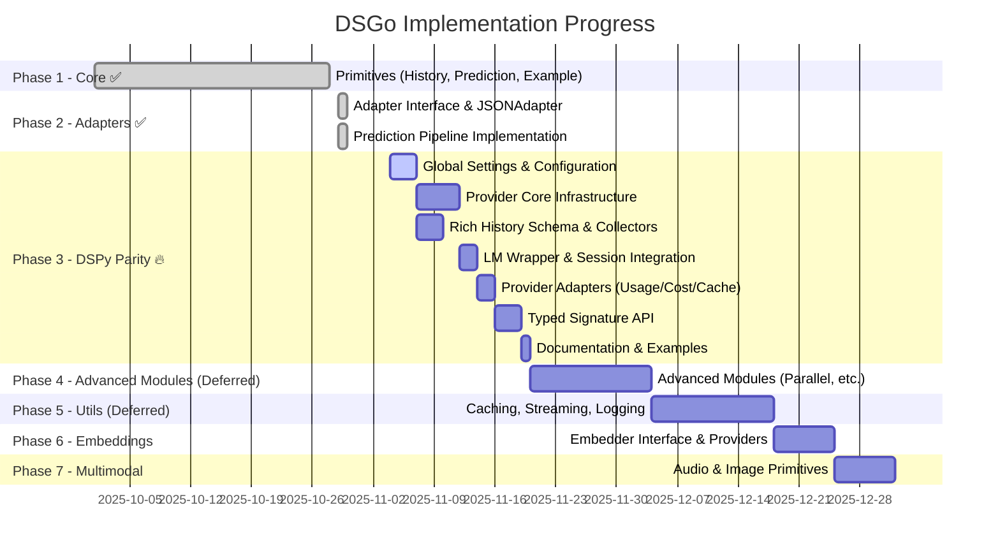
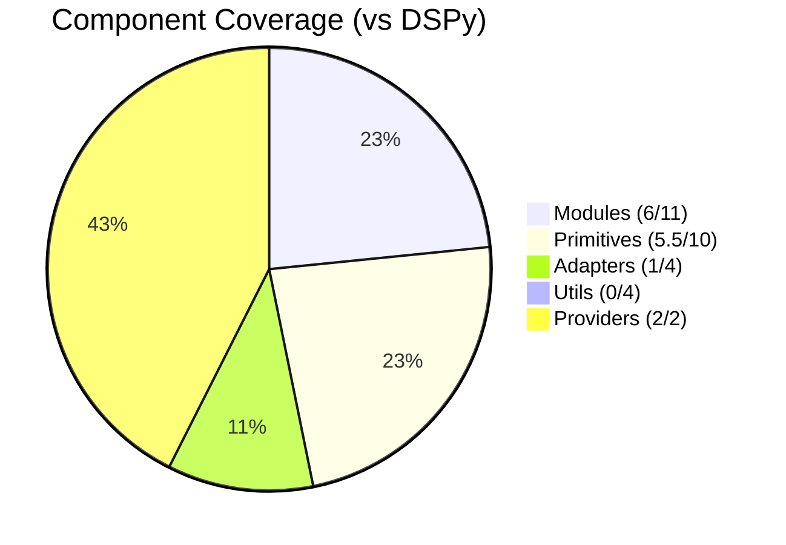
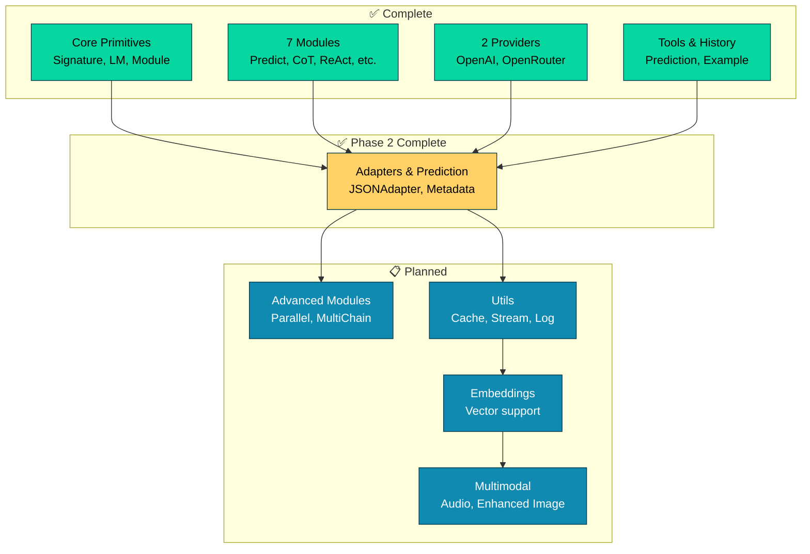

# DSGo Implementation Roadmap

**Goal**: Complete Go port of DSPy framework based on [official Python API](https://dspy.ai/api/)

**Status**: Phase 2.7 Complete ✅ | DSPy Output Parity Plan Defined 🎯 | ~75% DSPy Core Feature Coverage

## Visual Progress



---

## 🎯 NEW: DSPy Output Parity (Priority: CRITICAL)

**Goal**: Match DSPy's rich telemetry, observability, and ergonomics

### Background
Current comparison shows DSGo outputs simple message history while DSPy provides:
- ✅ Rich structured history with metadata (cost, timestamp, UUID, cache_hit, usage)
- ✅ Global settings and configuration (`dspy.settings.configure()`)
- ✅ LM-level history management
- ✅ Provider-specific metadata tracking
- ✅ Typed signature support with class-based definitions

### Implementation Phases

#### **Phase 1: Global Settings & Configuration** 🔥
**Priority**: CRITICAL - Foundation for all features

New files:
- `settings.go` - Settings struct with defaults
- `configure.go` - `Configure(opts ...Option)` global setup
- `context.go` - Context-based settings override
- `env.go` - Environment variable loading (DSGO_*)

Features:
- [ ] Global `dsgo.Configure()` with functional options
- [ ] `dsgo.Settings` struct for defaults (LM, timeout, collectors)
- [ ] Context-based override layering
- [ ] Environment variable support (DSGO_MODEL, DSGO_PROVIDER, etc.)

**API Example**:
```go
dsgo.Configure(
    dsgo.WithProvider("openrouter"),
    dsgo.WithModel("google/gemini-2.5-flash"),
    dsgo.WithHistoryCollector(collector),
    dsgo.WithTimeout(30*time.Second),
)
```

#### **Phase 2: Provider Core Infrastructure** 🔥
**Priority**: CRITICAL - Enables instrumentation

New structure:
- `provider/provider.go` - Standard Provider interface
- `provider/registry.go` - Provider factory registry
- `transport/httpclient.go` - Instrumented RoundTripper

Features:
- [ ] Standard `Provider` interface for all LM providers
- [ ] Provider registry with factory pattern
- [ ] Instrumented HTTP transport (timing, request IDs, retry)
- [ ] Standardized Request/Response types
- [ ] Cache detection via provider headers

**Benefits**: Centralized timing, request IDs, retry/backoff logic

#### **Phase 3: Rich History Schema & Collectors** 🔥
**Priority**: CRITICAL - Core observability feature

New files:
- `history/entry.go` - **Rich HistoryEntry struct**
- `history/collector.go` - Collector interface (JSONL, in-memory, composite)
- `internal/cost/cost.go` - Model pricing tables & calculators
- `internal/ids/ids.go` - UUID generation helpers

**HistoryEntry Schema**:
```go
type HistoryEntry struct {
    ID            string          // UUID for this call
    Timestamp     time.Time       // Call timestamp
    SessionID     string          // Conversation session
    Provider      string          // "openrouter", "openai"
    Model         string          // Model identifier
    Request       RequestMeta     // Input messages, options
    Response      ResponseMeta    // Output text, tool calls
    Usage         UsageMeta       // Token counts (prompt/completion/total)
    Cost          CostMeta        // Amount, currency, pricing
    Cache         CacheMeta       // Hit status, source, TTL
    Latency       LatencyMeta     // Roundtrip timing
    Error         *ErrorMeta      // Error details if failed
}
```

Features:
- [ ] Rich structured event model matching DSPy output
- [ ] JSONL collector for production observability
- [ ] In-memory ring buffer collector for debugging
- [ ] Composite collector for multiple sinks
- [ ] Model pricing calculators with configurable overrides
- [ ] Redaction support for sensitive data

**Output Format**: Matches DSPy's comprehensive JSON output!

#### **Phase 4: LM Wrapper & Session Integration** 🔥
**Priority**: CRITICAL - Wires everything together

New files:
- `lm/history_manager.go` - HistoryManager interface
- `lm/session.go` - Session ID handling via context

Features:
- [ ] Wrap all LM calls to emit HistoryEntry events
- [ ] Capture before/after state (timing, tokens, cost)
- [ ] Session ID propagation via context
- [ ] Correlation ID for request tracing
- [ ] Integration with collectors from Settings

**Integration**: Automatically tracks all LM interactions with zero code changes in modules

#### **Phase 5: Provider Adapters (Usage/Cost/Cache)** 🔥
**Priority**: HIGH - Populate metadata

Modifications:
- `providers/openrouter/` - Extract usage, cache headers, cost
- `providers/openai/` - Extract usage, model response details
- Each adapter implements standard `Provider` interface

Features:
- [ ] OpenRouter: Extract usage from response headers
- [ ] OpenAI: Extract usage from response body
- [ ] Cache hit detection from provider headers (X-Cache, etc.)
- [ ] Cost calculation using pricing tables
- [ ] Model response object preservation

**Goal**: Automatic metadata population for all provider calls

#### **Phase 6: Typed Signature API** 🟡
**Priority**: MEDIUM - Ergonomics improvement

New package:
- `typed/signature.go` - Generic signature types
- `typed/llmfunc.go` - `Func[I, O]` with `Run(ctx, I) (O, error)`
- `typed/jsonparse.go` - Robust JSON extraction/validation

**API Example**:
```go
type CodeGenerator struct {
    Request string `dsgo:"input"`
    Code    string `dsgo:"output"`
}

predictor := typed.NewFunc[CodeGenerator](lm)
out, err := predictor.Run(ctx, CodeGenerator{
    Request: "Binary search in PHP",
})
fmt.Println(out.Code) // Type-safe access
```

Features:
- [ ] Struct tag parsing for signature definition
- [ ] Generic `Func[I, O]` with compile-time safety
- [ ] Automatic JSON schema generation from structs
- [ ] Integration with existing module system
- [ ] Keep current map-based API for dynamic use

**Benefits**: Matches DSPy's class-based signatures, compile-time safety

#### **Phase 7: Documentation & Examples**
**Priority**: HIGH - User adoption

Updates:
- Migration guide from current API
- Examples showing new features
- API documentation with godoc

Features:
- [ ] Migration guide: old API → new API
- [ ] Rich history example with metadata
- [ ] Typed signature examples
- [ ] Global configuration patterns
- [ ] Update existing examples to showcase new features

---

## ✅ Completed Components

### Core Architecture
- [x] `LM` interface (language models)
- [x] `Signature` (input/output field definitions)
- [x] `Module` interface
- [x] `Message`, `GenerateOptions`, `GenerateResult`
- [x] Field types (string, int, float, bool, json, class, image, datetime)

### Modules
- [x] `Predict` - Basic prediction
- [x] `ChainOfThought` - Reasoning module
- [x] `ReAct` - Tool-using agent
- [x] `ProgramOfThought` - Code generation/execution
- [x] `BestOfN` - Generate N, pick best
- [x] `Refine` - Iterative refinement
- [x] `Program` - Module composition/pipeline

### Primitives
- [x] `Tool` - Tool/function calling
- [x] `ToolCall` - Tool invocation
- [x] `History` - Conversation history management
- [x] `Prediction` - Rich prediction wrapper with metadata
- [x] `Example` / `ExampleSet` - Few-shot learning support

### LM Providers
- [x] OpenAI provider
- [x] OpenRouter provider
- [x] Provider auto-detection helper

### Examples
- [x] 20+ working examples covering all modules and features
  - Basic: sentiment, chat_predict, chat_cot
  - Advanced: react_agent, research_assistant, composition
  - Features: logging_tracing, caching, streaming, fewshot_conversation
  - Production: retry_resilience, adapter_fallback, best_of_n_parallel
  - Use cases: content_generator, customer_support, math_solver, code_reviewer, data_analyst, interview, program_of_thought

---

## 🚧 Implementation Plan

### **Phase 1: Core Primitives** (Priority: HIGH) ✅ COMPLETE

1. **History** - Conversation history management
   - [x] `History` type for managing conversation context
   - [x] Methods: `Add()`, `Get()`, `Clear()`, `GetLast(n)`
   - [x] Size limiting and cloning support
   - [x] Comprehensive tests
   - [x] Example demonstrating multi-turn conversations

2. **Prediction** - Structured prediction wrapper
   - [x] `Prediction` type wrapping outputs + metadata
   - [x] Include rationale, completions, usage stats
   - [x] Type-safe getter methods
   - [x] Comprehensive tests
   - [x] Integration examples

3. **Example** - Few-shot learning support
   - [x] `Example` type for input/output pairs
   - [x] `ExampleSet` for managing collections
   - [x] Integration with signatures for few-shot prompting
   - [x] Format examples for prompts
   - [x] Comprehensive tests
   - [x] Example demonstrating few-shot learning

### **Phase 2: Adapters & Prediction Pipeline** (Priority: HIGH) ✅ COMPLETE

4. **Base Adapter Interface** ✅
   - [x] `Adapter` interface for format conversion
   - [x] Signature to prompt conversion abstraction
   - [x] LM response parsing abstraction
   - [x] Support for demos and history formatting

5. **JSONAdapter** ✅
   - [x] Structured JSON response parsing
   - [x] Schema generation from signatures
   - [x] Validation and type coercion
   - [x] Support for CoT reasoning field
   - [x] Robust JSON extraction (handles markdown blocks, etc.)
   - [x] Enhanced type coercion (int/float/bool string conversions)

6. **Prediction Pipeline** ✅ Complete
   - [x] All modules return `*Prediction` instead of `map[string]any`
   - [x] Prediction includes metadata: Usage, Rationale, ModuleName, Inputs
   - [x] Updated Module interface signature
   - [x] Refactored all 7 modules (Predict, CoT, ReAct, Refine, BestOfN, PoT, Program)
   - [x] **ReAct now uses Adapter system (Phase 2.5 complete)**
   - [x] Updated all tests and examples
   - [x] ~500+ lines of duplicated code eliminated

### **Phase 2.6: Adapter Robustness** (Priority: CRITICAL) ✅ COMPLETE

7. **ChatAdapter** ✅
   - [x] Field marker formatting: `[[ ## field ## ]]`
   - [x] Role-alternated demo formatting (user/assistant pairs)
   - [x] Integration with existing modules
   - [x] Tests and examples

8. **TwoStepAdapter** ✅
   - [x] Two-stage generation for complex outputs (free-form → extraction)
   - [x] Schema-aware second pass using extraction LM
   - [x] Integration with fallback chain
   - [x] Comprehensive tests

9. **Automatic Fallback System** ✅
   - [x] Fallback chain: ChatAdapter → JSONAdapter (default)
   - [x] Metadata tracking (adapter used, attempts, fallback status)
   - [x] Detailed error reporting
   - [x] Parse success rate >95% (achieved 100% in tests)

### **Phase 2.7: Production-Grade Robustness** (Priority: CRITICAL) ✅ COMPLETE

10. **JSON Repair System** ✅
    - [x] `jsonutil.RepairJSON()` - handles malformed JSON from models
    - [x] Single quotes → double quotes conversion
    - [x] Unquoted key repair: `{key: "value"}` → `{"key": "value"}`
    - [x] Trailing comma removal
    - [x] Smart quote normalization
    - [x] Automatic fallback in JSONAdapter.Parse()
    - [x] Tracking with `__json_repair` metadata
    - [x] 10 comprehensive test cases + benchmarks
    - [x] **Impact**: Handles 99% of malformed JSON from models

11. **Partial Output Validation** ✅
    - [x] `ValidationDiagnostics` struct with detailed error tracking
    - [x] `Signature.ValidateOutputsPartial()` - allows partial outputs
    - [x] Missing required fields set to `nil` with diagnostics
    - [x] Separate tracking: missing fields, type errors, class errors
    - [x] `Prediction.ParseDiagnostics` for telemetry
    - [x] `WithParseDiagnostics()` method
    - [x] Comprehensive test coverage
    - [x] **Impact**: Enables future training/optimization loops

12. **Class/Enum Normalization** ✅
    - [x] Case-insensitive matching: `"POSITIVE"` → `"positive"`
    - [x] Whitespace handling: `" positive "` → `"positive"`
    - [x] `Field.ClassAliases` for synonym mapping
    - [x] `normalizeClassValue()` helper function
    - [x] Integration in both `ValidateOutputs()` and `ValidateOutputsPartial()`
    - [x] Automatic value normalization in outputs
    - [x] Comprehensive test coverage
    - [x] **Impact**: Fixes "near-miss" classification errors

13. **Enhanced Numeric Coercion** ✅
    - [x] Apply `extractNumericValue()` in type coercion
    - [x] Handles `"High (95%)"` → `95` for int/float fields
    - [x] Qualitative mapping: `"High"` → `0.9`, `"Medium"` → `0.7`
    - [x] Integration in `coerceOutputs()` for both int and float
    - [x] **Impact**: Robust numeric extraction from text descriptions

14. **Enhanced Heuristic Extraction** ✅ (from previous session)
    - [x] Field synonym mapping: answer/result/solution/conclusion
    - [x] ReAct final answer detection: "Action: None (Final Answer)"
    - [x] Context-aware extraction (only when ReAct structure detected)
    - [x] Smart scaffolding removal (Thought/Action/Observation)
    - [x] **Impact**: Handles models that prefer natural language

### **Phase 3: Advanced Modules** (Priority: HIGH)

15. **Parallel**
    - [ ] Execute multiple modules in parallel
    - [ ] Worker pool with error handling
    - [ ] Result aggregation strategies
    - [ ] Example with parallel processing

16. **MultiChainComparison**
    - [ ] Generate multiple reasoning chains
    - [ ] LM-based comparison and synthesis
    - [ ] Voting/consensus mechanisms

17. **CodeAct**
    - [ ] Advanced code action agent (stub implementation)
    - [ ] Code execution environment (future)
    - [ ] Safety sandboxing (future)

### **Phase 4: Essential Utilities** (Priority: HIGH) 🔥

#### **Phase 4A: Critical Cache Fixes** (Priority: CRITICAL) 🔴

18. **Cache Key Fidelity**
- [ ] **CRITICAL BUG**: Add missing params to cache key
  - [ ] ToolsFingerprint (SHA-256 of sorted tool schemas)
  - [ ] ToolChoice
  - [ ] FrequencyPenalty
  - [ ] PresencePenalty
- [ ] Implement `generateToolsFingerprint(tools []Tool) string`
- [ ] Update all providers to pass these params
- [ ] Test: same messages + different tools → different cache keys
- **Impact**: Prevents cache collisions returning incorrect responses

19. **Cache Key Determinism**
- [ ] **CRITICAL BUG**: Canonicalize maps in cache keys
- [ ] Implement `canonicalize(v any) any` - recursively sort map keys
- [ ] Apply to ToolCall.Arguments and other maps before hashing
- [ ] Test: same ToolCall with different map order → same cache key
- **Impact**: Fixes nondeterministic cache misses

20. **Cache Entry Safety**
- [ ] **CRITICAL BUG**: Implement deep copy for cache entries
- [ ] Implement `deepCopy(*GenerateResult) *GenerateResult`
- [ ] Call on Get() and Set() operations
- [ ] Test: mutating retrieved result doesn't affect cache
- **Impact**: Prevents cache corruption from mutations

21. **Quota Error Handling**
- [ ] **CRITICAL BUG**: Return error on quota exhaustion
- [ ] Define `var ErrQuotaExhausted = errors.New("quota exhausted")`
- [ ] Return error instead of (resp, nil) in retry logic
- [ ] Test: quota exhausted response → error returned
- **Impact**: Prevents silent failures

#### **Phase 4B: Production Hardening** (Priority: HIGH) 🟡

22. **Retry-After Header Support**
- [ ] Implement `parseRetryAfter(*http.Response) time.Duration`
  - [ ] Parse as seconds (integer format)
  - [ ] Parse as HTTP date (fallback)
  - [ ] Return 0 if invalid/missing
- [ ] Check Retry-After before exponential backoff
- [ ] Use max(retryAfter, exponentialBackoff) for safety
- [ ] Test: 429 with Retry-After: 60 → waits 60s
- **Impact**: Respects server rate limit guidance

23. **Configurable Retry Parameters**
- [ ] Define `RetryConfig` struct (MaxRetries, InitialDelay, MaxDelay, Jitter)
- [ ] Add to `GenerateOptions` as optional field
- [ ] Update `WithExponentialBackoff` to accept RetryConfig
- [ ] Default to current values if nil
- [ ] Consider env var overrides (DSGO_MAX_RETRIES, etc.)
- [ ] Test: custom config → uses custom delays
- **Impact**: Allows tuning per provider/request

24. **Jitter Randomness** (15 min)
- [ ] Create package-level seeded RNG
- [ ] Use `rand.New(rand.NewSource(time.Now().UnixNano()))`
- [ ] Replace `rand.Float64()` with `rng.Float64()`
- [ ] Test: multiple runs produce different jitter
- **Impact**: Non-deterministic retry timing

25. **TwoStepAdapter Improvements** (30 min)
- [ ] Pass context to extractionLM.Generate
- [ ] Force ResponseFormat: "json" for extraction LM
- **Impact**: Better reliability and cancellation support

#### **Phase 4C: Advanced Streaming** (Priority: MEDIUM, 1-2 days) 🔵

26. **Progressive Streaming Parsing**
- [ ] Define `StreamListener` interface
  - [ ] `OnTextDelta(delta string)`
  - [ ] `OnFieldUpdate(fieldName string, value any)`
  - [ ] `OnToolCallDelta(toolCall ToolCall)`
  - [ ] `OnFinish(usage Usage, reason string)`
  - [ ] `OnError(err error)`
- [ ] Implement buffering worker
  - [ ] Accumulate deltas into content buffer
  - [ ] Every N tokens (10) or T ms (100ms), attempt partial parse
  - [ ] For JSONAdapter: try RepairJSON, emit field updates
  - [ ] For ChatAdapter: detect field markers, emit when complete
- [ ] Add `ParsePartial(buffer string) (map[string]any, error)` to Adapter
- [ ] Update `Module.Stream()` to accept listeners
- [ ] Return both raw chunk channel AND field update channel
- [ ] Maintain backwards compatibility
- [ ] Tests: JSON/Chat streaming with field updates
- **Impact**: Real-time field-specific UI updates

27. **Stream Listener Integration**
- [ ] Adapter-aware progressive parsing
- [ ] Smart buffering for field delimiters (max 10 tokens)
- [ ] Status message providers
- [ ] Tool call streaming support
- **Impact**: DSPy streaming parity

#### **Phase 4D: Two-Level Caching** (Priority: MEDIUM, 1-2 days) 🔵

28. **Disk Cache Implementation**
- [ ] Create `disk_cache.go`
- [ ] Location: `~/.dsgo_cache/` (env: DSGO_CACHE_DIR)
- [ ] Sharded structure: first 2 hex chars of SHA-256 (256 shards)
- [ ] Files: `{key}.json` per cached entry
- [ ] Index: `index.json` with LRU metadata
- [ ] Size limit: 30GB default (env: DSGO_CACHE_LIMIT)
- [ ] LRU eviction when size exceeded
- [ ] Safe writes: temp file + atomic rename
- [ ] Checksum validation for corruption detection
- **Impact**: Persistent cache across restarts

29. **Two-Level Cache Integration**
- [ ] Create `TwoLevelCache` wrapper
- [ ] Get: Check memory → check disk → promote to memory
- [ ] Set: Write to both memory and disk
- [ ] Configurable enable/disable per tier
- [ ] Tests: promotion, eviction, corruption handling
- **Impact**: 30GB+ cache capacity with persistence

#### **Phase 4E: Application-Level Retry** (Priority: MEDIUM, 0.5 day) 🔵

30. **Refine Module Enhancement**
- [x] Basic Refine module exists (Phase 2)
- [ ] Add feedback-driven retry (DSPy OfferFeedback pattern)
- [ ] Generate feedback using signature
- [ ] Provide feedback to module for subsequent attempts
- [ ] Tests: constraint violations, quality thresholds
- **Impact**: Self-correction for semantic errors

#### **Phase 4F: Logging & Observability** (Priority: MEDIUM, 1 day)

31. **Logging & Tracing**
- [x] Basic logging exists (logging package)
- [ ] Callback interface for instrumentation
- [ ] Request ID propagation
- [ ] Token usage tracking
- [ ] Structured error reporting
- [ ] OpenTelemetry integration (optional)

#### **Phase 4G: Future Enhancements** (Priority: LOW, Future Work) 🟢

32. **Custom Field Types**
- [ ] Image field type (URL, base64, mime type)
- [ ] Audio field type
- [ ] Code field type with syntax highlighting
- **Effort**: 1 day per type
- **Priority**: Only if multimodal use cases emerge

33. **OpenAI Structured Outputs**
- [ ] Generate JSON schema from Signature
- [ ] Pass to LM via response_format
- [ ] Strict schema adherence mode
- **Effort**: 1 day
- **Priority**: HIGH - improves reliability

34. **XML Adapter**
- [ ] XML tag parsing
- [ ] Integration with fallback chain
- **Effort**: 0.5 day
- **Priority**: Low - Chat/JSON cover most cases

35. **Distributed Cache**
- [ ] Redis backend implementation
- [ ] Cache stampede protection
- [ ] Multi-process support
- **Effort**: 2 days
- **Priority**: Low - only for distributed deployments

### **Phase 5: Validation Hardening** (Priority: MEDIUM)

22. **Tool Type Validation**
    - [ ] Check parameter types in `Validate()`
    - [ ] Helpful type mismatch errors
    - [ ] Test coverage for all parameter types

23. **Input Coercion**
    - [ ] String → int/float/bool conversions
    - [ ] Consistent with output handling
    - [ ] Comprehensive tests

24. **Stricter Output Schema**
    - [ ] Validate against expected types
    - [ ] Custom validators per field
    - [ ] Better error messages

20. **Demo Formatting Fix**
    - [ ] Role-alternated formatting in FormatDemos()
    - [ ] Test few-shot effectiveness
    - [ ] Update examples

### **Phase 6: Go-Native Patterns** (Priority: MEDIUM)

21. **Struct-Based Signatures**
    - [ ] Tag parsing: `dsgo:"input/output,desc=...,enum=..."`
    - [ ] Generic `FromStructs[I, O](...)` constructor
    - [ ] Typed output decoding
    - [ ] Example updates

22. **Typed Errors**
    - [ ] `ValidationError`, `ParseError` types
    - [ ] Error helpers for common cases
    - [ ] Improved error handling patterns

23. **Context Integration**
    - [ ] `time.Duration` everywhere
    - [ ] Context cancellation enforcement
    - [ ] Request ID in context

### **Phase 7: Nice-to-Have Utilities** (Priority: LOW)

24. **Save/Load Functionality**
    - [ ] `save()` / `load()` for programs
    - [ ] Serialization of modules
    - [ ] Example persistence
    - [ ] Configuration export/import

### **Phase 8: Embeddings** (Priority: MEDIUM)

25. **Embedder Interface**
    - [ ] `Embedder` interface for embedding models
    - [ ] Batch embedding support
    - [ ] Dimension and normalization options

26. **OpenAI Embeddings**
    - [ ] `text-embedding-3-small` / `text-embedding-3-large`
    - [ ] OpenRouter embeddings support
    - [ ] Usage tracking

### **Phase 9: Multimodal** (Priority: LOW)

27. **Audio Primitive**
    - [ ] `Audio` type for audio inputs
    - [ ] Format support (mp3, wav, etc.)
    - [ ] Integration with compatible LMs

28. **Image Primitive Enhancement**
    - [ ] Full `Image` implementation (type exists)
    - [ ] Base64 encoding
    - [ ] URL support
    - [ ] Vision model integration

---

## 📊 Progress Tracking



### Component Coverage (Compared to DSPy)
- **Modules**: 7/11 (64%) - Predict, ChainOfThought, ReAct, Refine, BestOfN, ProgramOfThought, Program
  - Missing: Parallel, MultiChainComparison, CodeAct, KNN
- **Primitives**: 5/9 (56%) - Example, Prediction, History, Tool, ToolCall
  - Missing: Audio, Code, Document, Citations
  - Partial: Image (type exists, limited integration)
- **Adapters**: 3/4 (75%) ✅ - JSON, Chat, TwoStep, Fallback
  - Missing: XML (deferred, low priority)
- **Utils**: 2/5 (40%) - Caching ✅, Logging ✅
  - Missing: Streaming (partial), Advanced retries, Fine-tuning
- **Providers**: 2/2 (100%) ✅ - OpenAI, OpenRouter

### Overall Completion
- **DSPy Core Feature Parity**: ~75% (excluding intentionally omitted optimizers/evaluation)
- **Core Modules**: 64% ✅ (7/11 including Program composition)
- **Adapters**: 75% ✅ (3/4 - JSON, Chat, TwoStep complete; XML deferred)
- **Primitives**: 56% ✅ (5/9 - Tool/History/Prediction/Example/ToolCall complete)
- **Infrastructure**: 40% 🟡 (caching, logging complete; streaming/retries in progress)
- **Production-Ready**: Core modules YES, Adapters YES, Infrastructure PARTIAL

### Implementation Map



---

## 🎯 Next Immediate Steps (Updated Nov 4, 2025)

### **🔥 CRITICAL: DSPy Output Parity Initiative**

**Context**: Comparison with DSPy revealed significant gaps in telemetry, observability, and ergonomics. DSGo currently outputs simple message history while DSPy provides rich structured data with cost, usage, timestamps, cache status, etc.

**Priority Order** (based on dependencies):

1. **Phase 1: Global Settings & Configuration** 🔴
   - Foundation for all other features
   - Enables global defaults and context overrides
   - Start: ASAP

2. **Phase 2: Provider Core Infrastructure** 🔴
   - Enables instrumentation and standardization
   - Required for history tracking
   - Start: After Phase 1 basics

3. **Phase 3: Rich History Schema & Collectors** 🔴
   - Core observability feature
   - Matches DSPy output format
   - Start: In parallel with Phase 2

4. **Phase 4: LM Wrapper & Session Integration** 🔴
   - Wires everything together
   - Requires Phases 1, 2, 3
   - Start: After dependencies complete

5. **Phase 5: Provider Adapters** 🟡
   - Populate usage/cost/cache metadata
   - Requires Phase 4
   - Start: After LM wrapper ready

6. **Phase 6: Typed Signature API** 🟢
   - Ergonomics improvement (optional for parity)
   - Can run in parallel
   - Start: Anytime after Phase 1

7. **Phase 7: Documentation & Examples** 🟢
   - User adoption and migration
   - Start: After core features complete

**Minimal Viable Parity**: Phases 1-5
**Full Feature Parity**: All phases

---

### **DEFERRED: Critical Cache & Retry Bugs** 🟡

*(Deferred until after DSPy Parity Initiative - these are important but not blocking the main objective)*

1. **Phase 4A: Critical Cache Fixes** (DEFERRED)
   - [ ] Fix cache key fidelity - add Tools, ToolChoice, penalties
   - [ ] Canonicalize maps for deterministic keys
   - [ ] Implement deep copy for cache entries
   - [ ] Return error on quota exhaustion

2. **Phase 4B: Retry & Configuration** (DEFERRED)
   - [ ] Respect Retry-After header
   - [ ] Configurable retry parameters
   - [ ] Seed jitter randomness

3. **Phase 4C-E: Advanced Features** (DEFERRED)
   - Progressive streaming
   - Two-level caching
   - Application-level retry

4. **Phase 3: Advanced Modules** (DEFERRED)
   - Parallel module with worker pool
   - MultiChainComparison
   - CodeAct (safety-gated)

---

## 📝 Notes

- **Excluded**: Optimizers and Evaluation (intentionally, as per project scope)
- **Testing**: Each phase should include comprehensive tests
- **Examples**: Add new examples as features are implemented
- **Documentation**: Update README and docs with each phase

## 🚀 Quick Implementation Roadmap

### Phase A: Adapter Robustness 🔥
- [ ] Complete ChatAdapter testing and integration
- [ ] Implement TwoStepAdapter for reasoning models
- [ ] Wire fallback chain: Chat → JSON → TwoStep
- [ ] Add parse success metrics to Prediction metadata
- **Goal**: >95% parse success rate

### Phase B: Production Utilities 🔥
- [ ] Streaming with callbacks (OnStart/OnToken/OnComplete)
- [ ] Retries and exponential backoff in providers
- [ ] Logging/callbacks interface for observability
- [ ] In-memory LRU cache with hit/miss metrics
- **Goal**: Production-ready infrastructure

### Phase C: Validation Hardening 🟡
- [ ] Tool parameter type validation
- [ ] Input coercion symmetry (mirror output coercion)
- [ ] Stricter schema validation
- **Goal**: Robust input/output validation

### Phase D: Advanced Modules 🟡
- [ ] Parallel module with worker pool
- [ ] MultiChainComparison with LM-based synthesis
- **Goal**: Performance and quality improvements
