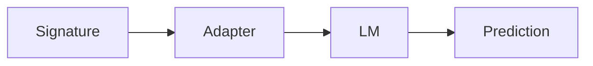

# core

Primitives used by DSGo modules: signatures, adapters, prediction, LM interface, caching, history.

## Data flow



## Configuration precedence

```mermaid
flowchart TD
  E[Process env] --> C[Configure(...)]
  D[Defaults] --> C
  F[.env files] --> E
  C --> R[Final settings]
```

- `.env` loading lives in `internal/env` and is triggered by `core.Configure()`.
- `core.Configure()` returns an error if no API key env vars are set.
- Settings and configuration live in `core`.

## Environment variables (common)

| Variable | Purpose |
|---|---|
| `DSGO_TIMEOUT` | Default timeout in seconds |
| `DSGO_MAX_RETRIES` | Default retry attempts |
| `DSGO_TRACING` | Enable tracing (`true`/`false`) |
| `DSGO_MAX_TOKENS` | Default max tokens (GenerateOptions) |
| `DSGO_TEMPERATURE` | Default temperature (GenerateOptions) |
| `DSGO_CACHE` | Enable/disable caching |
| `DSGO_CACHE_MEMORY` | Memory cache capacity |
| `DSGO_CACHE_DISK` | Enable/disable disk cache |
| `DSGO_CACHEDIR` | Disk cache directory |
| `DSGO_CACHE_LIMIT` | Disk cache size limit (bytes) |
| `DSGO_CACHE_TTL` | Cache TTL |
| `DSGO_OPENAI_API_KEY` | OpenAI API key (preferred) |
| `DSGO_OPENROUTER_API_KEY` | OpenRouter API key (preferred) |
| `OPENAI_API_KEY` | OpenAI API key (fallback) |
| `OPENROUTER_API_KEY` | OpenRouter API key (fallback) |
| `DSGO_STRUCTURED_OUTPUTS` | Enable structured output enforcement |
| `DSGO_STRUCTURED_MAX_ATTEMPTS` | Max structured validation attempts |
| `DSGO_STRUCTURED_TEMPERATURE` | Temperature override for structured mode |
| `DSGO_DEBUG_PARSE` | Parse debug |
| `DSGO_DEBUG_MARKERS` | Streaming marker debug |
| `DSGO_ENV_FILE_PATH` | Explicit .env path for Configure auto-load |

## Key files

- `signature.go`: signature + field validation
- `adapter.go`: adapters and fallback parsing
- `prediction.go`: `Prediction` metadata and helpers
- `lm.go`: `LM` interface
- `history.go`: thread-safe conversation history
- `collector.go`: collectors for observability
- `settings.go` / `configure.go`: global configuration
