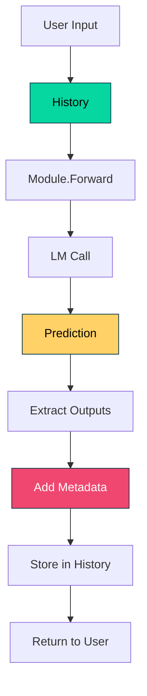

# 011_history_prediction - History and Prediction Primitives

## Overview

Demonstrates two fundamental primitives in DSGo: **History** for managing multi-turn conversations and **Prediction** with rich metadata. These building blocks are essential for creating stateful, observable LM programs.

## What it demonstrates

- Multi-turn conversation history with message limits
- System/user/assistant message management
- History inspection and statistics
- Rich predictions with metadata (rationale, score, module name)
- Type-safe prediction getters (GetString, GetFloat, etc.)
- Classification with confidence scores
- Token tracking across conversation turns

## Usage

```bash
cd examples/011_history_prediction
go run main.go
```

### With Harness Flags

```bash
go run main.go -verbose -format=json
go run main.go -concurrency=1 -timeout=120
```

### Environment Variables

```bash
export HARNESS_VERBOSE=true
export HARNESS_OUTPUT_FORMAT=json
go run main.go
```

## Expected Output

```
=== DSGo Primitives Demo: History and Prediction ===
Learn about conversation history and rich prediction metadata

--- Demo 1: Conversation History ---

[Turn 1]
User: What is a closure in JavaScript?
Assistant: A closure is a function that has access to variables in its outer scope...

[Turn 2]
User: Can you show me a simple example?
Assistant: Here's a simple example: function outer() { let count = 0; return function inner() { count++; return count; } }

[Turn 3]
User: How is this different from a regular function?
Assistant: A closure maintains state between calls via captured variables...

📊 Conversation Stats:
  Total messages: 7
  Last 3 messages:
    1. [user] How is this different from a regular function?
    2. [assistant] A closure maintains state between calls via ca...
    3. [system] You are a helpful coding assistant. Keep resp...

--- Demo 2: Rich Predictions with Metadata ---
Input: This product exceeded my expectations! Highly recommended.

📦 Prediction Details:
  Sentiment: positive
  Confidence: 0.95
  Reasoning: The text contains strong positive language...
  Module: SentimentClassifier

✅ Type-safe access: sentiment = positive

📊 Summary:
  Total demos executed: 2
  Total tokens used: 1850
  ✅ All primitive examples completed successfully!

💡 Next: See 015_fewshot for few-shot learning with example demonstrations
```

## Key Concepts

### 1. History - Multi-Turn Conversations

**History** tracks conversation context across turns:

```go
history := dsgo.NewHistoryWithLimit(10) // Keep last 10 messages

history.AddSystemMessage("You are a helpful coding assistant.")
history.AddUserMessage("What is a closure?")
history.AddAssistantMessage("A closure is a function...")
```

**Key Features:**
- Automatically manages conversation context
- Limits message count to prevent context overflow
- Supports system, user, and assistant roles
- Enables multi-turn conversations with context retention

**Message Roles:**
- **System**: Set behavior/personality/instructions
- **User**: User queries and inputs
- **Assistant**: LM responses

### 2. History Inspection

Monitor conversation state:

```go
// Get conversation statistics
totalMessages := history.Len()

// Get recent messages
last3 := history.GetLast(3)

// Get all messages
allMessages := history.GetMessages()

// Inspect individual messages
for _, msg := range allMessages {
    fmt.Printf("[%s] %s\n", msg.Role, msg.Content)
}
```

**Use Cases:**
- Debug conversation flow
- Monitor context window usage
- Implement conversation summaries
- Track token consumption

### 3. Rich Predictions with Metadata

**Prediction** wraps LM outputs with metadata:

```go
prediction := outputs.
    WithRationale("The text contains strong positive language").
    WithScore(0.95).
    WithModuleName("SentimentClassifier").
    WithInputs(map[string]any{"text": text})
```

**Available Metadata:**
- `Rationale`: Reasoning or explanation
- `Score`: Confidence or quality score (0-1)
- `ModuleName`: Which module produced this
- `Inputs`: Original inputs (for traceability)
- `Usage`: Token statistics
- `AdapterUsed`: Which adapter parsed response
- `ParseAttempts`: Number of parse attempts

### 4. Type-Safe Getters

Access prediction outputs safely:

```go
// String output
if sentiment, ok := prediction.GetString("sentiment"); ok {
    fmt.Printf("Sentiment: %s\n", sentiment)
}

// Float output
if confidence, ok := prediction.GetFloat("confidence"); ok {
    fmt.Printf("Confidence: %.2f\n", confidence)
}

// Int output
if count, ok := prediction.GetInt("count"); ok {
    fmt.Printf("Count: %d\n", count)
}

// Bool output
if valid, ok := prediction.GetBool("is_valid"); ok {
    fmt.Printf("Valid: %v\n", valid)
}
```

**Benefits:**
- No runtime type assertion panics
- Clean error handling with `ok` pattern
- Explicit type checking

### 5. Combining History with Modules

Use history to maintain context across module calls:

```go
history := dsgo.NewHistoryWithLimit(10)
history.AddSystemMessage("You are a helpful assistant.")

predict := module.NewPredict(sig, lm)

// Turn 1
history.AddUserMessage("What is DSGo?")
result1, _ := predict.Forward(ctx, map[string]any{
    "question": "What is DSGo?",
})
answer1, _ := result1.GetString("answer")
history.AddAssistantMessage(answer1)

// Turn 2 - LM can reference previous context if you pass history
history.AddUserMessage("How do I install it?")
result2, _ := predict.Forward(ctx, map[string]any{
    "question": "How do I install it?",
})
answer2, _ := result2.GetString("answer")
history.AddAssistantMessage(answer2)
```

**Note:** DSGo modules don't automatically use history. You need to incorporate history into your prompt or use a custom adapter that includes it.

## Use Cases

### 1. Chatbots and Conversational AI

Maintain context across user interactions:

```go
history := dsgo.NewHistoryWithLimit(20)
history.AddSystemMessage("You are a customer support agent. Be helpful and concise.")

for userInput := range userMessages {
    history.AddUserMessage(userInput)
    
    result, _ := chatModule.Forward(ctx, map[string]any{
        "message": userInput,
    })
    
    response, _ := result.GetString("response")
    history.AddAssistantMessage(response)
    
    fmt.Printf("Bot: %s\n", response)
}
```

### 2. Observability and Debugging

Track predictions with full metadata:

```go
result, _ := predict.Forward(ctx, inputs)

prediction := result.
    WithModuleName("EmailClassifier").
    WithScore(confidence).
    WithRationale(reasoning)

// Log for monitoring
log.Printf("Module: %s, Score: %.2f, Tokens: %d",
    prediction.ModuleName,
    prediction.Score,
    prediction.Usage.TotalTokens)

// Store for analytics
analytics.RecordPrediction(prediction)
```

### 3. Multi-Agent Systems

Different agents maintaining separate conversation histories:

```go
// Agent 1: Research assistant
researchHistory := dsgo.NewHistoryWithLimit(15)
researchHistory.AddSystemMessage("You are a research assistant.")

// Agent 2: Writing assistant
writingHistory := dsgo.NewHistoryWithLimit(15)
writingHistory.AddSystemMessage("You are a creative writing assistant.")

// Each agent maintains its own context
researchHistory.AddUserMessage("Find papers on DSPy")
writingHistory.AddUserMessage("Write a blog post introduction")
```

### 4. Context Window Management

Prevent context overflow with automatic limits:

```go
// Only keep last 10 messages (20 with system message)
history := dsgo.NewHistoryWithLimit(10)

// As conversation grows, oldest messages are dropped automatically
for i := 0; i < 100; i++ {
    history.AddUserMessage(fmt.Sprintf("Question %d", i))
    history.AddAssistantMessage(fmt.Sprintf("Answer %d", i))
}

// History only contains last 10 message pairs
fmt.Printf("Total messages: %d\n", history.Len()) // ~21 (10 pairs + system)
```

## Advanced Patterns

### Conversation Summarization

Summarize old messages before discarding:

```go
history := dsgo.NewHistory()

// When history gets too long
if history.Len() > 20 {
    // Get old messages
    oldMessages := history.GetMessages()[:10]
    
    // Summarize them
    summary := summarizeMessages(oldMessages)
    
    // Create new history with summary
    newHistory := dsgo.NewHistory()
    newHistory.AddSystemMessage("Previous conversation: " + summary)
    
    // Add recent messages
    for _, msg := range history.GetLast(10) {
        newHistory.AddMessage(msg.Role, msg.Content)
    }
    
    history = newHistory
}
```

### Branching Conversations

Create conversation branches:

```go
mainHistory := dsgo.NewHistory()
mainHistory.AddUserMessage("What is Go?")
mainHistory.AddAssistantMessage("Go is a programming language...")

// Branch 1: Continue with Go questions
branch1 := cloneHistory(mainHistory)
branch1.AddUserMessage("Show me a Go example")

// Branch 2: Switch to different topic
branch2 := cloneHistory(mainHistory)
branch2.AddUserMessage("What about Rust?")
```

### Prediction Chaining

Chain predictions with metadata:

```go
// Step 1: Generate
generateSig := dsgo.NewSignature("Generate story idea").
    AddOutput("idea", dsgo.FieldTypeString, "Story idea")
generateModule := module.NewPredict(generateSig, lm)

idea, _ := generateModule.Forward(ctx, map[string]any{})
ideaPred := idea.WithModuleName("IdeaGenerator").WithScore(0.8)

// Step 2: Refine (using previous prediction)
refineSig := dsgo.NewSignature("Refine story idea").
    AddInput("idea", dsgo.FieldTypeString, "Original idea").
    AddOutput("refined", dsgo.FieldTypeString, "Refined idea")
refineModule := module.NewPredict(refineSig, lm)

refined, _ := refineModule.Forward(ctx, map[string]any{
    "idea": ideaPred.Outputs["idea"],
})
refinedPred := refined.
    WithModuleName("IdeaRefiner").
    WithScore(0.9).
    WithInputs(map[string]any{"previous": ideaPred})

fmt.Printf("Chain: %s -> %s\n", ideaPred.ModuleName, refinedPred.ModuleName)
```

## Performance Characteristics

**History:**
- Memory per message: ~100-1000 bytes (depends on content)
- Lookup time: O(1) for recent messages
- Limit enforcement: O(1) per add

**Prediction Metadata:**
- Overhead: Negligible (~100 bytes per prediction)
- No performance impact on inference

## Troubleshooting

### History Growing Too Large

**Symptom:** High token usage, slow responses

**Solution:**
```go
// Use message limits
history := dsgo.NewHistoryWithLimit(10)

// Or periodically clear old messages
if history.Len() > 20 {
    history = dsgo.NewHistory()
    history.AddSystemMessage(systemPrompt)
}
```

### Type Assertion Errors

**Symptom:** `panic: interface conversion`

**Solution:** Use type-safe getters:
```go
// ❌ Unsafe
sentiment := prediction.Outputs["sentiment"].(string) // Can panic!

// ✅ Safe
if sentiment, ok := prediction.GetString("sentiment"); ok {
    fmt.Println(sentiment)
}
```

### Missing Metadata

**Symptom:** Prediction metadata is nil or empty

**Solution:** Explicitly set metadata:
```go
prediction := result.
    WithModuleName("MyModule").
    WithScore(0.9).
    WithRationale("Reasoning here")
```

## Comparison with Other Approaches

**vs. Manual Message Arrays:**
- History: Automatic limit enforcement, role validation
- Manual: More control, more boilerplate

**vs. Raw map[string]any:**
- Type-safe getters: Prevents panics, cleaner code
- Raw maps: More flexible, easier to misuse

**vs. String Concatenation for Context:**
- History: Structured, inspectable, token-aware
- String concat: Simple but brittle, no structure

## See Also

- [008_chat_predict](../008_chat_predict/) - Multi-turn conversations with Predict
- [009_chat_cot](../009_chat_cot/) - Multi-turn with Chain of Thought
- [015_fewshot](../015_fewshot/) - Few-shot learning (completes the primitive trio)
- [013_sentiment](../013_sentiment/) - Example using Prediction metadata
- [QUICKSTART.md](../../QUICKSTART.md) - Getting started guide

## Production Tips

1. **Always Use History Limits**: Prevent unbounded memory growth
2. **Log Prediction Metadata**: Essential for debugging and monitoring
3. **Use Type-Safe Getters**: Avoid runtime panics in production
4. **Track Token Usage**: Monitor via `prediction.Usage.TotalTokens`
5. **Set Module Names**: Helps identify which component produced predictions
6. **Store Inputs with Predictions**: Enables reproducibility and debugging
7. **Summarize Long Histories**: Keep context relevant and concise
8. **Version System Messages**: Track changes to agent behavior over time

## When to Use These Primitives

**Use History:**
- Multi-turn conversations (chatbots, assistants)
- Context-dependent tasks
- Conversational workflows
- Agent-to-agent communication

**Use Prediction Metadata:**
- Production systems requiring observability
- Multi-step pipelines needing traceability
- Systems with quality thresholds
- Analytics and monitoring

**Use Both:**
- Complex conversational agents
- Customer support systems
- Educational tutors
- Research assistants
- Any stateful LM application

## Architecture Notes

These primitives are the foundation of DSGo:



**Design Principles:**
- **Immutable Predictions**: Safe to pass around
- **Bounded History**: Prevents memory leaks
- **Type Safety**: Compile-time and runtime checking
- **Observable**: Everything can be logged/monitored
