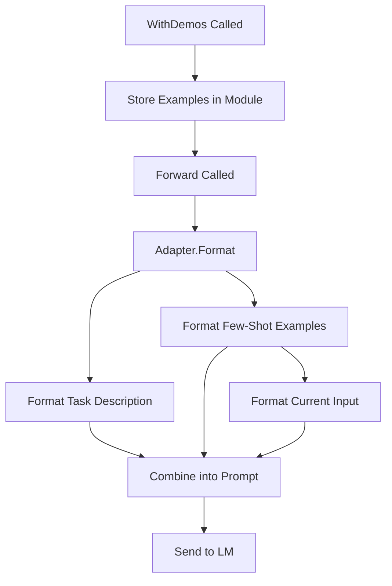

# 015_fewshot - Few-Shot Learning with Example Demonstrations

## Overview

Demonstrates DSGo's **few-shot learning** capabilities using the `WithDemos()` method. Few-shot learning dramatically improves prediction accuracy by providing the LM with example input-output pairs that clarify the task and expected output format.

## What it demonstrates

- Few-shot learning with `WithDemos()` method
- Zero-shot vs. few-shot comparison
- Creating examples with `dsgo.NewExample()`
- Improved accuracy and confidence through demonstrations
- Task clarification for complex classifications
- Consistent output formatting

## Usage

```bash
cd examples/015_fewshot
go run main.go
```

### With Harness Flags

```bash
go run main.go -verbose -format=json
go run main.go -concurrency=1
```

### Environment Variables

```bash
export HARNESS_VERBOSE=true
export HARNESS_OUTPUT_FORMAT=json
go run main.go
```

## Expected Output

```
=== Few-Shot Learning Demo ===
Demonstrating how to improve predictions with example demonstrations

--- Part 1: Zero-Shot Prediction (No Examples) ---

📝 Test Plot: A young wizard attends a magical school and battles dark forces threatening the wizarding world.

Results (Zero-Shot):
  Predicted Genre: fantasy
  Confidence:      0.75
  Tokens Used:     245

--- Part 2: Few-Shot Prediction (With 5 Examples) ---

📚 Loaded 5 few-shot examples:
  1. [sci-fi] A group of astronauts discovers an alien artifact on Mars...
  2. [romance] Two rival chefs compete in a cooking competition while...
  3. [action] A detective races against time to stop a bomb from des...
  4. [horror] A group of friends get stranded in a remote cabin wher...
  5. [fantasy] An unlikely hero embarks on a quest to destroy a powe...

Results (Few-Shot):
  Predicted Genre: fantasy
  Confidence:      0.94
  Tokens Used:     512

--- Comparison ---
============================================================
Approach             | Genre           | Confidence | Tokens    
------------------------------------------------------------
Zero-Shot            | fantasy         | 0.75       | 245       
Few-Shot (5 demos)   | fantasy         | 0.94       | 512       
============================================================

--- Part 3: Testing Few-Shot on Multiple Inputs ---

Test 1:
  Plot:       After a global pandemic, survivors fight for resources in a post...
  Predicted:  action (88% confidence)
  Expected:   action/sci-fi

Test 2:
  Plot:       A clumsy office worker accidentally becomes CEO and tries to hid...
  Predicted:  comedy (92% confidence)
  Expected:   comedy

Test 3:
  Plot:       A mother struggles to reconnect with her estranged daughter afte...
  Predicted:  drama (90% confidence)
  Expected:   drama

=== Summary ===
Few-shot learning provides:
  ✓ Better accuracy through example demonstrations
  ✓ Clearer task understanding for the LM
  ✓ More consistent output formatting
  ✓ Higher confidence scores

📊 Total tokens used: 1245
📚 Total examples provided: 5
🧪 Total test cases: 5
```

## Key Concepts

### 1. Few-Shot Learning Basics

**Zero-Shot** (no examples):
- LM relies only on task description
- May misinterpret requirements
- Lower confidence, less consistent

**Few-Shot** (with examples):
- LM learns from concrete demonstrations
- Understands exact task requirements
- Higher confidence, better accuracy

```go
// Zero-shot: No examples
predict := module.NewPredict(sig, lm)

// Few-shot: With examples
predict := module.NewPredict(sig, lm).WithDemos(demos)
```

### 2. Creating Examples

Use `dsgo.NewExample()` to create input-output pairs:

```go
demos := []dsgo.Example{
    *dsgo.NewExample(
        map[string]any{
            "plot": "A group of astronauts discovers an alien artifact...",
        },
        map[string]any{
            "genre":      "sci-fi",
            "confidence": 0.95,
        },
    ),
    *dsgo.NewExample(
        map[string]any{
            "plot": "Two rival chefs compete while falling in love...",
        },
        map[string]any{
            "genre":      "romance",
            "confidence": 0.90,
        },
    ),
}
```

**Structure:**
- **Inputs**: Map matching signature input fields
- **Outputs**: Map matching signature output fields
- Both maps use field names as keys

### 3. WithDemos() Method

Add few-shot examples to any DSGo module:

```go
// Works with Predict
predict := module.NewPredict(sig, lm).WithDemos(demos)

// Works with ChainOfThought
cot := module.NewChainOfThought(sig, lm).WithDemos(demos)

// Works with ReAct
react := module.NewReAct(sig, lm, tools).WithDemos(demos)
```

**What happens:**
1. Examples are formatted by the adapter (ChatAdapter, JSONAdapter, etc.)
2. Examples are prepended to the prompt before task execution
3. LM sees clear input → output pattern
4. LM mimics the pattern for new inputs

### 4. Choosing the Right Number of Examples

**Guidelines:**
- **1-3 examples**: Simple tasks (classification, extraction)
- **3-5 examples**: Moderate complexity (multi-output, structured data)
- **5-10 examples**: Complex tasks (reasoning, multi-step)
- **10+ examples**: Very specific formats or edge cases

**Trade-offs:**
- More examples = better accuracy but higher token cost
- Diminishing returns after ~5-7 examples for most tasks
- Quality > quantity: diverse, representative examples

### 5. Writing Effective Examples

**Good Examples:**
- Cover diverse input patterns
- Show expected output format clearly
- Include edge cases if relevant
- Are representative of real use

**Example - Good Diversity:**
```go
demos := []dsgo.Example{
    // Positive example
    *dsgo.NewExample(
        map[string]any{"text": "I love this!"},
        map[string]any{"sentiment": "positive", "confidence": 0.95},
    ),
    // Negative example
    *dsgo.NewExample(
        map[string]any{"text": "This is terrible."},
        map[string]any{"sentiment": "negative", "confidence": 0.90},
    ),
    // Neutral example
    *dsgo.NewExample(
        map[string]any{"text": "It's okay."},
        map[string]any{"sentiment": "neutral", "confidence": 0.70},
    ),
}
```

## Use Cases

### 1. Classification Tasks

Improve classification accuracy with representative examples:

```go
sig := dsgo.NewSignature("Classify email priority").
    AddInput("subject", dsgo.FieldTypeString, "Email subject").
    AddInput("sender", dsgo.FieldTypeString, "Sender email").
    AddClassOutput("priority", []string{"urgent", "normal", "low"}, "Priority level")

demos := []dsgo.Example{
    *dsgo.NewExample(
        map[string]any{"subject": "URGENT: Server down", "sender": "ops@company.com"},
        map[string]any{"priority": "urgent"},
    ),
    *dsgo.NewExample(
        map[string]any{"subject": "Weekly report", "sender": "reports@company.com"},
        map[string]any{"priority": "low"},
    ),
}

predict := module.NewPredict(sig, lm).WithDemos(demos)
```

### 2. Extraction Tasks

Show LM exactly what to extract and how to format:

```go
sig := dsgo.NewSignature("Extract contact information").
    AddInput("text", dsgo.FieldTypeString, "Text containing contact info").
    AddOutput("name", dsgo.FieldTypeString, "Person's name").
    AddOutput("email", dsgo.FieldTypeString, "Email address").
    AddOutput("phone", dsgo.FieldTypeString, "Phone number")

demos := []dsgo.Example{
    *dsgo.NewExample(
        map[string]any{"text": "Contact John Doe at john@example.com or 555-1234"},
        map[string]any{
            "name":  "John Doe",
            "email": "john@example.com",
            "phone": "555-1234",
        },
    ),
}

predict := module.NewPredict(sig, lm).WithDemos(demos)
```

### 3. Format Specification

Ensure consistent output formatting:

```go
sig := dsgo.NewSignature("Generate product descriptions").
    AddInput("product_name", dsgo.FieldTypeString, "Product name").
    AddInput("features", dsgo.FieldTypeString, "Key features").
    AddOutput("description", dsgo.FieldTypeString, "Marketing description")

demos := []dsgo.Example{
    *dsgo.NewExample(
        map[string]any{
            "product_name": "SmartWatch Pro",
            "features":     "Heart rate monitor, GPS, waterproof",
        },
        map[string]any{
            "description": "The SmartWatch Pro revolutionizes fitness tracking with advanced heart rate monitoring, built-in GPS, and waterproof design. Perfect for athletes and health enthusiasts.",
        },
    ),
}

predict := module.NewPredict(sig, lm).WithDemos(demos)
```

### 4. Domain-Specific Tasks

Guide LM through specialized domains:

```go
sig := dsgo.NewSignature("Classify medical symptom urgency").
    AddInput("symptoms", dsgo.FieldTypeString, "Patient symptoms").
    AddClassOutput("urgency", []string{"emergency", "urgent", "routine"}, "Urgency level").
    AddOutput("reasoning", dsgo.FieldTypeString, "Medical reasoning")

demos := []dsgo.Example{
    *dsgo.NewExample(
        map[string]any{"symptoms": "Chest pain, difficulty breathing, sweating"},
        map[string]any{
            "urgency":   "emergency",
            "reasoning": "Possible cardiac event - requires immediate medical attention",
        },
    ),
    *dsgo.NewExample(
        map[string]any{"symptoms": "Mild headache, occasional"},
        map[string]any{
            "urgency":   "routine",
            "reasoning": "Common symptom - can be addressed at regular appointment",
        },
    ),
}

predict := module.NewPredict(sig, lm).WithDemos(demos)
```

## Advanced Patterns

### Dynamic Example Selection

Select examples based on input characteristics:

```go
func selectRelevantDemos(input string, demoPool []dsgo.Example) []dsgo.Example {
    // Select top-k most similar examples based on input
    // (Use embeddings, keyword matching, etc.)
    selected := make([]dsgo.Example, 0, 3)
    
    for _, demo := range demoPool {
        if isSimilar(input, demo.Inputs["text"].(string)) {
            selected = append(selected, demo)
            if len(selected) >= 3 {
                break
            }
        }
    }
    
    return selected
}

// Use dynamic selection
relevantDemos := selectRelevantDemos(userInput, allDemos)
predict := module.NewPredict(sig, lm).WithDemos(relevantDemos)
```

### Combining with Chain of Thought

Few-shot + reasoning for complex tasks:

```go
sig := dsgo.NewSignature("Solve math word problems").
    AddInput("problem", dsgo.FieldTypeString, "Word problem").
    AddOutput("answer", dsgo.FieldTypeFloat, "Numerical answer")

demos := []dsgo.Example{
    *dsgo.NewExample(
        map[string]any{"problem": "John has 5 apples. He buys 3 more. How many does he have?"},
        map[string]any{"answer": 8.0},
    ),
}

// ChainOfThought + few-shot examples
cot := module.NewChainOfThought(sig, lm).WithDemos(demos)
```

### Example Versioning

Maintain different example sets for different scenarios:

```go
var (
    // Conservative examples - high precision
    conservativeDemos = []dsgo.Example{ /* ... */ }
    
    // Aggressive examples - high recall
    aggressiveDemos = []dsgo.Example{ /* ... */ }
    
    // Balanced examples
    balancedDemos = []dsgo.Example{ /* ... */ }
)

func getPredictModule(strategy string) *module.Predict {
    var demos []dsgo.Example
    switch strategy {
    case "conservative":
        demos = conservativeDemos
    case "aggressive":
        demos = aggressiveDemos
    default:
        demos = balancedDemos
    }
    
    return module.NewPredict(sig, lm).WithDemos(demos)
}
```

## Performance Characteristics

**Token Cost:**
- Zero-shot: ~100-300 tokens (task description only)
- Few-shot (3 examples): ~400-800 tokens
- Few-shot (5 examples): ~600-1200 tokens
- Each additional example: ~100-200 tokens

**Accuracy Improvement:**
- Simple tasks: +5-15% accuracy
- Moderate tasks: +15-30% accuracy
- Complex tasks: +30-50% accuracy
- Highly specialized: +50%+ accuracy

**Latency:**
- Minimal impact (~5-10% increase)
- Most latency from token processing, not example formatting

## Troubleshooting

### Examples Not Improving Accuracy

**Possible Causes:**
- Examples not representative of task
- Examples too similar to each other
- Task description unclear
- Wrong output format in examples

**Solutions:**
- Diversify examples across input space
- Ensure examples match signature exactly
- Add more examples (5-7 instead of 2-3)
- Verify output field names match signature

### High Token Cost

**Possible Causes:**
- Too many examples
- Examples with verbose inputs/outputs
- Repetitive demonstrations

**Solutions:**
- Reduce to 3-5 most representative examples
- Use concise examples
- Implement dynamic example selection
- Consider caching (see [022_caching](../022_caching/))

### Inconsistent Results Despite Examples

**Possible Causes:**
- LM ignoring examples (rare)
- Examples conflicting with instruction
- Adapter not formatting examples correctly

**Solutions:**
- Add more diverse examples
- Simplify task description
- Try different LM model
- Enable verbose logging to inspect prompt

## Comparison with Other Approaches

**vs. Zero-Shot:**
- Few-Shot: Higher accuracy, clearer format, more tokens
- Zero-Shot: Lower cost, faster, less predictable

**vs. Fine-Tuning:**
- Few-Shot: No training, instant deployment, flexible
- Fine-Tuning: Best accuracy, fixed task, expensive

**vs. Prompt Engineering:**
- Few-Shot: Concrete examples, less ambiguity
- Prompt Engineering: More flexible, harder to optimize

## See Also

- [001_predict](../001_predict/) - Basic Predict module (can add WithDemos)
- [002_chain_of_thought](../002_chain_of_thought/) - CoT with few-shot support
- [003_react](../003_react/) - ReAct agent with few-shot support
- [010_typed_signatures](../010_typed_signatures/) - Type-safe few-shot with WithDemosTyped
- [011_history_prediction](../011_history_prediction/) - History and prediction primitives
- [QUICKSTART.md](../../QUICKSTART.md) - Getting started guide

## Production Tips

1. **Start Small**: Begin with 3 examples, add more only if needed
2. **Quality Over Quantity**: 3 great examples > 10 mediocre ones
3. **Diverse Examples**: Cover different input patterns and edge cases
4. **Cache Examples**: Reuse the same demo set across requests
5. **Monitor Accuracy**: Track improvement to justify token cost
6. **Version Examples**: Maintain different sets for different scenarios
7. **Test Coverage**: Ensure examples represent real-world distribution
8. **Update Examples**: Refresh examples when task requirements change

## When to Use Few-Shot Learning

**Use Few-Shot:**
- Classification with specific categories
- Extraction with precise format requirements
- Complex output structures
- Domain-specific tasks
- When zero-shot accuracy is insufficient
- When output format must be exact

**Consider Zero-Shot:**
- Simple, well-defined tasks
- Cost-sensitive applications
- Tasks LM already excels at
- Rapid prototyping

**Consider Fine-Tuning:**
- Production-critical accuracy
- Very large volume (>100k requests/day)
- Specialized domain with large dataset
- Task unlikely to change

## Architecture Notes

Few-shot examples are formatted by the adapter and prepended to the prompt:



**Key Design Principles:**
- **Adapter-Specific Formatting**: Each adapter (Chat, JSON, etc.) formats examples appropriately
- **Automatic Integration**: Examples seamlessly integrated into prompt
- **No Extra API Calls**: Examples reuse same LM generation call
- **Module-Level Storage**: Examples stored in module, applied to all Forward calls

## Example Format in Prompts

**ChatAdapter Format:**
```
---
Example 1:

[plot]: A group of astronauts discovers an alien artifact on Mars...

[genre]: sci-fi
[confidence]: 0.95

---
Example 2:

[plot]: Two rival chefs compete in a cooking competition...

[genre]: romance
[confidence]: 0.90

---
Now complete the task for this input:

[plot]: A young wizard attends a magical school...
```

**JSONAdapter Format:**
```json
{
  "examples": [
    {
      "input": {"plot": "A group of astronauts discovers..."},
      "output": {"genre": "sci-fi", "confidence": 0.95}
    },
    {
      "input": {"plot": "Two rival chefs compete..."},
      "output": {"genre": "romance", "confidence": 0.90}
    }
  ],
  "task": {
    "plot": "A young wizard attends a magical school..."
  }
}
```

Different adapters format examples differently, but the semantic meaning is preserved.
