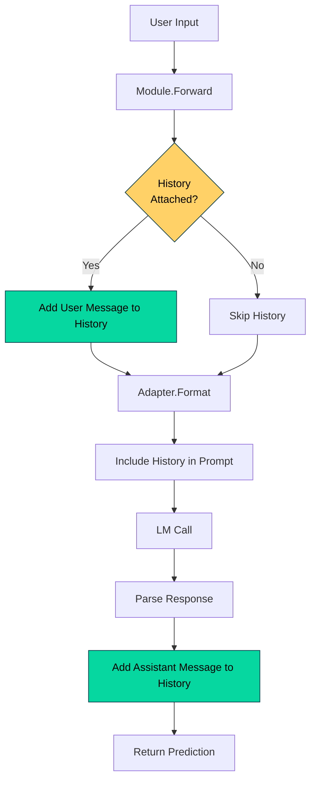

# 016_history - Advanced History Management

## Overview

Demonstrates DSGo's **History** management capabilities for building stateful, multi-turn conversational LM programs. Shows how to use WithHistory(), manage message limits, clone/restore conversation state, and inspect message history.

## What it demonstrates

- Multi-turn conversations with `WithHistory()`
- Automatic message limit enforcement with `NewHistoryWithLimit()`
- History cloning and restoration for conversation branching
- Message inspection with `GetLast()` and `GetMessages()`
- Manual message addition without LM calls
- History clearing and state management
- Context window management for long conversations

## Usage

```bash
cd examples/016_history
go run main.go
```

### With Harness Flags

```bash
go run main.go -verbose -format=json
go run main.go -concurrency=1
```

### Environment Variables

```bash
export HARNESS_VERBOSE=true
export HARNESS_OUTPUT_FORMAT=json
go run main.go
```

## Expected Output

```
=== History Management Demo ===
Advanced history operations: limits, cloning, inspection, and restoration

--- Demo 1: Basic Multi-Turn Conversation with History ---

[Turn 1]
User: What is Go programming language?
Assistant: Go is a statically typed, compiled programming language designed at Google...

[Turn 2]
User: What are its main features?
Assistant: Go's main features include: strong static typing, garbage collection, built-in concurrency...

[Turn 3]
User: How does it compare to Python?
Assistant: Compared to Python, Go is compiled (vs interpreted), statically typed (vs dynamically typed)...

📊 Total messages in history: 6
💡 History stores all conversation context for multi-turn coherence

────────────────────────────────────────────────────────────────────────────────

--- Demo 2: Conversation with History Limit (Auto-Pruning) ---

[Turn 1] History size: 0 (limit: 4)
User: Once upon a time, there was a brave knight.
Assistant: The knight stood tall in gleaming armor, his sword at his side, ready for adventure...

[Turn 2] History size: 2 (limit: 4)
User: The knight found a mysterious cave.
Assistant: Dark and foreboding, the cave entrance beckoned with an eerie glow from within...

[Turn 3] History size: 4 (limit: 4)
User: Inside the cave was a sleeping dragon.
Assistant: The dragon's massive scales shimmered in the dim light, its breath slow and deep...

[Turn 4] History size: 4 (limit: 4)
User: The dragon woke up!
Assistant: With a thunderous roar, the dragon's eyes snapped open, fixing on the intruder...

📊 Final history size: 4 (limited to 4)
✅ Old messages automatically pruned to prevent context overflow!

────────────────────────────────────────────────────────────────────────────────

--- Demo 3: Advanced History Management Operations ---

1️⃣ Building conversation...
   History size: 6 messages

2️⃣ Cloning history...
   Original: 6 messages, Clone: 6 messages
   ✅ Clone is independent copy of conversation state

3️⃣ Getting last 2 messages...
   Retrieved 2 messages:
   [1] Role: user      Content: What is 15 / 3?
   [2] Role: assistant Content: 15 divided by 3 equals 5.

4️⃣ Adding messages manually...
   History size after manual adds: 8 messages
   ✅ Can manually add messages without LM calls

5️⃣ Clearing history...
   History size after clear: 0 messages
   ✅ History is empty!

6️⃣ Restoring from clone...
   Restored history size: 6 messages
   ✅ History restored from clone!

=== Summary ===
History management capabilities:
  ✓ Multi-turn conversation context
  ✓ Automatic message limit enforcement
  ✓ History cloning and restoration
  ✓ Message inspection and retrieval
  ✓ Manual history manipulation

📊 Total tokens used: 2340
🔧 Total demos: 3
```

## Key Concepts

### 1. WithHistory() - Stateful Conversations

Attach a History object to any module to enable multi-turn context:

```go
history := dsgo.NewHistoryWithLimit(0) // No limit
predict := module.NewPredict(sig, lm).WithHistory(history)

// Turn 1
result1, _ := predict.Forward(ctx, map[string]any{
    "question": "What is Go?",
})

// Turn 2 - LM sees context from Turn 1
result2, _ := predict.Forward(ctx, map[string]any{
    "question": "What are its main features?", // "its" refers to Go
})
```

**How it works:**
1. Module stores reference to History object
2. Each Forward() call adds user input to history
3. Adapter includes history in LM prompt
4. LM response is added to history automatically
5. Next Forward() includes full conversation context

### 2. History Limits - Context Window Management

Prevent unbounded memory and token growth:

```go
// Keep only last 10 messages (5 user-assistant pairs)
history := dsgo.NewHistoryWithLimit(10)

// As conversation grows, oldest messages are dropped
for i := 0; i < 100; i++ {
    predict.Forward(ctx, inputs) // History never exceeds 10 messages
}
```

**Limit Strategies:**
- **No limit (0)**: Keep all messages (use for short conversations)
- **Small (4-10)**: Quick responses, minimal context (chatbots)
- **Medium (10-20)**: Balanced context retention (customer support)
- **Large (20-50)**: Long-term context (research assistants)

**Token Considerations:**
- Each message ~50-500 tokens
- 10 message history ≈ 500-5000 tokens
- Model context windows: 4k-128k tokens
- Leave room for prompt + response

### 3. History Cloning - Conversation Branching

Create independent copies for branching conversations:

```go
mainHistory := dsgo.NewHistory()
// ... build conversation ...

// Branch 1: Technical deep-dive
branch1 := mainHistory.Clone()
predict1 := module.NewPredict(sig, lm).WithHistory(branch1)

// Branch 2: High-level summary
branch2 := mainHistory.Clone()
predict2 := module.NewPredict(sig, lm).WithHistory(branch2)

// Branches are independent
```

**Use Cases:**
- A/B testing different conversation paths
- Exploring multiple reasoning paths
- Conversation rollback/undo
- Multi-agent systems with separate contexts

### 4. Message Inspection

Monitor and debug conversation state:

```go
// Get total message count
total := history.Len()

// Get last N messages
recent := history.GetLast(5)

// Get all messages
all := history.GetMessages()

// Inspect individual messages
for _, msg := range recent {
    fmt.Printf("[%s] %s\n", msg.Role, msg.Content)
}
```

**Message Structure:**
```go
type Message struct {
    Role    string // "system", "user", "assistant"
    Content string // Message text
}
```

### 5. Manual Message Addition

Add messages without LM calls:

```go
history := dsgo.NewHistory()

// Add system message (behavior/instructions)
history.AddSystemMessage("You are a helpful coding assistant.")

// Add user message (simulate user input)
history.AddUserMessage("What is DSGo?")

// Add assistant message (simulate LM response)
history.AddAssistantMessage("DSGo is a Go port of DSPy...")

// Continue with actual LM calls
result, _ := predict.Forward(ctx, inputs)
```

**When to use:**
- Setting initial system instructions
- Simulating conversation history
- Testing with pre-filled context
- Injecting additional context

### 6. History Clearing

Reset conversation state:

```go
// Clear all messages
history.Clear()

// History is now empty
fmt.Println(history.Len()) // 0

// Add new system message for fresh start
history.AddSystemMessage("New session started.")
```

## Use Cases

### 1. Chatbots and Virtual Assistants

Maintain conversation context across user interactions:

```go
history := dsgo.NewHistoryWithLimit(20)
history.AddSystemMessage("You are a friendly customer support agent.")

predict := module.NewPredict(sig, lm).WithHistory(history)

// Multi-turn customer support
for userInput := range userMessages {
    result, _ := predict.Forward(ctx, map[string]any{
        "message": userInput,
    })
    
    response, _ := result.GetString("response")
    sendToUser(response)
}
```

### 2. Educational Tutors

Track student progress and adapt explanations:

```go
history := dsgo.NewHistoryWithLimit(30)
history.AddSystemMessage("You are a patient math tutor. Track student understanding.")

cot := module.NewChainOfThought(sig, lm).WithHistory(history)

// Student asks follow-up questions
// Tutor references previous explanations
```

### 3. Research Assistants

Maintain research context across multiple queries:

```go
history := dsgo.NewHistoryWithLimit(50)
history.AddSystemMessage("You are a research assistant specializing in AI papers.")

react := module.NewReAct(sig, lm, tools).WithHistory(history)

// User: "Find papers on DSPy"
// Assistant: [uses search tool]
// User: "Summarize the most recent one"  // "one" refers to previous results
// Assistant: [references context]
```

### 4. Multi-Agent Collaboration

Each agent maintains separate history:

```go
// Researcher agent
researchHistory := dsgo.NewHistoryWithLimit(20)
researchHistory.AddSystemMessage("You are a research agent.")
researcher := module.NewPredict(researchSig, lm).WithHistory(researchHistory)

// Writer agent
writerHistory := dsgo.NewHistoryWithLimit(20)
writerHistory.AddSystemMessage("You are a writing agent.")
writer := module.NewPredict(writerSig, lm).WithHistory(writerHistory)

// Agents maintain separate contexts
```

### 5. Conversation Rollback

Undo conversation steps with cloning:

```go
// Save state before risky operation
checkpoint := history.Clone()

// Try something
result, err := predict.Forward(ctx, riskyInput)

if err != nil || !isGoodResult(result) {
    // Rollback to checkpoint
    history = checkpoint
    // Try alternative approach
}
```

## Advanced Patterns

### Conversation Summarization

Summarize old messages to maintain context efficiency:

```go
func summarizeAndTrim(history *dsgo.History, lm dsgo.LM) *dsgo.History {
    if history.Len() <= 20 {
        return history // Still small enough
    }
    
    // Get old messages to summarize
    oldMessages := history.GetMessages()[:10]
    
    // Create summary
    summarySig := dsgo.NewSignature("Summarize conversation history").
        AddInput("messages", dsgo.FieldTypeString, "Messages to summarize").
        AddOutput("summary", dsgo.FieldTypeString, "Concise summary")
    
    summaryModule := module.NewPredict(summarySig, lm)
    result, _ := summaryModule.Forward(ctx, map[string]any{
        "messages": formatMessages(oldMessages),
    })
    
    summary, _ := result.GetString("summary")
    
    // Create new history with summary
    newHistory := dsgo.NewHistory()
    newHistory.AddSystemMessage("Previous conversation: " + summary)
    
    // Add recent messages
    for _, msg := range history.GetLast(10) {
        newHistory.AddMessage(msg.Role, msg.Content)
    }
    
    return newHistory
}
```

### Session Management

Manage multiple conversation sessions:

```go
type SessionManager struct {
    sessions map[string]*dsgo.History
}

func (sm *SessionManager) GetHistory(sessionID string) *dsgo.History {
    if history, exists := sm.sessions[sessionID]; exists {
        return history
    }
    
    // Create new session
    history := dsgo.NewHistoryWithLimit(20)
    history.AddSystemMessage("Welcome to a new session!")
    sm.sessions[sessionID] = history
    
    return history
}

// Usage
manager := &SessionManager{sessions: make(map[string]*dsgo.History)}
userHistory := manager.GetHistory(userID)
predict := module.NewPredict(sig, lm).WithHistory(userHistory)
```

### Context-Aware Prompt Building

Use history for custom prompt construction:

```go
history := dsgo.NewHistoryWithLimit(10)
predict := module.NewPredict(sig, lm).WithHistory(history)

// After some conversation
messages := history.GetLast(5)

// Build custom context
context := "Recent conversation:\n"
for _, msg := range messages {
    context += fmt.Sprintf("[%s]: %s\n", msg.Role, msg.Content)
}

// Use in next prediction
result, _ := predict.Forward(ctx, map[string]any{
    "context": context,
    "question": newQuestion,
})
```

### History Persistence

Save and restore conversation state:

```go
import "encoding/json"

// Save history
func saveHistory(history *dsgo.History, filename string) error {
    messages := history.GetMessages()
    data, err := json.Marshal(messages)
    if err != nil {
        return err
    }
    return os.WriteFile(filename, data, 0644)
}

// Load history
func loadHistory(filename string) (*dsgo.History, error) {
    data, err := os.ReadFile(filename)
    if err != nil {
        return nil, err
    }
    
    var messages []dsgo.Message
    if err := json.Unmarshal(data, &messages); err != nil {
        return nil, err
    }
    
    history := dsgo.NewHistory()
    for _, msg := range messages {
        history.AddMessage(msg.Role, msg.Content)
    }
    
    return history, nil
}
```

## Performance Characteristics

**Memory:**
- Per message: ~100-1000 bytes (depends on content length)
- 20-message history: ~2-20 KB
- Cloning: O(n) where n = message count

**Token Cost:**
- Each message adds ~50-500 tokens to prompt
- 10-message history: +500-5000 tokens per request
- Limit history to control costs

**Latency:**
- Message addition: O(1)
- Limit enforcement: O(1) amortized
- GetLast(n): O(n)
- Clone: O(total messages)

**Throughput:**
- History operations add negligible overhead
- Main cost is larger prompts → longer LM processing

## Troubleshooting

### History Growing Too Large

**Symptom:** Slow responses, high token costs, context overflow errors

**Solution:**
```go
// Use limits
history := dsgo.NewHistoryWithLimit(20)

// Or periodically summarize and trim
if history.Len() > 30 {
    history = summarizeAndTrim(history, lm)
}
```

### Context Not Maintained

**Symptom:** LM doesn't remember previous conversation

**Solution:**
```go
// Ensure history is attached
predict := module.NewPredict(sig, lm).WithHistory(history)

// Verify history is being populated
fmt.Println("History size:", history.Len())
```

### Messages Out of Order

**Symptom:** Conversation flow is incorrect

**Solution:**
```go
// Check message order
for i, msg := range history.GetMessages() {
    fmt.Printf("%d. [%s] %s\n", i, msg.Role, msg.Content[:50])
}

// Ensure user/assistant alternation
```

### Clone Not Independent

**Symptom:** Modifying clone affects original

**Solution:**
```go
// DSGo clones are deep copies - this shouldn't happen
// If it does, report as a bug

// Workaround: Manual clone
func manualClone(h *dsgo.History) *dsgo.History {
    newHistory := dsgo.NewHistory()
    for _, msg := range h.GetMessages() {
        newHistory.AddMessage(msg.Role, msg.Content)
    }
    return newHistory
}
```

## Comparison with Other Approaches

**vs. Manual Context String Concatenation:**
- History: Structured, inspectable, limit-enforced
- String concat: Simple but error-prone, no structure

**vs. Database Session Storage:**
- History: In-memory, fast, simple
- Database: Persistent, scalable, complex

**vs. Stateless (each request independent):**
- History: Coherent multi-turn conversations
- Stateless: Simpler, no memory overhead, no context

## See Also

- [008_chat_predict](../008_chat_predict/) - Multi-turn conversations with Predict
- [009_chat_cot](../009_chat_cot/) - Multi-turn with Chain of Thought
- [011_history_prediction](../011_history_prediction/) - History and Prediction primitives
- [015_fewshot](../015_fewshot/) - Few-shot learning with WithDemos()
- [QUICKSTART.md](../../QUICKSTART.md) - Getting started guide

## Production Tips

1. **Always Use Limits**: Prevent unbounded growth with `NewHistoryWithLimit(N)`
2. **Monitor Token Usage**: Track `prediction.Usage.TotalTokens` to detect context bloat
3. **Summarize Long Conversations**: Compress old context periodically
4. **Clone for Branching**: Use `Clone()` for A/B testing or rollback
5. **Log History State**: Inspect `history.Len()` in production for debugging
6. **Set Clear System Messages**: Initialize with behavior instructions
7. **Test Edge Cases**: Empty history, limit boundaries, very long messages
8. **Version Control Sessions**: Track conversation versions for quality improvement

## When to Use History

**Use History:**
- Multi-turn conversations (chatbots, assistants)
- Context-dependent tasks (follow-up questions)
- Conversational workflows (iterative refinement)
- Educational applications (tutoring, Q&A)
- Customer support systems

**Avoid History:**
- Independent, stateless requests
- Batch processing unrelated items
- Simple one-shot predictions
- Memory-constrained environments

## Architecture Notes

History integrates seamlessly with DSGo modules:



**Design Principles:**
- **Automatic Integration**: Modules handle history updates transparently
- **Adapter-Driven Formatting**: Each adapter formats history appropriately
- **Bounded Memory**: Limits prevent unbounded growth
- **Deep Cloning**: Clones are fully independent
- **Observable**: History state is fully inspectable
