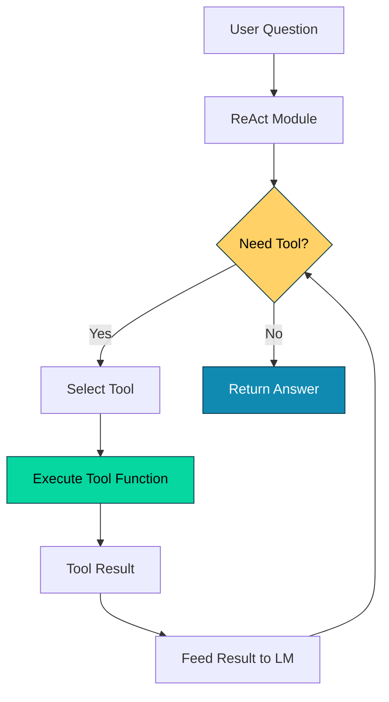

# 017_tools - Tool Definition & Integration

## Overview

Demonstrates DSGo's **Tool** system for extending LM capabilities with custom functions. Shows how to create tools with various parameter types, integrate them with modules (especially ReAct), and handle tool execution.

## What it demonstrates

- Creating custom tools with `NewTool()`
- Required and optional parameters
- Multiple parameter types (string, number, boolean)
- Tool integration with ReAct module
- Tool execution and result handling
- Error handling in tool functions
- Tools with no parameters (e.g., current date/time)

## Usage

```bash
cd examples/017_tools
go run main.go
```

### With Harness Flags

```bash
go run main.go -verbose -format=json
go run main.go -concurrency=1
```

### Environment Variables

```bash
export HARNESS_VERBOSE=true
export HARNESS_OUTPUT_FORMAT=json
go run main.go
```

## Expected Output

```
=== Tool Definition & Usage Demo ===
Demonstrates creating tools with different parameter types and integrating them with modules

--- Demo 1: Basic Tools (String Parameters) ---
Question: What is DSGo and what is 15 + 27?

Answer: DSGo is a Go port of DSPy, a framework for programming language models. The sum of 15 and 27 is 42.

✅ Tools used: search, calculator
📊 Tokens used: 450

────────────────────────────────────────────────────────────────────────────────

--- Demo 2: Advanced Tools (Multiple Parameter Types) ---
Question: What's the weather in San Francisco and what time is it now?

Answer: The weather in San Francisco is sunny at 68°F. The current date and time is Monday, November 5, 2025 at 2:30 PM PST.

✅ Tools used: get_weather, get_current_date
📊 Tokens used: 380

────────────────────────────────────────────────────────────────────────────────

--- Demo 3: Tools with Optional Parameters ---
Instruction: Format 'hello world' in uppercase with the prefix 'Greeting:'

Result: Greeting: HELLO WORLD

✅ Tool with optional parameters demonstrated
📊 Tokens used: 290

=== Summary ===
Tool capabilities:
  ✓ Custom function definitions
  ✓ Rich parameter types and validation
  ✓ Required and optional parameters
  ✓ Seamless integration with modules
  ✓ Error handling and robustness

📊 Total tokens used: 1120
🔧 Total demos: 3
```

## Key Concepts

### 1. Tool Creation - NewTool()

Define custom functions that LMs can call:

```go
searchTool := dsgo.NewTool(
    "search",                                    // Tool name
    "Search for information on the internet",    // Description for LM
    func(ctx context.Context, args map[string]any) (any, error) {
        query := args["query"].(string)
        // Implement search logic
        return searchResults, nil
    },
).AddParameter("query", "string", "The search query", true)
//                                                       ^^^^ required
```

**Tool Structure:**
- **Name**: Identifier the LM uses to call the tool
- **Description**: Tells the LM what the tool does and when to use it
- **Function**: Go function that implements the tool logic
- **Parameters**: Inputs the tool accepts

### 2. Parameter Types

Tools support multiple parameter types:

```go
// String parameter
tool.AddParameter("name", "string", "User name", true)

// Number parameter  
tool.AddParameter("age", "number", "User age", true)

// Boolean parameter
tool.AddParameter("verified", "boolean", "Is verified", false)
//                                                       ^^^^^ optional

// No parameters
dateTool := dsgo.NewTool(
    "get_current_date",
    "Get current date and time",
    func(ctx context.Context, args map[string]any) (any, error) {
        return time.Now().String(), nil
    },
) // No AddParameter calls needed
```

**Parameter Definition:**
```go
AddParameter(
    name string,        // Parameter name
    paramType string,   // "string", "number", "boolean", "object", "array"
    description string, // What the parameter is for
    required bool,      // true = required, false = optional
)
```

### 3. Tool Integration with ReAct

ReAct module automatically manages tool selection and execution:

```go
tools := []dsgo.Tool{*searchTool, *calculatorTool}

react := module.NewReAct(sig, lm, tools).
    WithMaxIterations(5).  // Max tool calls
    WithVerbose(true)       // Show reasoning

result, err := react.Forward(ctx, inputs)
```

**How ReAct Uses Tools:**
1. **Think**: LM decides which tool to call based on descriptions
2. **Act**: ReAct executes the chosen tool with LM-provided arguments
3. **Observe**: Tool result is fed back to LM
4. **Repeat**: Continue until answer is found or max iterations reached

### 4. Tool Function Implementation

Tool functions receive context and arguments:

```go
func(ctx context.Context, args map[string]any) (any, error) {
    // 1. Extract and validate parameters
    query, ok := args["query"].(string)
    if !ok {
        return nil, fmt.Errorf("query must be a string")
    }
    
    // 2. Implement tool logic
    result := performSearch(query)
    
    // 3. Return result or error
    return result, nil
}
```

**Best Practices:**
- Always validate parameter types
- Return descriptive errors
- Keep tool logic focused and simple
- Use context for cancellation and timeouts
- Return structured data when possible

### 5. Optional Parameters

Tools can have optional parameters with defaults:

```go
formatTool := dsgo.NewTool(
    "format_text",
    "Format text with optional styling",
    func(ctx context.Context, args map[string]any) (any, error) {
        text := args["text"].(string)  // Required
        
        // Optional with default
        uppercase := false
        if val, ok := args["uppercase"].(bool); ok {
            uppercase = val
        }
        
        // Optional with default
        prefix := ""
        if val, ok := args["prefix"].(string); ok {
            prefix = val
        }
        
        result := text
        if uppercase {
            result = strings.ToUpper(result)
        }
        if prefix != "" {
            result = prefix + " " + result
        }
        
        return result, nil
    },
).
    AddParameter("text", "string", "Text to format", true).        // Required
    AddParameter("uppercase", "boolean", "Convert to uppercase", false).  // Optional
    AddParameter("prefix", "string", "Prefix to add", false)       // Optional
```

## Common Tool Patterns

### Information Retrieval Tools

```go
searchTool := dsgo.NewTool(
    "search",
    "Search the web for information",
    func(ctx context.Context, args map[string]any) (any, error) {
        query := args["query"].(string)
        // Call search API
        results := searchAPI(query)
        return results, nil
    },
).AddParameter("query", "string", "Search query", true)
```

### Calculation Tools

```go
calculatorTool := dsgo.NewTool(
    "calculator",
    "Perform mathematical calculations",
    func(ctx context.Context, args map[string]any) (any, error) {
        expression := args["expression"].(string)
        result := evaluateExpression(expression)
        return fmt.Sprintf("%v", result), nil
    },
).AddParameter("expression", "string", "Math expression", true)
```

### API Integration Tools

```go
weatherTool := dsgo.NewTool(
    "get_weather",
    "Get current weather for a location",
    func(ctx context.Context, args map[string]any) (any, error) {
        location := args["location"].(string)
        
        // Call weather API
        resp, err := http.Get(fmt.Sprintf("https://api.weather.com/%s", location))
        if err != nil {
            return nil, err
        }
        
        // Parse and return
        weather := parseWeatherResponse(resp)
        return weather, nil
    },
).AddParameter("location", "string", "City or location", true)
```

### Data Processing Tools

```go
analysisTool := dsgo.NewTool(
    "analyze_data",
    "Analyze numerical data and return statistics",
    func(ctx context.Context, args map[string]any) (any, error) {
        data := args["data"].([]any)
        
        // Convert to numbers
        numbers := make([]float64, len(data))
        for i, v := range data {
            numbers[i] = v.(float64)
        }
        
        // Calculate statistics
        stats := calculateStats(numbers)
        return stats, nil
    },
).AddParameter("data", "array", "Array of numbers", true)
```

### Stateful Tools

```go
type DatabaseTool struct {
    db *sql.DB
}

func (dt *DatabaseTool) CreateTool() *dsgo.Tool {
    return dsgo.NewTool(
        "query_database",
        "Query the database",
        func(ctx context.Context, args map[string]any) (any, error) {
            query := args["query"].(string)
            
            rows, err := dt.db.QueryContext(ctx, query)
            if err != nil {
                return nil, err
            }
            defer rows.Close()
            
            results := parseRows(rows)
            return results, nil
        },
    ).AddParameter("query", "string", "SQL query", true)
}
```

## Advanced Usage

### Tool Composition

Combine multiple tools for complex tasks:

```go
tools := []dsgo.Tool{
    *createSearchTool(),
    *createCalculatorTool(),
    *createWeatherTool(),
    *createDatabaseTool(),
}

react := module.NewReAct(sig, lm, tools).
    WithMaxIterations(10)  // Allow multiple tool calls
```

### Tool with Context

Use context for cancellation and timeouts:

```go
apiTool := dsgo.NewTool(
    "call_api",
    "Call external API",
    func(ctx context.Context, args map[string]any) (any, error) {
        endpoint := args["endpoint"].(string)
        
        // Create request with context
        req, _ := http.NewRequestWithContext(ctx, "GET", endpoint, nil)
        
        client := &http.Client{Timeout: 10 * time.Second}
        resp, err := client.Do(req)
        if err != nil {
            return nil, err
        }
        defer resp.Body.Close()
        
        // Check context cancellation
        select {
        case <-ctx.Done():
            return nil, ctx.Err()
        default:
        }
        
        body, _ := io.ReadAll(resp.Body)
        return string(body), nil
    },
).AddParameter("endpoint", "string", "API endpoint URL", true)
```

### Error Handling

Provide detailed error messages:

```go
validateTool := dsgo.NewTool(
    "validate_email",
    "Validate email address format",
    func(ctx context.Context, args map[string]any) (any, error) {
        email, ok := args["email"].(string)
        if !ok {
            return nil, fmt.Errorf("email parameter must be a string")
        }
        
        if email == "" {
            return nil, fmt.Errorf("email cannot be empty")
        }
        
        if !strings.Contains(email, "@") {
            return map[string]any{
                "valid": false,
                "reason": "missing @ symbol",
            }, nil
        }
        
        return map[string]any{
            "valid": true,
            "email": email,
        }, nil
    },
).AddParameter("email", "string", "Email address to validate", true)
```

### Returning Structured Data

Return rich objects, not just strings:

```go
analysisTool := dsgo.NewTool(
    "analyze_sentiment",
    "Analyze sentiment of text",
    func(ctx context.Context, args map[string]any) (any, error) {
        text := args["text"].(string)
        
        sentiment := analyzeSentiment(text)
        
        // Return structured result
        return map[string]any{
            "sentiment": sentiment.Label,
            "score":     sentiment.Score,
            "confidence": sentiment.Confidence,
            "keywords":   sentiment.Keywords,
        }, nil
    },
).AddParameter("text", "string", "Text to analyze", true)
```

## Tool Selection by LM

The LM decides which tool to use based on:

1. **Tool Name**: Should be descriptive (e.g., `search`, `calculate`, `get_weather`)
2. **Tool Description**: Clear explanation of what it does
3. **Parameter Descriptions**: Help LM understand required inputs
4. **Question Context**: LM matches question needs to tool capabilities

**Example:**
```
Question: "What's 15 + 27?"
→ LM selects: calculator tool (matches math operation)

Question: "What's the weather in Tokyo?"
→ LM selects: get_weather tool (matches weather query)

Question: "Search for information about DSGo"
→ LM selects: search tool (matches information retrieval)
```

## Performance Characteristics

**Tool Execution:**
- Execution time: Depends on tool implementation
- Network tools: 100ms - 5s (API calls)
- Compute tools: <10ms (calculations)
- Database tools: 10ms - 1s (queries)

**Token Cost:**
- Tool definition: +50-100 tokens per tool (in prompt)
- Tool call: +20-50 tokens (LM decides to call)
- Tool result: +50-500 tokens (result fed back to LM)
- Multi-tool workflows: Can use 2x-5x tokens vs. direct answer

**Iterations:**
- Simple questions: 1-2 tool calls
- Complex questions: 3-5 tool calls
- Research tasks: 5-10+ tool calls
- Set `WithMaxIterations()` to limit cost

## Troubleshooting

### Tool Not Being Called

**Symptom:** LM answers without using available tools

**Solution:**
```go
// 1. Improve tool description
searchTool := dsgo.NewTool(
    "search",
    "ALWAYS use this to search for factual information, current events, or unknown data",
    // ...
)

// 2. Adjust signature context
sig := dsgo.NewSignature("You MUST use tools to answer. Do not guess or make up information.")

// 3. Increase max iterations
react.WithMaxIterations(10)
```

### Wrong Tool Called

**Symptom:** LM uses incorrect tool for the task

**Solution:**
```go
// Make tool names and descriptions more specific
weatherTool := dsgo.NewTool(
    "get_current_weather",  // More specific than just "weather"
    "Get CURRENT weather conditions for a specific city (temperature, conditions)",
    // ...
)

forecastTool := dsgo.NewTool(
    "get_weather_forecast",  // Distinct from current weather
    "Get FUTURE weather forecast for next 7 days",
    // ...
)
```

### Parameter Type Errors

**Symptom:** Runtime panic or error extracting parameters

**Solution:**
```go
func(ctx context.Context, args map[string]any) (any, error) {
    // Always validate types
    query, ok := args["query"].(string)
    if !ok {
        return nil, fmt.Errorf("query parameter must be a string, got %T", args["query"])
    }
    
    // Handle optional parameters safely
    limit := 10  // default
    if val, ok := args["limit"].(float64); ok {  // JSON numbers are float64
        limit = int(val)
    }
    
    return performSearch(query, limit), nil
}
```

### Tool Execution Timeout

**Symptom:** Tool hangs or takes too long

**Solution:**
```go
func(ctx context.Context, args map[string]any) (any, error) {
    // Use context with timeout
    ctx, cancel := context.WithTimeout(ctx, 5*time.Second)
    defer cancel()
    
    // Execute with timeout
    resultChan := make(chan string)
    go func() {
        resultChan <- performSlowOperation(args)
    }()
    
    select {
    case result := <-resultChan:
        return result, nil
    case <-ctx.Done():
        return nil, fmt.Errorf("tool execution timed out")
    }
}
```

## Comparison with Other Approaches

**vs. Direct Function Calls:**
- Tools: LM decides when to call
- Functions: Manual orchestration required

**vs. Function Calling APIs (OpenAI, etc.):**
- DSGo Tools: Framework-agnostic, works with any LM
- Native Function Calling: Provider-specific, tighter integration

**vs. Prompt-Based "Tools":**
- Tools: Actual code execution, real results
- Prompt-Based: LM simulates tool use, hallucinated results

## See Also

- [003_react](../003_react/) - ReAct Agent with Tools
- [010_typed_signatures](../010_typed_signatures/) - Type-safe tools with generics
- [027_research_assistant](../027_research_assistant/) - Production tool usage
- [QUICKSTART.md](../../QUICKSTART.md) - Getting started guide

## Production Tips

1. **Validate Inputs**: Always type-check and validate tool arguments
2. **Handle Errors Gracefully**: Return informative error messages
3. **Use Context**: Implement cancellation and timeouts
4. **Limit Iterations**: Set `WithMaxIterations()` to control costs
5. **Descriptive Names**: Use clear, specific tool names
6. **Test Tools Independently**: Unit test tool functions before integration
7. **Monitor Usage**: Track which tools are called and how often
8. **Rate Limiting**: Add rate limiting for external API tools
9. **Caching**: Cache tool results for repeated queries
10. **Logging**: Log tool calls and results for debugging

## When to Use Tools

**Use Tools:**
- Information retrieval (search, databases)
- Calculations and data processing
- External API integration
- Real-time data (weather, stock prices, news)
- Actions with side effects (send email, update DB)

**Avoid Tools:**
- Simple Q&A (LM knowledge is sufficient)
- Creative tasks (writing, brainstorming)
- Subjective analysis (LM reasoning preferred)
- When latency is critical (tools add overhead)

## Architecture Notes

Tools integrate with DSGo's module system:



**Design Principles:**
- **Declarative**: Define tools, framework handles execution
- **Type-Safe**: Parameter validation at runtime
- **Context-Aware**: Proper cancellation support
- **Observable**: Tool calls are logged and traceable
- **Composable**: Mix and match tools freely
