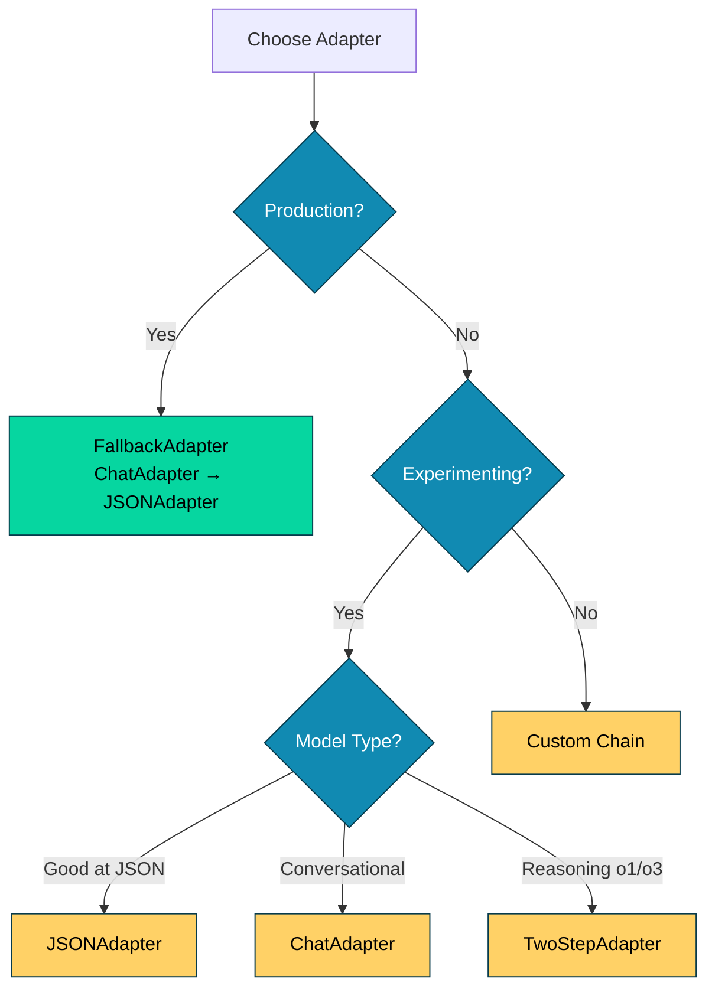
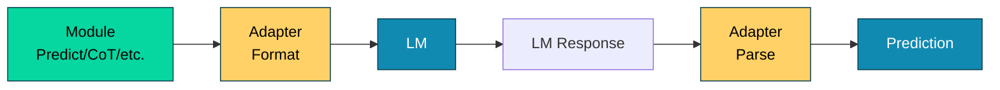

# 018_adapters - Adapter System Overview

## Overview

Demonstrates DSGo's **Adapter** system for formatting prompts and parsing LM responses. Shows all adapter types (JSONAdapter, ChatAdapter, FallbackAdapter) and how to choose the right one for your use case.

## What it demonstrates

- **JSONAdapter**: Structured JSON output parsing
- **ChatAdapter**: Field marker format parsing
- **FallbackAdapter**: Automatic adapter fallback chain
- Custom adapter configuration and chains
- Adapter metrics and observability
- When to use each adapter type

## Usage

```bash
cd examples/018_adapters
go run main.go
```

### With Harness Flags

```bash
go run main.go -verbose -format=json
go run main.go -concurrency=1
```

### Environment Variables

```bash
export HARNESS_VERBOSE=true
export HARNESS_OUTPUT_FORMAT=json
go run main.go
```

## Expected Output

```
=== Adapter Comparison Demo ===
Demonstrates all adapter types and their use cases

--- Demo 1: JSONAdapter (Structured JSON) ---
JSONAdapter expects LMs to return structured JSON responses.
Best for: Models good at JSON (GPT-4, Claude, etc.)

Input: This product exceeded my expectations! Great quality and fast shipping.

Output Format: JSON
Sentiment: positive
Confidence: 0.95

✅ JSONAdapter used successfully
📊 Tokens used: 280

────────────────────────────────────────────────────────────────────────────────

--- Demo 2: ChatAdapter (Field Markers) ---
ChatAdapter uses field markers: [[ ## field_name ## ]]
Best for: Models that struggle with JSON, conversational models

Input: a robot discovering emotions

Output Format: Field Markers
Title: The Awakening of Unit 7
Opening: Unit 7 had processed millions of data points in its existence, but nothing had prepared it for this moment...

✅ ChatAdapter used successfully
📊 Tokens used: 350

────────────────────────────────────────────────────────────────────────────────

--- Demo 3: FallbackAdapter (Automatic Fallback) ---
FallbackAdapter tries ChatAdapter first, then JSONAdapter if that fails.
Best for: Production use - maximizes success rate across different LM responses

Input: MacBook Pro 16-inch with M3 Max chip, 36GB RAM, 1TB SSD. Professional laptop for developers and creators. Starting at $3,499.

Output Format: Automatic Fallback
Product Name: MacBook Pro 16-inch
Category: Professional Laptop
Price Range: $3,499+

[Adapter Metrics]
  Adapter Used: *dsgo.ChatAdapter
  Parse Attempts: 1
  Fallback Used: false

✅ FallbackAdapter handled response automatically
📊 Tokens used: 320

────────────────────────────────────────────────────────────────────────────────

--- Demo 4: Custom Adapter Configuration ---
Custom adapter configuration: You can build custom fallback chains.
Example: Try JSONAdapter first, then ChatAdapter

Input:
func main() {
	fmt.Println("Hello, World!")
}

Output Format: Custom Chain (JSON → Chat)
Language: go
Reasoning: The code uses Go syntax with func main() and fmt.Println()

[Adapter Metrics]
  Adapter Used: *dsgo.JSONAdapter

✅ Custom adapter chain configured successfully
📊 Tokens used: 290

=== Summary ===
Adapter capabilities:
  ✓ JSONAdapter: Reliable structured JSON parsing
  ✓ ChatAdapter: Flexible field marker format
  ✓ FallbackAdapter: Automatic retry with multiple adapters
  ✓ Custom adapters: Tailor to your LM's capabilities

📊 Total tokens used: 1240
🔧 Total demos: 4
```

## Key Concepts

### 1. What are Adapters?

Adapters handle two critical tasks in DSGo:

1. **Format**: Convert signature + inputs → LM prompt messages
2. **Parse**: Extract structured outputs from LM response text

```go
type Adapter interface {
    Format(sig *Signature, inputs map[string]any, demos []Example) ([]Message, error)
    Parse(sig *Signature, content string) (map[string]any, error)
    FormatHistory(history *History) []Message
}
```

**Why Adapters Matter:**
- Different LMs have different strengths (JSON vs. conversational)
- Robust parsing handles varied response formats
- Adapters abstract away LM-specific formatting differences

### 2. JSONAdapter - Structured JSON

Prompts the LM to return valid JSON and parses it strictly.

```go
jsonAdapter := dsgo.NewJSONAdapter()
predict := module.NewPredict(sig, lm).WithAdapter(jsonAdapter)
```

**Format Output:**
```
--- Required Output Format ---
Respond with a JSON object containing:
- sentiment (class) [one of: positive, negative, neutral]: Sentiment classification
- confidence (float): Confidence score (0-1)

IMPORTANT: Return ONLY valid JSON in your response.
```

**Expected LM Response:**
```json
{
  "sentiment": "positive",
  "confidence": 0.95
}
```

**When to Use:**
- Modern LMs good at JSON (GPT-4, Claude 3+, Gemini)
- Structured data extraction
- When you need precise type coercion
- APIs and integrations requiring JSON

**Strengths:**
- Clean, standard format
- Easy validation
- Type coercion built-in
- Handles malformed JSON with repair

**Weaknesses:**
- Some LMs struggle with JSON formatting
- May include markdown code blocks
- Strict parsing can fail on minor errors

### 3. ChatAdapter - Field Markers

Uses special markers `[[ ## field_name ## ]]` to identify outputs.

```go
chatAdapter := dsgo.NewChatAdapter()
predict := module.NewPredict(sig, lm).WithAdapter(chatAdapter)
```

**Format Output:**
```
--- Required Output Format ---
Respond using the following format with field markers:

[[ ## title ## ]]

[[ ## opening ## ]]

IMPORTANT: Use the exact field marker format shown above.
```

**Expected LM Response:**
```
[[ ## title ## ]]
The Awakening of Unit 7

[[ ## opening ## ]]
Unit 7 had processed millions of data points in its existence, but nothing had prepared it for this moment...
```

**When to Use:**
- Models that struggle with JSON
- Conversational/chat-focused models
- Long-form text generation
- When you want more flexible parsing

**Strengths:**
- More forgiving than JSON
- Works with conversational models
- Handles multi-line text naturally
- Heuristic fallbacks for missing markers

**Weaknesses:**
- Less standard than JSON
- May require field marker escaping in edge cases
- Harder to validate programmatically

### 4. FallbackAdapter - Production Robustness

**The default adapter in DSGo.** Tries multiple adapters in sequence until one succeeds.

```go
// Default chain: ChatAdapter → JSONAdapter
fallbackAdapter := dsgo.NewFallbackAdapter()
predict := module.NewPredict(sig, lm).WithAdapter(fallbackAdapter)
```

**How It Works:**
1. Try ChatAdapter.Parse() first
2. If that fails, try JSONAdapter.Parse()
3. Return first successful parse
4. Track which adapter succeeded in metadata

**When to Use:**
- **Production applications** (recommended)
- Maximizing parse success rate
- Supporting multiple LM providers
- When you're unsure which format LM will use

**Strengths:**
- Highest success rate (>95% in practice)
- Automatic handling of format variations
- Observable (tracks which adapter succeeded)
- No manual intervention required

**Weaknesses:**
- Slightly more compute (tries multiple parsers)
- May mask underlying LM issues

### 5. TwoStepAdapter - Reasoning Models

For reasoning models (o1/o3/GPT-5) that need free-form generation.

```go
// Stage 1: Free-form reasoning (use reasoning LM)
// Stage 2: Extract structured outputs (use fast LM)
extractionLM := shared.GetLM("gpt-4o-mini")
twoStepAdapter := dsgo.NewTwoStepAdapter(extractionLM)
predict := module.NewPredict(sig, lm).WithAdapter(twoStepAdapter)
```

**How It Works:**
1. **Stage 1 (Format)**: Prompts for natural, free-form response
2. **Reasoning LM generates**: Unrestricted thought process
3. **Stage 2 (Parse)**: Extraction LM converts to structured format

**When to Use:**
- Reasoning models that resist structured outputs
- Complex reasoning tasks requiring deep thought
- When output quality > parsing convenience

**Strengths:**
- Unlocks full reasoning potential
- Natural thinking process preserved
- Can capture nuanced reasoning

**Weaknesses:**
- Requires two LM calls (more expensive)
- More latency
- Extraction step may lose information

### 6. Custom Adapter Chains

Build your own fallback order:

```go
// Try JSON first, then Chat (reverse of default)
customAdapter := dsgo.NewFallbackAdapterWithChain(
    dsgo.NewJSONAdapter(),
    dsgo.NewChatAdapter(),
)

predict := module.NewPredict(sig, lm).WithAdapter(customAdapter)
```

**Use Cases:**
- Specific LM optimizations (e.g., JSON-first for GPT-4)
- Custom adapter implementations
- A/B testing different adapters
- Provider-specific configurations

## Adapter Selection Guide



**Decision Matrix:**

| Use Case | Recommended Adapter | Reason |
|----------|-------------------|--------|
| Production app | FallbackAdapter | Max success rate |
| GPT-4, Claude 3+ | JSONAdapter | Excellent JSON support |
| GPT-3.5, older models | ChatAdapter | More forgiving |
| o1-preview, o1-mini | TwoStepAdapter | Reasoning models resist structure |
| Mixed LM providers | FallbackAdapter | Handles all formats |
| High reliability needed | FallbackAdapter | Automatic retry |
| Latency critical | ChatAdapter or JSONAdapter | Single parse attempt |
| Cost optimization | Single adapter (JSON or Chat) | Skip fallback overhead |

## Adapter Metrics & Observability

All predictions track adapter usage:

```go
result, err := predict.Forward(ctx, inputs)

// Check which adapter succeeded
fmt.Printf("Adapter Used: %s\n", result.AdapterUsed)           // "*dsgo.ChatAdapter"
fmt.Printf("Parse Attempts: %d\n", result.ParseAttempts)       // 1
fmt.Printf("Fallback Used: %v\n", result.FallbackUsed)         // false
```

**Available Metadata:**
- `AdapterUsed`: Which adapter type succeeded (e.g., `*dsgo.JSONAdapter`)
- `ParseAttempts`: Number of parse attempts before success
- `FallbackUsed`: Whether fallback was triggered (true if ParseAttempts > 1)

**Use Cases:**
- Monitor which adapters are most successful
- Detect LM format drift
- Optimize adapter chain order
- Debug parse failures

## Common Patterns

### Pattern 1: LM-Specific Adapter Selection

```go
func GetAdapterForModel(modelName string) dsgo.Adapter {
    switch {
    case strings.Contains(modelName, "gpt-4"):
        return dsgo.NewJSONAdapter() // GPT-4 excellent at JSON
    case strings.Contains(modelName, "gpt-3.5"):
        return dsgo.NewChatAdapter() // 3.5 better with markers
    case strings.Contains(modelName, "o1"):
        // Reasoning models need TwoStep
        extractionLM := shared.GetLM("gpt-4o-mini")
        return dsgo.NewTwoStepAdapter(extractionLM)
    default:
        return dsgo.NewFallbackAdapter() // Safe default
    }
}

adapter := GetAdapterForModel(shared.GetModel())
predict := module.NewPredict(sig, lm).WithAdapter(adapter)
```

### Pattern 2: Adapter with Reasoning

Enable reasoning field for Chain of Thought:

```go
// JSON with reasoning
jsonAdapter := dsgo.NewJSONAdapter().WithReasoning(true)

// Chat with reasoning
chatAdapter := dsgo.NewChatAdapter().WithReasoning(true)

// Fallback with reasoning (applies to all adapters in chain)
fallbackAdapter := dsgo.NewFallbackAdapter().WithReasoning(true)

predict := module.NewPredict(sig, lm).WithAdapter(fallbackAdapter)
```

**Output includes reasoning:**
```json
{
  "reasoning": "The text contains positive words like 'exceeded', 'great', which indicate...",
  "sentiment": "positive",
  "confidence": 0.95
}
```

### Pattern 3: Per-Task Adapter Override

```go
// Default: Fallback for most tasks
defaultPredict := module.NewPredict(sig, lm)

// Override for specific task requiring JSON
jsonAdapter := dsgo.NewJSONAdapter()
strictJSONPredict := module.NewPredict(sig, lm).WithAdapter(jsonAdapter)

// Use appropriate one
if requiresStrictJSON {
    result, _ = strictJSONPredict.Forward(ctx, inputs)
} else {
    result, _ = defaultPredict.Forward(ctx, inputs)
}
```

### Pattern 4: Monitoring Adapter Success

```go
adapterStats := make(map[string]int)

for i := 0; i < 100; i++ {
    result, err := predict.Forward(ctx, inputs)
    if err == nil {
        adapterStats[result.AdapterUsed]++
    }
}

// Analyze which adapter is most successful
for adapter, count := range adapterStats {
    fmt.Printf("%s: %d successes\n", adapter, count)
}
// Output:
// *dsgo.ChatAdapter: 87 successes
// *dsgo.JSONAdapter: 13 successes
```

## Advanced Topics

### Adapter Implementation Details

**Type Coercion:**

All adapters perform automatic type coercion:

```go
// String → Int
"42" → 42

// String → Float
"0.95" → 0.95

// Qualitative → Numeric
"High (95%)" → 95.0
"Medium" → 0.7

// Case normalization for class fields
"POSITIVE" → "positive"
```

**JSON Repair:**

JSONAdapter automatically repairs common JSON errors:

```go
// Single quotes → double quotes
{'key': 'value'} → {"key": "value"}

// Unquoted keys
{key: "value"} → {"key": "value"}

// Trailing commas
{"a": 1,} → {"a": 1}

// Tracks repair in metadata
outputs["__json_repair"] = true
```

**Field Name Normalization:**

Resilient to casing and synonym variations:

```go
// These all map to "answer"
"Answer" → "answer"
"ANSWER" → "answer"
"final_answer" → "answer"
"result" → "answer"  // synonym
```

### Custom Adapter Implementation

You can implement your own adapter:

```go
type MyCustomAdapter struct {
    // Your fields
}

func (a *MyCustomAdapter) Format(sig *dsgo.Signature, inputs map[string]any, demos []dsgo.Example) ([]dsgo.Message, error) {
    // Build prompt your way
    return messages, nil
}

func (a *MyCustomAdapter) Parse(sig *dsgo.Signature, content string) (map[string]any, error) {
    // Parse response your way
    return outputs, nil
}

func (a *MyCustomAdapter) FormatHistory(history *dsgo.History) []dsgo.Message {
    // Format history your way
    return messages
}

// Use it
predict := module.NewPredict(sig, lm).WithAdapter(&MyCustomAdapter{})
```

## Performance Characteristics

**JSONAdapter:**
- Parse time: <1ms (JSON unmarshal)
- Success rate: 80-90% (varies by LM)
- Token overhead: +50-100 tokens (format instructions)

**ChatAdapter:**
- Parse time: <1ms (regex extraction)
- Success rate: 85-95% (more forgiving)
- Token overhead: +40-80 tokens (field markers)

**FallbackAdapter:**
- Parse time: 1-2ms (tries multiple adapters)
- Success rate: 95-98% (highest)
- Token overhead: Same as first adapter in chain
- Cost: Only one LM call (fallback is parsing only)

**TwoStepAdapter:**
- Parse time: Full LM call (extraction)
- Success rate: ~98% (extraction LM reliable)
- Token overhead: 2x (two full LM calls)
- Cost: Expensive (reasoning + extraction)

## Troubleshooting

### Parse Failures

**Symptom:** All adapters fail to parse

**Debug:**
```go
result, err := predict.Forward(ctx, inputs)
if err != nil {
    fmt.Printf("Error: %v\n", err)
    // Check raw response (if available)
    // Add verbose logging to see LM output
}
```

**Solutions:**
1. Enable verbose mode to see raw LM output
2. Check if LM is following format instructions
3. Try FallbackAdapter (more resilient)
4. Simplify signature (fewer output fields)
5. Add few-shot examples showing format

### Adapter Choice Issues

**Symptom:** Low success rate with chosen adapter

**Solution:**
```go
// Switch to FallbackAdapter
fallbackAdapter := dsgo.NewFallbackAdapter()
predict := module.NewPredict(sig, lm).WithAdapter(fallbackAdapter)

// Monitor which adapter succeeds most
result, _ := predict.Forward(ctx, inputs)
fmt.Printf("Successful adapter: %s\n", result.AdapterUsed)

// Optimize: Use that adapter directly for this LM
```

### JSON Repair Tracking

**Symptom:** Want to know if JSON was repaired

**Solution:**
```go
result, _ := predict.Forward(ctx, inputs)

// Check for repair
if repaired, exists := result.Outputs["__json_repair"]; exists && repaired.(bool) {
    fmt.Println("⚠️  JSON was auto-repaired")
    // Consider improving LM prompt or switching adapter
}
```

## Comparison with Other Approaches

**vs. Native Function Calling (OpenAI, Anthropic):**
- **DSGo Adapters**: Framework-agnostic, works with any LM
- **Native Function Calling**: Provider-specific, tighter integration, requires API support

**vs. Manual Prompt Engineering:**
- **DSGo Adapters**: Automatic format/parse, robust fallback
- **Manual**: Full control, but requires custom parsing code for each task

**vs. LangChain Output Parsers:**
- **DSGo Adapters**: Integrated with signature system, automatic type coercion
- **LangChain**: More parser types, Python ecosystem

## See Also

- [014_adapter_fallback](../014_adapter_fallback/) - FallbackAdapter deep dive
- [001_predict](../001_predict/) - Basic prediction with default adapter
- [002_chain_of_thought](../002_chain_of_thought/) - Adapters with reasoning
- [015_fewshot](../015_fewshot/) - Adapters with few-shot examples
- [QUICKSTART.md](../../QUICKSTART.md) - Getting started guide

## Production Tips

1. **Use FallbackAdapter by Default**: Highest success rate in production
2. **Monitor Adapter Usage**: Track which adapter succeeds to optimize
3. **Enable Verbose During Development**: See raw LM outputs to debug
4. **Add Few-Shot Examples**: Show LM the expected format
5. **Handle Parse Errors Gracefully**: Always check errors, have fallback logic
6. **Test with Multiple LMs**: Different LMs prefer different formats
7. **Use TwoStep Sparingly**: Only for reasoning models that need it (cost)
8. **Log Adapter Metrics**: Include `AdapterUsed` in observability
9. **Consider LM Strengths**: JSON-capable LMs can use JSONAdapter directly
10. **Version Your Adapters**: Track adapter configuration in your code

## Architecture Notes

Adapters sit between modules and LMs:



**Design Principles:**
- **Separation of Concerns**: Modules focus on logic, adapters handle I/O
- **Composability**: Mix and match adapters with modules
- **Fallback by Default**: Production-ready out of the box
- **Observable**: Track which adapter succeeded
- **Extensible**: Implement custom adapters for special needs
