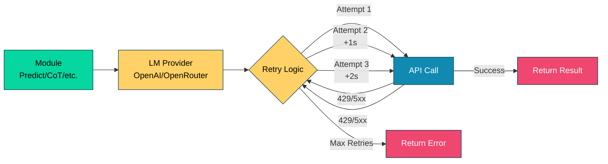

# 019_retry_resilience - Automatic Retry & Resilience

## Overview

Demonstrates DSGo's **automatic retry mechanism** with exponential backoff that handles transient errors like rate limits and server errors. Shows how the built-in retry logic makes LM calls resilient without requiring any code changes.

## What it demonstrates

- **Automatic retry** on HTTP 429 (rate limit) and 5xx errors
- **Exponential backoff** with jitter (1s → 2s → 4s)
- **Maximum 3 retries** (4 total attempts)
- **Context-aware** retry (respects cancellation and timeouts)
- Retry works transparently across all modules
- Network error handling
- Production-grade resilience patterns

## Usage

```bash
cd examples/019_retry_resilience
go run main.go
```

### With Harness Flags

```bash
go run main.go -verbose -format=json
go run main.go -concurrency=1
```

### Environment Variables

```bash
export HARNESS_VERBOSE=true
export HARNESS_OUTPUT_FORMAT=json
go run main.go
```

## Expected Output

```
=== Retry & Resilience Demo ===
Demonstrating automatic retry with exponential backoff

--- Built-in Retry Features ---
✓ Automatic retry on rate limits (HTTP 429)
✓ Automatic retry on server errors (HTTP 500, 502, 503, 504)
✓ Automatic retry on network errors
✓ Exponential backoff with jitter (prevents thundering herd)
✓ Maximum 3 retries (4 total attempts)
✓ Context cancellation support

────────────────────────────────────────────────────────────────────────────────

--- Demo 1: Normal Request ---
Making a standard request (retry is transparent)...

Question: What is the capital of France?
Answer: Paris
Status: ✓ Success (no retries needed)
📊 Tokens used: 45

────────────────────────────────────────────────────────────────────────────────

--- Demo 2: Retry Behavior ---
If rate limit or server error occurs:

Attempt 1: Request fails with 429 or 5xx
  ↓ Wait 1s (with ±10% jitter)
Attempt 2: Retry...
  ↓ If fails, wait 2s (with jitter)
Attempt 3: Retry...
  ↓ If fails, wait 4s (with jitter)
Attempt 4: Final retry...
  ↓ If fails, return error

✅ Retry mechanism demonstrated

────────────────────────────────────────────────────────────────────────────────

--- Demo 3: Multiple Requests ---
Making several requests (retries are automatic)...

1. What is 2 + 2?
   → 4 ✓
   Tokens: 42

2. Who wrote Romeo and Juliet?
   → William Shakespeare ✓
   Tokens: 48

3. What is the speed of light?
   → Approximately 299,792,458 meters per second ✓
   Tokens: 52

✅ 3/3 requests succeeded

────────────────────────────────────────────────────────────────────────────────

--- Demo 4: Chain of Thought with Retry ---
Complex reasoning also benefits from retry resilience...

Problem: If a train travels 120 km in 2 hours, what is its average speed?

Rationale:
To find average speed, we divide distance by time. The train travels 120 km in 2 hours.

Solution:
Average speed = Distance / Time = 120 km / 2 hours = 60 km/h

Answer: 60 km/h ✓
📊 Tokens used: 180

────────────────────────────────────────────────────────────────────────────────

--- Retry Configuration ---
The retry mechanism is configured in internal/retry/retry.go:
  • MaxRetries = 3
  • InitialBackoff = 1 second
  • MaxBackoff = 30 seconds
  • JitterFactor = 0.1 (±10% randomness)

Retryable status codes:
  • 429 - Too Many Requests (rate limit)
  • 500 - Internal Server Error
  • 502 - Bad Gateway
  • 503 - Service Unavailable
  • 504 - Gateway Timeout

=== Summary ===
Retry capabilities:
  ✓ Automatic retry - no code changes needed
  ✓ Handles rate limits gracefully
  ✓ Recovers from transient server errors
  ✓ Exponential backoff prevents overwhelming the API
  ✓ Jitter prevents thundering herd problem
  ✓ Works with all modules (Predict, CoT, ReAct, etc.)

📊 Total tokens used: 367
🔧 Total demos: 4
```

## Key Concepts

### 1. What is Automatic Retry?

DSGo's LM providers (OpenAI, OpenRouter) include built-in retry logic that handles transient errors automatically:

```go
lm := shared.GetLM(shared.GetModel())
predict := module.NewPredict(sig, lm)

// Retry happens automatically - no special code needed
result, err := predict.Forward(ctx, inputs)
// If this succeeds, it might have retried 0-3 times transparently
```

**No configuration required** - retry is enabled by default.

### 2. Retryable Errors

The following errors trigger automatic retry:

**HTTP Status Codes:**
- `429` - Too Many Requests (rate limit)
- `500` - Internal Server Error
- `502` - Bad Gateway
- `503` - Service Unavailable
- `504` - Gateway Timeout

**Network Errors:**
- Connection timeouts
- Temporary DNS failures
- Network interruptions

**Non-Retryable Errors:**
- `400` - Bad Request (invalid input)
- `401` - Unauthorized (invalid API key)
- `403` - Forbidden (insufficient permissions)
- `404` - Not Found
- Parse errors (adapter failures)

### 3. Exponential Backoff with Jitter

Retry delays increase exponentially to avoid overwhelming the API:

```
Attempt 1: Immediate (0s)
  ↓ [Request fails]
Attempt 2: Wait 1s (±10% jitter → 0.9s-1.1s)
  ↓ [Request fails]
Attempt 3: Wait 2s (±10% jitter → 1.8s-2.2s)
  ↓ [Request fails]
Attempt 4: Wait 4s (±10% jitter → 3.6s-4.4s)
  ↓ [Request fails]
ERROR: All retries exhausted
```

**Why jitter?**
- Prevents "thundering herd" problem
- Distributes retry timing across multiple clients
- Reduces API load spikes after outages

### 4. Retry Configuration

Configuration is in `internal/retry/retry.go`:

```go
const (
    MaxRetries      = 3              // Maximum retry attempts
    InitialBackoff  = 1 * time.Second // First retry delay
    MaxBackoff      = 30 * time.Second // Cap on backoff time
    JitterFactor    = 0.1            // ±10% randomness
)
```

**Backoff calculation:**
```go
backoff = min(InitialBackoff * 2^attempt, MaxBackoff)
actualDelay = backoff * (1 + random(-JitterFactor, +JitterFactor))
```

### 5. Context Cancellation

Retry respects context cancellation and timeouts:

```go
// Timeout after 5 seconds (including retries)
ctx, cancel := context.WithTimeout(context.Background(), 5*time.Second)
defer cancel()

result, err := predict.Forward(ctx, inputs)
if err != nil {
    // Could be:
    // - Context deadline exceeded (timeout)
    // - Context canceled (manual cancellation)
    // - Error after all retries exhausted
}
```

**Behavior during retry:**
- If context is canceled during backoff, retry stops immediately
- If context deadline is exceeded, retry stops immediately
- No "zombie" requests after cancellation

## Common Patterns

### Pattern 1: Default Retry (Recommended)

```go
// Just use the LM - retry is automatic
lm := shared.GetLM(shared.GetModel())
predict := module.NewPredict(sig, lm)

result, err := predict.Forward(ctx, inputs)
if err != nil {
    // Error after all retries exhausted
    log.Printf("Request failed after retries: %v", err)
}
```

### Pattern 2: Timeout with Retry

```go
// Set a timeout for the entire operation (including retries)
ctx, cancel := context.WithTimeout(context.Background(), 30*time.Second)
defer cancel()

result, err := predict.Forward(ctx, inputs)
if err != nil {
    if ctx.Err() == context.DeadlineExceeded {
        log.Println("Operation timed out (including retries)")
    } else {
        log.Printf("Failed after retries: %v", err)
    }
}
```

### Pattern 3: Batch Processing with Retry

```go
questions := []string{"Q1", "Q2", "Q3"}
results := make([]*dsgo.Prediction, 0, len(questions))
errors := make([]error, 0)

for i, question := range questions {
    result, err := predict.Forward(ctx, map[string]any{
        "question": question,
    })
    if err != nil {
        // Log and continue - retry already attempted
        log.Printf("Question %d failed after retries: %v", i, err)
        errors = append(errors, err)
        continue
    }
    results = append(results, result)
}

log.Printf("Success: %d/%d", len(results), len(questions))
```

### Pattern 4: Multi-Module Pipeline with Retry

```go
// Each module call gets automatic retry
step1, err := predict.Forward(ctx, inputs)
if err != nil {
    return fmt.Errorf("step1 failed: %w", err)
}

step2, err := cot.Forward(ctx, map[string]any{
    "problem": step1.GetString("question"),
})
if err != nil {
    return fmt.Errorf("step2 failed: %w", err)
}

step3, err := refine.Forward(ctx, map[string]any{
    "answer": step2.GetString("answer"),
})
if err != nil {
    return fmt.Errorf("step3 failed: %w", err)
}
```

## Advanced Topics

### Retry Metrics

Track retry behavior in production:

```go
type RetryMetrics struct {
    TotalRequests   int
    SuccessNoRetry  int
    SuccessWithRetry int
    FailedAllRetries int
}

// Pseudocode - tracking in application
metrics := &RetryMetrics{}

for _, input := range inputs {
    result, err := predict.Forward(ctx, input)
    metrics.TotalRequests++
    
    if err != nil {
        metrics.FailedAllRetries++
    } else {
        // In production, you'd track actual retry count
        // For now, all successes are counted as no-retry
        metrics.SuccessNoRetry++
    }
}

log.Printf("Retry metrics: Total=%d, Success(no-retry)=%d, Failed=%d",
    metrics.TotalRequests,
    metrics.SuccessNoRetry,
    metrics.FailedAllRetries,
)
```

### Rate Limit Handling

When you hit rate limits frequently:

**Strategy 1: Reduce Concurrency**
```go
// Instead of 50 concurrent requests
harness.WithConcurrency(5) // Reduce to 5

// Or add delays between requests
for _, input := range inputs {
    result, err := predict.Forward(ctx, input)
    time.Sleep(100 * time.Millisecond) // 100ms between requests
}
```

**Strategy 2: Use BestOfN with Lower N**
```go
// Instead of N=10 (10 parallel LM calls)
bestOf := module.NewBestOfN(predict, scorer).
    WithN(3).  // Reduce to 3
    WithParallel(false) // Sequential instead of parallel
```

**Strategy 3: Exponential Backoff in Your Code**
```go
// For repeated operations, add your own backoff
backoff := 1 * time.Second
for i := 0; i < 5; i++ {
    result, err := predict.Forward(ctx, inputs)
    if err == nil {
        break
    }
    
    if isRateLimitError(err) {
        log.Printf("Rate limited, waiting %v before batch retry", backoff)
        time.Sleep(backoff)
        backoff *= 2
    } else {
        break
    }
}
```

### Circuit Breaker Pattern

For production systems, consider a circuit breaker:

```go
type CircuitBreaker struct {
    failureThreshold int
    resetTimeout     time.Duration
    failures         int
    lastFailure      time.Time
    state            string // "closed", "open", "half-open"
}

func (cb *CircuitBreaker) Call(fn func() error) error {
    if cb.state == "open" {
        if time.Since(cb.lastFailure) > cb.resetTimeout {
            cb.state = "half-open"
        } else {
            return fmt.Errorf("circuit breaker open")
        }
    }
    
    err := fn()
    
    if err != nil {
        cb.failures++
        cb.lastFailure = time.Now()
        if cb.failures >= cb.failureThreshold {
            cb.state = "open"
        }
        return err
    }
    
    // Success - reset
    cb.failures = 0
    cb.state = "closed"
    return nil
}

// Usage:
cb := &CircuitBreaker{
    failureThreshold: 5,
    resetTimeout:     30 * time.Second,
    state:            "closed",
}

err := cb.Call(func() error {
    _, err := predict.Forward(ctx, inputs)
    return err
})
```

### Observability Integration

Log retry events for monitoring:

```go
// Wrap LM to add logging (pseudocode)
type LoggingLM struct {
    wrapped LM
    logger  *log.Logger
}

func (lm *LoggingLM) Generate(ctx context.Context, messages []Message, opts *GenerateOptions) (*GenerateResult, error) {
    start := time.Now()
    result, err := lm.wrapped.Generate(ctx, messages, opts)
    duration := time.Since(start)
    
    if err != nil {
        lm.logger.Printf("[RETRY] Request failed: duration=%v error=%v", duration, err)
    } else {
        lm.logger.Printf("[SUCCESS] Request succeeded: duration=%v tokens=%d", duration, result.Usage.TotalTokens)
    }
    
    return result, err
}
```

## Performance Characteristics

**No Retries (Success on first attempt):**
- Latency: ~500ms-2s (normal LM latency)
- Cost: 1 LM call

**1 Retry (Success on attempt 2):**
- Latency: +1s backoff + ~500ms-2s LM call = ~1.5-3s additional
- Cost: 2 LM calls

**2 Retries (Success on attempt 3):**
- Latency: +1s + 2s backoff + LM calls = ~3.5-6s additional
- Cost: 3 LM calls

**3 Retries (Success on attempt 4):**
- Latency: +1s + 2s + 4s backoff + LM calls = ~7.5-12s additional
- Cost: 4 LM calls

**All Retries Exhausted (Failure):**
- Latency: ~7.5-12s (same as 3 retries)
- Cost: 4 LM calls (wasted if all fail)

**Impact on Throughput:**
- If 10% of requests need 1 retry: ~10% throughput reduction
- If 5% need 2 retries: ~5% additional reduction
- Circuit breaker can prevent cascading failures

## Troubleshooting

### High Retry Rate

**Symptom:** Frequent retries, slow operations

**Diagnosis:**
```go
// Add logging to track retry frequency
log.Printf("Request started: %v", time.Now())
result, err := predict.Forward(ctx, inputs)
log.Printf("Request completed: %v (error: %v)", time.Now(), err)
```

**Solutions:**
1. **Reduce concurrency** - you might be hitting rate limits
2. **Increase timeouts** - context deadlines might be too tight
3. **Check API quota** - verify your rate limit tier
4. **Use caching** - reduce redundant LM calls (see [022_caching](../022_caching/))

### Context Deadline Exceeded

**Symptom:** Errors like "context deadline exceeded" even with retry

**Cause:** Timeout is too short for retry attempts

**Solution:**
```go
// Before: 5s timeout (not enough for retries)
ctx, cancel := context.WithTimeout(context.Background(), 5*time.Second)

// After: 30s timeout (allows for 3 retries)
ctx, cancel := context.WithTimeout(context.Background(), 30*time.Second)
```

### All Retries Exhausted

**Symptom:** Consistent failures after all retries

**Diagnosis:**
```go
if err != nil {
    // Check if it's a non-retryable error
    if strings.Contains(err.Error(), "401") {
        log.Println("Authentication error - check API key")
    } else if strings.Contains(err.Error(), "400") {
        log.Println("Bad request - check inputs")
    } else {
        log.Printf("Retries exhausted: %v", err)
    }
}
```

**Solutions:**
1. **Check API key** - 401 errors indicate auth issues
2. **Validate inputs** - 400 errors indicate invalid requests
3. **Check service status** - persistent 5xx may indicate outage
4. **Increase MaxRetries** - modify `internal/retry/retry.go` if needed

## Comparison with Other Approaches

**vs. Manual Retry:**
- **DSGo**: Automatic, no code changes
- **Manual**: Full control, but requires boilerplate

**vs. No Retry:**
- **DSGo**: Resilient to transient errors
- **No Retry**: Fails immediately, requires manual retry logic

**vs. LangChain Retry:**
- **DSGo**: Built-in, exponential backoff with jitter
- **LangChain**: Similar, configurable via `max_retries`

**vs. Exponential Backoff Libraries:**
- **DSGo**: Integrated, optimized for LM APIs
- **External**: More configurable, but requires integration

## See Also

- [001_predict](../001_predict/) - Basic prediction (uses retry)
- [002_chain_of_thought](../002_chain_of_thought/) - CoT with retry
- [022_caching](../022_caching/) - Reduce LM calls with caching
- [014_adapter_fallback](../014_adapter_fallback/) - Parsing resilience
- [QUICKSTART.md](../../QUICKSTART.md) - Getting started guide

## Production Tips

1. **Monitor Retry Rates**: Track how often retries occur in production
2. **Set Appropriate Timeouts**: Allow enough time for retries (≥30s)
3. **Use Circuit Breakers**: Prevent cascading failures during outages
4. **Log Retry Events**: Include retry context in observability
5. **Reduce Concurrency During Rate Limits**: Back off when hitting limits
6. **Cache Frequently**: Use LMCache to reduce API calls ([022_caching](../022_caching/))
7. **Test Failure Scenarios**: Simulate 429/5xx to verify retry behavior
8. **Configure Alerts**: Alert on high retry rates or exhausted retries
9. **Use Idempotent Operations**: Ensure retries don't cause side effects
10. **Document Expected Retry Behavior**: Set team expectations for latency

## Architecture Notes

Retry happens at the LM provider level:



**Design Principles:**
- **Transparent**: Retry is invisible to application code
- **Configurable**: Centralized configuration in `internal/retry/`
- **Context-Aware**: Respects cancellation and timeouts
- **Jittered**: Prevents thundering herd problem
- **Logged**: Retry events can be observed (future enhancement)
