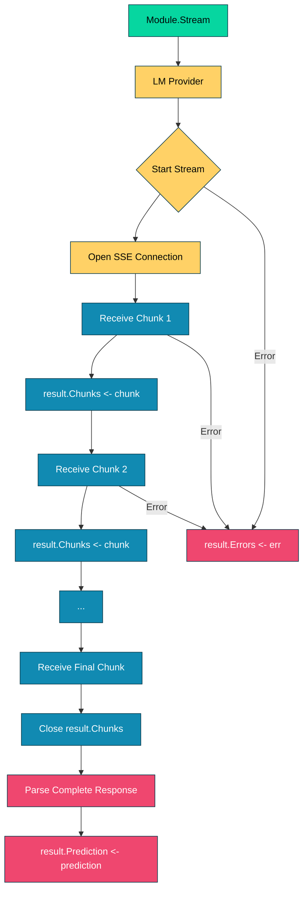

# 020_streaming - Real-Time Streaming Output

## Overview

Demonstrates DSGo's **streaming support** for real-time output processing. Shows how the `Stream()` method allows you to process LM responses as they arrive, chunk by chunk, providing a better user experience for long-running tasks.

## What it demonstrates

- **Real-time streaming** with `module.Stream()`
- **Chunk-by-chunk processing** for progressive rendering
- **Better UX** - immediate feedback vs waiting for complete response
- **Error handling** via `result.Errors` channel
- **Final structured output** via `result.Prediction` channel
- Streaming works with Predict module (other modules use Forward)
- Use cases: chat, content generation, code writing, Q&A

## Usage

```bash
cd examples/020_streaming
go run main.go
```

### With Harness Flags

```bash
go run main.go -verbose -format=json
go run main.go -concurrency=1
```

### Environment Variables

```bash
export HARNESS_VERBOSE=true
export HARNESS_OUTPUT_FORMAT=json
go run main.go
```

## Expected Output

```
=== Streaming Demo ===
Demonstrating real-time streaming output for better UX

--- Streaming Features ---
✓ Real-time output - see responses as they're generated
✓ Better user experience - no waiting for complete response
✓ Chunk-by-chunk processing - process data incrementally
✓ Early termination - cancel streams when needed
✓ Progress feedback - show users that work is happening

────────────────────────────────────────────────────────────────────────────────

--- Demo 1: Story Generation (Streaming) ---
Generating a creative story in real-time...

📝 Streaming output:

The Red Dust of Discovery

Commander Elena Vasquez's boots crunched against the rust-colored terrain as she approached the anomaly. Three months into her solo mission, the metallic glint beneath the Martian surface had appeared on her ground-penetrating radar like a whisper from another age.

As she carefully excavated the site, her breath caught. The object was unlike anything in the mission briefings—a crystalline sphere, roughly the size of a basketball, with intricate geometric patterns that seemed to shift in the dim sunlight. When she touched it, the artifact pulsed with a soft blue light, and suddenly her mind filled with images...

[Stream continues with the complete story...]

[Stream finished: stop | 127 chunks]

--- Parsed Structured Output ---
Title: The Red Dust of Discovery
Genre: Science Fiction
Story Length: 1456 characters
Chunks Received: 127
📊 Tokens used: 412

────────────────────────────────────────────────────────────────────────────────

--- Demo 2: Streaming vs Non-Streaming ---
Comparing user experience...

Non-Streaming:
  • User waits for entire response (5-10 seconds)
  • No feedback during generation
  • Entire response appears at once

Streaming:
  • Immediate feedback (first chunk in <1 second)
  • Progressive output visible
  • User can start reading while generation continues
  • Better perceived performance

✅ Streaming provides better UX

────────────────────────────────────────────────────────────────────────────────

--- Demo 3: Q&A Streaming ---
Stream detailed explanation in real-time...

🌱 Streaming explanation:

Photosynthesis is a complex biochemical process that occurs in the chloroplasts of plant cells. At the molecular level, it involves two main stages: the light-dependent reactions and the light-independent reactions (Calvin cycle).

In the light-dependent reactions, chlorophyll molecules in the thylakoid membranes absorb photons of light energy. This energy excites electrons, which are then passed through an electron transport chain...

[Stream continues with complete explanation...]

[Stream finished: stop | 95 chunks]

--- Structured Q&A Output ---
Explanation length: 1247 characters
Summary: Photosynthesis converts light energy into chemical energy through light-dependent reactions (producing ATP and NADPH) and the Calvin cycle (fixing CO2 into glucose).
📊 Tokens used: 285

────────────────────────────────────────────────────────────────────────────────

--- Use Cases for Streaming ---
1. **Interactive Chat**: Show responses as they're typed
2. **Long Content**: Stories, articles, reports
3. **Code Generation**: Display code as it's written
4. **Real-time Analysis**: Stream reasoning steps
5. **User Feedback**: Keep users engaged during long operations

=== Summary ===
Streaming capabilities:
  ✓ Real-time output improves perceived performance
  ✓ Chunk-by-chunk processing enables progressive rendering
  ✓ Works with Predict module (currently)
  ✓ Error handling via result.Errors channel
  ✓ Final structured output via result.Prediction channel

📊 Total tokens used: 710
📦 Total chunks received: 222
🔧 Total demos: 3
```

## Key Concepts

### 1. What is Streaming?

Streaming allows you to process LM responses as they arrive, chunk by chunk, instead of waiting for the complete response:

```go
// Non-streaming (traditional)
result, err := predict.Forward(ctx, inputs)
// ⏳ User waits 5-10 seconds for complete response

// Streaming (progressive)
streamResult, err := predict.Stream(ctx, inputs)
// ⚡ First chunk arrives in <1 second
for chunk := range streamResult.Chunks {
    fmt.Print(chunk.Content) // Display immediately
}
```

**Benefits:**
- **Better UX** - Users see progress immediately
- **Perceived performance** - Feels faster even if total time is same
- **Early interaction** - Users can start reading/processing sooner
- **Engagement** - Visual feedback keeps users engaged

### 2. Stream Result Structure

The `Stream()` method returns a `*StreamResult` with three channels:

```go
type StreamResult struct {
    Chunks      <-chan StreamChunk  // Receive chunks in real-time
    Errors      <-chan error         // Receive streaming errors
    Prediction  <-chan *Prediction   // Receive final parsed output
}

type StreamChunk struct {
    Content      string  // The text content of this chunk
    FinishReason string  // Reason stream ended ("stop", "length", etc.)
}
```

**Usage pattern:**

```go
result, err := predict.Stream(ctx, inputs)
if err != nil {
    return fmt.Errorf("failed to start stream: %w", err)
}

// 1. Process chunks as they arrive
for chunk := range result.Chunks {
    fmt.Print(chunk.Content)
    
    if chunk.FinishReason != "" {
        fmt.Printf("\n[Stream finished: %s]\n", chunk.FinishReason)
    }
}

// 2. Check for streaming errors
select {
case err := <-result.Errors:
    if err != nil {
        return fmt.Errorf("streaming error: %w", err)
    }
default:
}

// 3. Get final structured output
prediction := <-result.Prediction
title, _ := prediction.GetString("title")
```

### 3. When to Use Streaming

**✅ Use streaming for:**
- **Interactive chat** - Show responses as they're typed
- **Long content** - Stories, articles, documentation
- **Code generation** - Display code as it's written
- **Real-time analysis** - Stream reasoning steps
- **User engagement** - Keep users informed during long operations

**❌ Don't use streaming for:**
- **Short responses** - Overhead not worth it (<100 tokens)
- **Batch processing** - Non-interactive background tasks
- **Structured data only** - When you only need final parsed output
- **High concurrency** - Streaming requires more resources per request

### 4. Error Handling

Streaming has two error points:

**Error 1: Stream initialization**
```go
result, err := predict.Stream(ctx, inputs)
if err != nil {
    // Failed to start streaming
    // Could be: validation error, LM connection error, etc.
    return fmt.Errorf("failed to start stream: %w", err)
}
```

**Error 2: During streaming**
```go
// Process chunks...
for chunk := range result.Chunks {
    fmt.Print(chunk.Content)
}

// Check for errors that occurred during streaming
select {
case err := <-result.Errors:
    if err != nil {
        // Network error, timeout, LM error, etc.
        return fmt.Errorf("streaming error: %w", err)
    }
default:
    // No errors - stream completed successfully
}
```

**Important:** Always check both error points!

### 5. Context Cancellation

Streaming respects context cancellation:

```go
// Cancel stream after 10 seconds
ctx, cancel := context.WithTimeout(context.Background(), 10*time.Second)
defer cancel()

result, err := predict.Stream(ctx, inputs)
if err != nil {
    return err
}

for chunk := range result.Chunks {
    fmt.Print(chunk.Content)
    // If context is canceled, stream stops automatically
}

// Check if canceled
select {
case err := <-result.Errors:
    if err != nil {
        // Could be context deadline exceeded
        return err
    }
default:
}
```

**Behavior:**
- Context cancellation stops streaming immediately
- `result.Chunks` channel closes
- `result.Errors` receives cancellation error
- No "zombie" streams after cancellation

## Common Patterns

### Pattern 1: Basic Streaming (Recommended)

```go
result, err := predict.Stream(ctx, inputs)
if err != nil {
    return fmt.Errorf("stream failed: %w", err)
}

// Display chunks in real-time
for chunk := range result.Chunks {
    fmt.Print(chunk.Content)
}

// Check for errors
select {
case err := <-result.Errors:
    if err != nil {
        return fmt.Errorf("streaming error: %w", err)
    }
default:
}

// Get final structured output
prediction := <-result.Prediction
```

### Pattern 2: Streaming with Progress Indicator

```go
result, err := predict.Stream(ctx, inputs)
if err != nil {
    return err
}

fmt.Print("Generating response")
chunkCount := 0

for chunk := range result.Chunks {
    fmt.Print(chunk.Content)
    chunkCount++
    
    // Show progress every 10 chunks
    if chunkCount%10 == 0 {
        fmt.Printf(" [%d chunks]", chunkCount)
    }
}

fmt.Printf("\nCompleted in %d chunks\n", chunkCount)
```

### Pattern 3: Streaming with Buffer (for UI)

```go
result, err := predict.Stream(ctx, inputs)
if err != nil {
    return err
}

var buffer strings.Builder
updateInterval := 100 * time.Millisecond
lastUpdate := time.Now()

for chunk := range result.Chunks {
    buffer.WriteString(chunk.Content)
    
    // Update UI at regular intervals (throttle updates)
    if time.Since(lastUpdate) > updateInterval {
        updateUI(buffer.String()) // Your UI update function
        lastUpdate = time.Now()
    }
}

// Final UI update
updateUI(buffer.String())

// Get structured output
prediction := <-result.Prediction
```

### Pattern 4: Streaming with Early Termination

```go
ctx, cancel := context.WithCancel(context.Background())
defer cancel()

result, err := predict.Stream(ctx, inputs)
if err != nil {
    return err
}

var buffer strings.Builder

for chunk := range result.Chunks {
    buffer.WriteString(chunk.Content)
    fmt.Print(chunk.Content)
    
    // Stop if we've received enough content
    if buffer.Len() > 500 {
        fmt.Println("\n[Stopping early - sufficient content]")
        cancel() // Cancel context to stop stream
        break
    }
}
```

### Pattern 5: Streaming Multiple Requests Concurrently

```go
questions := []string{
    "Explain quantum computing",
    "Write a Python quicksort",
    "Describe photosynthesis",
}

var wg sync.WaitGroup
for _, question := range questions {
    wg.Add(1)
    
    go func(q string) {
        defer wg.Done()
        
        result, err := predict.Stream(ctx, map[string]any{
            "question": q,
        })
        if err != nil {
            log.Printf("Stream failed for %s: %v", q, err)
            return
        }
        
        fmt.Printf("\n--- %s ---\n", q)
        for chunk := range result.Chunks {
            fmt.Print(chunk.Content)
        }
        fmt.Println()
    }(question)
}

wg.Wait()
```

## Performance Characteristics

**Latency:**
- **Non-streaming**: User waits for complete response (~5-10s for long content)
- **Streaming**: First chunk in <1 second, progressive output

**Time to First Byte (TTFB):**
- **Non-streaming**: ~5-10 seconds
- **Streaming**: <1 second

**Total Execution Time:**
- **Same for both** - Streaming doesn't make generation faster
- **Perceived performance** is much better with streaming

**Resource Usage:**
- **Streaming**: Slightly higher (maintains connection, buffers chunks)
- **Memory**: Minimal - chunks are processed incrementally
- **Network**: Keeps connection open longer

**Throughput:**
- **Non-streaming**: Can batch multiple requests efficiently
- **Streaming**: Better for interactive use cases
- **Recommendation**: Use non-streaming for batch jobs, streaming for user-facing

## Troubleshooting

### Stream Never Starts

**Symptom:** `Stream()` returns error immediately

**Diagnosis:**
```go
result, err := predict.Stream(ctx, inputs)
if err != nil {
    log.Printf("Failed to start stream: %v", err)
    // Check: validation errors, LM connection, API key
}
```

**Solutions:**
1. **Check inputs** - Ensure all required fields are provided
2. **Verify LM connection** - Test with non-streaming first
3. **Check API key** - Authentication errors prevent streaming
4. **Validate signature** - Ensure signature is well-formed

### No Chunks Received

**Symptom:** Stream starts but no chunks arrive

**Diagnosis:**
```go
result, err := predict.Stream(ctx, inputs)
if err != nil {
    return err
}

timeout := time.After(30 * time.Second)
select {
case chunk := <-result.Chunks:
    fmt.Printf("First chunk: %s\n", chunk.Content)
case <-timeout:
    fmt.Println("No chunks received in 30s")
}
```

**Solutions:**
1. **Check context** - Ensure context isn't already canceled
2. **Verify LM** - Some LMs don't support streaming
3. **Check timeout** - Context deadline might be too short
4. **Network issues** - Firewall or proxy blocking streaming

### Incomplete Streaming

**Symptom:** Stream stops before completion

**Diagnosis:**
```go
for chunk := range result.Chunks {
    fmt.Print(chunk.Content)
    
    if chunk.FinishReason != "stop" {
        fmt.Printf("\nUnexpected finish: %s\n", chunk.FinishReason)
    }
}

select {
case err := <-result.Errors:
    if err != nil {
        log.Printf("Stream error: %v", err)
    }
default:
}
```

**Solutions:**
1. **Check finish reason**:
   - `"stop"` - Normal completion ✅
   - `"length"` - Hit max tokens (increase MaxTokens)
   - `"timeout"` - Context deadline exceeded
2. **Increase MaxTokens** - Response was truncated
3. **Extend timeout** - Context canceled too early

### Chunks Out of Order

**Symptom:** Chunks appear scrambled

**Cause:** You're likely streaming multiple requests concurrently without proper synchronization

**Solution:**
```go
// Use mutex or separate goroutines with separate outputs
var mu sync.Mutex

for chunk := range result.Chunks {
    mu.Lock()
    fmt.Print(chunk.Content)
    mu.Unlock()
}
```

## Comparison with Other Approaches

**vs. Non-Streaming (Forward):**
- **Streaming**: Better UX, progressive rendering
- **Forward**: Simpler code, better for batch processing

**vs. LangChain Streaming:**
- **DSGo**: Built-in, channel-based, type-safe
- **LangChain**: Similar callback-based approach

**vs. OpenAI SDK Streaming:**
- **DSGo**: Higher-level, works with all LMs
- **OpenAI SDK**: Low-level, OpenAI-specific

## See Also

- [001_predict](../001_predict/) - Basic prediction (non-streaming)
- [008_chat_predict](../008_chat_predict/) - Multi-turn chat (good for streaming)
- [009_chat_cot](../009_chat_cot/) - Multi-turn CoT (streaming reasoning)
- [002_chain_of_thought](../002_chain_of_thought/) - CoT reasoning
- [QUICKSTART.md](../../QUICKSTART.md) - Getting started guide

## Production Tips

1. **Throttle UI Updates**: Don't update UI for every chunk (100ms intervals)
2. **Handle Cancellation**: Always support user cancellation
3. **Show Progress**: Display chunk count or character count
4. **Error Recovery**: Fallback to non-streaming on stream errors
5. **Buffer Management**: Don't accumulate entire response in memory if not needed
6. **Timeouts**: Set reasonable context deadlines (30-60s)
7. **Loading States**: Show "generating..." while waiting for first chunk
8. **Graceful Degradation**: Fall back to non-streaming if streaming fails
9. **Monitor Performance**: Track TTFB and chunk delivery rate
10. **Test Edge Cases**: Empty responses, very long responses, early cancellation

## Architecture Notes

Streaming flow:



**Design Principles:**
- **Channel-based**: Idiomatic Go concurrency
- **Non-blocking**: Channels don't block sender
- **Error isolation**: Streaming errors don't crash application
- **Context-aware**: Respects cancellation and timeouts
- **Type-safe**: Structured output after streaming completes
