# 021_best_of_n_parallel - Parallel Candidate Generation with BestOfN

## Overview

Demonstrates DSGo's **BestOfN module with parallel execution** for significantly improved performance. Shows how enabling parallel mode can speed up candidate generation by 2-3x when generating multiple solutions simultaneously.

## What it demonstrates

- **Parallel execution** with `WithParallel(true)` for 2-3x speedup
- **Performance comparison** between sequential and parallel modes
- **Custom scoring functions** for domain-specific candidate selection
- **Early stopping** with score thresholds to save API calls
- **Candidate analysis** with `WithReturnAll(true)`
- Use cases: creative titles, product taglines, problem-solving
- **Concurrency safety** considerations for stateless vs stateful modules

## Usage

```bash
cd examples/021_best_of_n_parallel
go run main.go
```

### With Harness Flags

```bash
go run main.go -verbose -format=json
go run main.go -concurrency=1
```

### Environment Variables

```bash
export HARNESS_VERBOSE=true
export HARNESS_OUTPUT_FORMAT=json
go run main.go
```

## Expected Output

```
=== BestOfN Parallel Execution ===
Demonstrates parallel candidate generation for improved performance

--- Parallel Execution Features ---
✓ Generate N candidates concurrently
✓ Significant performance improvement (2-3x faster)
✓ Custom scoring functions for domain-specific selection
✓ Early stopping with score thresholds
✓ Analyze all candidates with WithReturnAll()

────────────────────────────────────────────────────────────────────────────────

--- Demo 1: Best Title Selection (Parallel) ---
Generate 5 creative titles and select the best one

Topic: Machine Learning for Beginners
Generated 5 candidates in parallel (2.34s)

All Candidates Generated:
1. 5 Essential Machine Learning Concepts Every Beginner Must Master 👑 WINNER (highest score)
2. Machine Learning Made Easy: A Complete Beginner's Roadmap
3. Getting Started with Machine Learning: Your First Steps
4. Understanding Machine Learning: A Comprehensive Guide for Newcomers
5. Machine Learning Fundamentals: What You Need to Know

🏆 Selected Best Title:
Title: 5 Essential Machine Learning Concepts Every Beginner Must Master
Hook: Discover the foundational concepts that will kickstart your ML journey.
Score: 115.0
📊 Tokens used: 1240

────────────────────────────────────────────────────────────────────────────────

--- Demo 2: Performance Comparison ---
Compare sequential vs parallel execution times

Sequential execution (N=3)...
Time: 8.45s

Parallel execution (N=3)...
Time: 3.12s
⚡ Speedup: 2.71x faster

Best Solution:
To find the area of a rectangle, we multiply the length by the width.

Area = length × width
Area = 12 cm × 8 cm
Area = 96 cm²

The area of the rectangle is 96 square centimeters.

Answer: 96 cm²
📊 Tokens used: 720

────────────────────────────────────────────────────────────────────────────────

--- Demo 3: Early Stopping with Threshold ---
Save API calls by stopping when a good enough candidate is found

Requested 10 candidates, generated 4 (early stopped)
Best tagline: "Hydrate smarter, glow brighter."
Score: 135.5 (threshold: 130.0)
📊 Tokens used: 380

────────────────────────────────────────────────────────────────────────────────

--- When to Use Parallel Execution ---
✅ Good for:
  • Creative tasks (titles, taglines, summaries)
  • Latency-sensitive applications
  • High N values (N≥5)
  • Stateless modules

❌ Avoid for:
  • Modules with shared state (e.g., History)
  • Low N values (N<3) - overhead not worth it
  • API rate limits (use sequential)

=== Summary ===
Parallel execution benefits:
  ✓ 2-3x faster execution with parallel=true
  ✓ Custom scoring enables domain-specific selection
  ✓ Early stopping saves API calls when threshold met
  ✓ ReturnAll allows analysis of all candidates

⚠️  Important: Ensure modules are stateless for parallel execution
   Modules with History cause data races. Use separate instances.

📊 Total tokens used: 2340
🔧 Total demos: 3
```

## Key Concepts

### 1. Parallel Execution

Enable parallel execution to generate candidates concurrently:

```go
// Sequential (default) - generates one candidate at a time
bestOfN := module.NewBestOfN(basePred, 5).
    WithScorer(scorer).
    WithParallel(false)  // Sequential: N × response_time

// Parallel - generates all candidates concurrently
bestOfN := module.NewBestOfN(basePred, 5).
    WithScorer(scorer).
    WithParallel(true)   // Parallel: ≈ response_time (2-3x faster)
```

**Performance:**
- **Sequential**: Total time = N × single_response_time
- **Parallel**: Total time ≈ single_response_time (plus small overhead)
- **Speedup**: Typically 2-3x for N=3-5, up to Nx for larger N

**When parallel is beneficial:**
- N ≥ 3 (overhead is worth it)
- Latency-sensitive applications
- Creative tasks requiring multiple variations
- No API rate limit concerns

### 2. Custom Scoring Functions

Define domain-specific criteria for selecting the best candidate:

```go
scorer := func(inputs map[string]any, pred *dsgo.Prediction) (float64, error) {
    title, _ := pred.GetString("title")
    
    score := 100.0
    
    // Criterion 1: Prefer shorter titles (up to 50 chars)
    if len(title) > 50 {
        score -= float64(len(title)-50) * 0.5
    }
    
    // Criterion 2: Bonus for data-driven titles (numbers)
    if strings.ContainsAny(title, "0123456789") {
        score += 15.0
    }
    
    // Criterion 3: Penalize very long hooks
    hook, _ := pred.GetString("hook")
    if len(hook) > 100 {
        score -= float64(len(hook)-100) * 0.3
    }
    
    return score, nil
}
```

**Scoring strategies:**
- **Length-based**: Prefer concise or detailed responses
- **Content-based**: Keyword matching, sentiment, structure
- **Format-based**: Numbers, bullets, specific patterns
- **Multi-criteria**: Combine multiple weighted factors
- **Domain-specific**: SEO score, readability, creativity

### 3. Early Stopping with Thresholds

Save API calls by stopping when a candidate meets your quality threshold:

```go
bestOfN := module.NewBestOfN(basePred, 10).
    WithScorer(scorer).
    WithParallel(true).
    WithThreshold(130.0)  // Stop when score ≥ 130

// If candidate #4 scores 135, generation stops
// Saves 6 API calls (60% reduction)
```

**Benefits:**
- **Cost savings**: Fewer API calls when quality threshold is met
- **Faster execution**: Don't wait for all N candidates
- **Quality guarantee**: Ensure minimum acceptable quality

**Best practices:**
- Set threshold based on observed score distribution
- Use with `WithReturnAll(true)` to analyze stopping behavior
- Balance between quality and cost (higher threshold = more calls)

### 4. Analyzing All Candidates

Return all generated candidates for analysis and comparison:

```go
bestOfN := module.NewBestOfN(basePred, 5).
    WithScorer(scorer).
    WithReturnAll(true)  // Include all candidates in result

result, err := bestOfN.Forward(ctx, inputs)

// result.Completions contains all candidates (sorted by score)
for i, completion := range result.Completions {
    title := completion["title"]
    fmt.Printf("%d. %s\n", i+1, title)
}

// Best candidate is also available via standard getters
best, _ := result.GetString("title")
```

**Use cases:**
- **A/B testing**: Compare multiple variations
- **User choice**: Present top N to users
- **Analysis**: Study score distribution
- **Debugging**: Understand why certain candidates scored higher

### 5. Concurrency Safety

**⚠️ Critical**: Parallel execution requires thread-safe modules.

**Safe modules (stateless):**
```go
// ✅ Safe: Predict module has no shared state
predict := module.NewPredict(sig, lm)
bestOfN := module.NewBestOfN(predict, 5).WithParallel(true)
```

**Unsafe modules (stateful):**
```go
// ❌ UNSAFE: History is not thread-safe
history := dsgo.NewHistory()
predict := module.NewPredict(sig, lm).WithHistory(history)
bestOfN := module.NewBestOfN(predict, 5).WithParallel(true)
// This will cause data races!
```

**Solutions for stateful modules:**

1. **Use sequential execution:**
```go
bestOfN := module.NewBestOfN(predict, 5).WithParallel(false)
```

2. **Create N independent instances:**
```go
// Not currently supported by BestOfN, but conceptually:
// Each worker gets its own module instance with separate state
```

3. **Use stateless modules:**
```go
// Remove History or other shared state
predict := module.NewPredict(sig, lm)  // No History
bestOfN := module.NewBestOfN(predict, 5).WithParallel(true)
```

## Common Patterns

### Pattern 1: Creative Content Selection

Generate multiple creative options and select the best:

```go
sig := dsgo.NewSignature("Generate a creative product tagline").
    AddInput("product", dsgo.FieldTypeString, "Product description").
    AddOutput("tagline", dsgo.FieldTypeString, "Catchy tagline")

predict := module.NewPredict(sig, lm)

// Prefer short, punchy taglines
scorer := func(inputs map[string]any, pred *dsgo.Prediction) (float64, error) {
    tagline, _ := pred.GetString("tagline")
    score := 100.0 - float64(len(tagline))
    
    if len(tagline) < 40 {
        score += 50.0  // Bonus for very short
    }
    
    return score, nil
}

bestOfN := module.NewBestOfN(predict, 5).
    WithScorer(scorer).
    WithParallel(true).
    WithReturnAll(true)

result, err := bestOfN.Forward(ctx, map[string]any{
    "product": "AI-powered productivity app",
})
```

### Pattern 2: Performance-Critical Applications

Maximize throughput with parallel execution:

```go
start := time.Now()

bestOfN := module.NewBestOfN(predict, 5).
    WithScorer(scorer).
    WithParallel(true)  // 2-3x faster

result, err := bestOfN.Forward(ctx, inputs)

elapsed := time.Since(start)
fmt.Printf("Generated %d candidates in %.2fs\n", 5, elapsed.Seconds())
// Parallel: ~3s for 5 candidates
// Sequential: ~10s for 5 candidates
```

### Pattern 3: Cost-Optimized with Early Stopping

Balance quality and cost with adaptive stopping:

```go
bestOfN := module.NewBestOfN(predict, 10).
    WithScorer(scorer).
    WithParallel(true).
    WithThreshold(90.0).     // Good enough threshold
    WithReturnAll(true)

result, err := bestOfN.Forward(ctx, inputs)

fmt.Printf("Requested %d candidates, generated %d\n", 
    10, len(result.Completions))
// Might stop at 3-4 candidates if threshold is met
// Saves 60-70% of API calls
```

### Pattern 4: Comparative Analysis

Generate and compare all candidates:

```go
bestOfN := module.NewBestOfN(predict, 5).
    WithScorer(scorer).
    WithParallel(true).
    WithReturnAll(true)

result, err := bestOfN.Forward(ctx, inputs)

// Analyze score distribution
fmt.Println("Candidate Analysis:")
for i, completion := range result.Completions {
    title := completion["title"]
    // Access score via metadata if needed
    fmt.Printf("%d. %s\n", i+1, title)
}

// Show best
best, _ := result.GetString("title")
fmt.Printf("\nSelected: %s (score: %.1f)\n", best, result.Score)
```

### Pattern 5: Domain-Specific Optimization

Multi-criteria scoring for specialized domains:

```go
// SEO-optimized title generator
scorer := func(inputs map[string]any, pred *dsgo.Prediction) (float64, error) {
    title, _ := pred.GetString("title")
    
    score := 0.0
    
    // SEO: Ideal length 50-60 characters
    titleLen := len(title)
    if titleLen >= 50 && titleLen <= 60 {
        score += 30.0
    } else if titleLen < 50 {
        score += 20.0 - float64(50-titleLen)*0.5
    } else {
        score += 20.0 - float64(titleLen-60)*0.5
    }
    
    // SEO: Numbers improve click-through
    if strings.ContainsAny(title, "0123456789") {
        score += 20.0
    }
    
    // SEO: Action words
    actionWords := []string{"How", "Why", "What", "Best", "Top"}
    for _, word := range actionWords {
        if strings.Contains(title, word) {
            score += 10.0
            break
        }
    }
    
    // SEO: Year for freshness
    if strings.Contains(title, "2024") || strings.Contains(title, "2025") {
        score += 15.0
    }
    
    return score, nil
}
```

## Performance Characteristics

### Execution Time

**Sequential (N=5):**
- Time = 5 × single_response_time
- Example: 5 × 2s = 10s total

**Parallel (N=5):**
- Time ≈ single_response_time + overhead
- Example: 2s + 0.5s = 2.5s total
- **Speedup: 4x**

### Resource Usage

**Memory:**
- Parallel: N × (model input + output buffers)
- Typically negligible (<10MB for N=5)

**API Concurrency:**
- Parallel: N simultaneous requests
- Watch for rate limits (OpenAI: 3000 RPM, OpenRouter: varies)
- Use sequential if approaching limits

**Network:**
- Parallel: N concurrent connections
- Most providers handle this well
- May need connection pooling for large N

### Cost Analysis

**Without early stopping:**
- Cost = N × cost_per_request
- Example: 5 candidates × $0.002 = $0.01

**With early stopping (threshold=90):**
- Average cost = 3.2 × cost_per_request (if stopping at candidate 3-4)
- Savings: 36% reduction
- Example: 3.2 × $0.002 = $0.0064 (36% cheaper)

**Optimal threshold:**
- Too low: Poor quality, frequent stopping
- Too high: Rare stopping, minimal savings
- **Recommendation**: Set to 75th percentile of observed scores

## Troubleshooting

### Parallel Execution Not Faster

**Symptom:** Parallel mode shows minimal speedup

**Diagnosis:**
```go
start := time.Now()
result, _ := bestOfN.Forward(ctx, inputs)
elapsed := time.Since(start)
fmt.Printf("Time: %.2fs for %d candidates\n", elapsed.Seconds(), N)
// Expected: ~2-3s for N=5
// If seeing 10s+, parallel isn't working
```

**Possible causes:**
1. **API rate limiting** - Provider throttling requests
2. **Low N value** - Overhead dominates for N<3
3. **Network bottleneck** - Connection pool too small
4. **CPU bottleneck** - Machine can't handle N goroutines

**Solutions:**
- Check provider rate limits
- Increase N to 5+ for meaningful speedup
- Use sequential for N<3
- Monitor system resources

### Data Races with History

**Symptom:** Panic or corrupted state with parallel execution

**Diagnosis:**
```bash
go test -race ./...
# Shows: WARNING: DATA RACE
# Write at 0x... in dsgo.History.Add
```

**Cause:** History is not thread-safe

**Solution:**
```go
// Option 1: Use sequential execution
bestOfN := module.NewBestOfN(predict, 5).
    WithParallel(false)

// Option 2: Remove History (if not needed)
predict := module.NewPredict(sig, lm)  // No WithHistory
bestOfN := module.NewBestOfN(predict, 5).
    WithParallel(true)
```

### Early Stopping Not Working

**Symptom:** Always generates all N candidates

**Diagnosis:**
```go
result, _ := bestOfN.Forward(ctx, inputs)
fmt.Printf("Generated: %d, Requested: %d\n", 
    len(result.Completions), N)
// Should see: Generated: 3, Requested: 10 (if stopped early)
// If seeing: Generated: 10, Requested: 10 (not stopping)
```

**Possible causes:**
1. **Threshold too high** - No candidate reaches it
2. **Scorer returns low scores** - All below threshold
3. **Parallel interference** - Candidates generated before checking

**Solutions:**
- Lower threshold to realistic value
- Analyze score distribution first
- Remember: parallel mode generates all at once, early stopping mainly affects sequential

### Inconsistent Results

**Symptom:** Different winners on repeated runs

**Cause:** Temperature > 0 introduces randomness

**Expected behavior:**
```go
// Temperature 0.7 = creative but variable
predict := module.NewPredict(sig, lm).
    WithOptions(&dsgo.GenerateOptions{
        Temperature: 0.7,  // Different results each time
    })

// For deterministic results:
predict := module.NewPredict(sig, lm).
    WithOptions(&dsgo.GenerateOptions{
        Temperature: 0.0,  // Same results (but less creative)
    })
```

## Comparison with Other Approaches

**vs. Sequential BestOfN:**
- **Parallel**: 2-3x faster, higher API concurrency
- **Sequential**: Slower, better for rate limits

**vs. Single Prediction:**
- **BestOfN**: Higher quality, higher cost
- **Single**: Faster, cheaper, lower quality

**vs. LangChain's Parallel Generation:**
- **DSGo**: Built-in scoring, early stopping, type-safe
- **LangChain**: Manual orchestration required

## See Also

- [005_best_of_n](../005_best_of_n/) - Basic BestOfN (sequential)
- [001_predict](../001_predict/) - Basic prediction module
- [002_chain_of_thought](../002_chain_of_thought/) - CoT for better reasoning
- [022_caching](../022_caching/) - Cache to avoid regeneration
- [QUICKSTART.md](../../QUICKSTART.md) - Getting started guide

## Production Tips

1. **Monitor Rate Limits**: Watch for 429 errors with parallel
2. **Set Realistic Thresholds**: Based on observed score distribution
3. **Profile Performance**: Measure actual speedup in your use case
4. **Handle Errors**: One failure shouldn't crash all candidates
5. **Log Scores**: Track score distribution for threshold tuning
6. **Use Caching**: Cache results for identical inputs
7. **Batch Similar Requests**: Group related generations
8. **Test Concurrency**: Verify modules are stateless
9. **Cost Tracking**: Monitor API spend with parallel
10. **Fallback to Sequential**: On rate limit errors

## Architecture Notes

Parallel execution flow:

```mermaid
graph TB
    A[BestOfN.Forward] --> B{Parallel?}
    B -->|Yes| C[Launch N Goroutines]
    B -->|No| D[Sequential Loop]
    
    C --> E1[Goroutine 1<br/>Generate candidate]
    C --> E2[Goroutine 2<br/>Generate candidate]
    C --> E3[Goroutine N<br/>Generate candidate]
    
    E1 --> F1[Score candidate 1]
    E2 --> F2[Score candidate 2]
    E3 --> F3[Score candidate N]
    
    F1 --> G[Collect All Results]
    F2 --> G
    F3 --> G
    
    G --> H[Sort by Score]
    H --> I[Return Best]
    
    D --> J[Generate 1]
    J --> K{Score ≥ Threshold?}
    K -->|Yes| I
    K -->|No| L[Generate Next]
    L --> K
    
    classDef module fill:#06d6a0,stroke:#073b4c,color:#000
    classDef parallel fill:#ffd166,stroke:#073b4c,color:#000
    classDef sequential fill:#118ab2,stroke:#073b4c,color:#fff
    classDef result fill:#ef476f,stroke:#073b4c,color:#fff
    
    class A,B module
    class C,E1,E2,E3,F1,F2,F3,G parallel
    class D,J,K,L sequential
    class H,I result
```



**Design Principles:**
- **Stateless parallelism**: Each goroutine operates independently
- **No shared state**: Avoids data races
- **Bounded concurrency**: N goroutines max
- **Error isolation**: One failure doesn't affect others
- **Deterministic scoring**: Same input → same score
