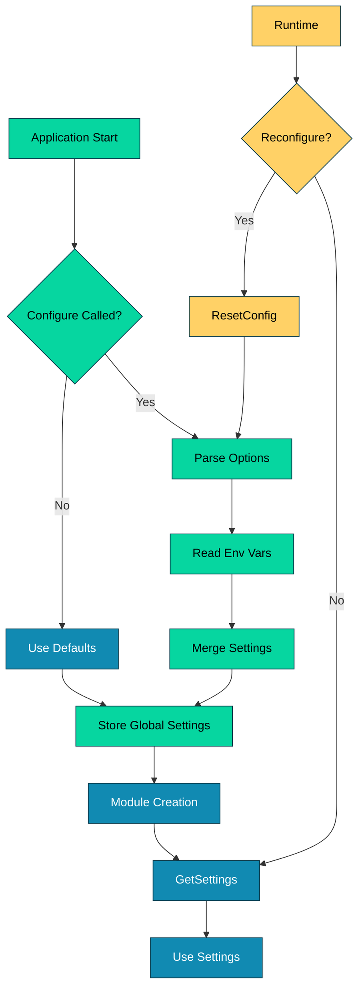

# 023_global_config - Global Configuration System

## Overview

Demonstrates DSGo's **global configuration system** for managing application-wide settings. Shows how to configure providers, models, timeouts, and other settings using functional options or environment variables, with explicit override capabilities.

## What it demonstrates

- **Functional options** (WithProvider, WithModel, WithTimeout, etc.)
- **Environment variable fallbacks** (DSGO_PROVIDER, DSGO_MODEL, etc.)
- **Configuration precedence** (options > env vars > defaults)
- **Thread-safe global settings** access
- **Runtime reconfiguration** with ResetConfig()
- Use cases: multi-environment deployments (dev/staging/prod), centralized configuration

## Usage

```bash
cd examples/023_global_config
go run main.go
```

### With Harness Flags

```bash
go run main.go -verbose -format=json
go run main.go -concurrency=1
```

### Environment Variables

```bash
export HARNESS_VERBOSE=true
export HARNESS_OUTPUT_FORMAT=json
go run main.go
```

## Expected Output

```
=== Global Configuration System ===
Demonstrates DSGo's global configuration via functional options and environment variables

--- Configuration Features ---
✓ Functional options (WithProvider, WithModel, etc.)
✓ Environment variable fallbacks (DSGO_PROVIDER, DSGO_MODEL, etc.)
✓ Options override environment variables
✓ Thread-safe global settings
✓ Runtime reconfiguration with ResetConfig()

────────────────────────────────────────────────────────────────────────────────

--- Example 1: Functional Options ---
Configure DSGo using functional options for explicit control

Configured Provider: openrouter
Configured Model: google/gemini-2.5-flash
Timeout: 30s
Max Retries: 3
Tracing Enabled: true

────────────────────────────────────────────────────────────────────────────────

--- Example 2: Environment Variables ---
Configure DSGo using environment variables (fallback mechanism)

Provider from env: openai
Model from env: gpt-4
Timeout from env: 1m0s
Max Retries from env: 5

────────────────────────────────────────────────────────────────────────────────

--- Example 3: Override Env with Options ---
Functional options take precedence over environment variables

Provider (from env): openai
Model (overridden): google/gemini-2.5-flash
Timeout (overridden): 45s

────────────────────────────────────────────────────────────────────────────────

--- Example 4: Using Configured Settings ---
Create LM instance and run prediction with configured settings

Created LM: google/gemini-2.5-flash

Greeting: Hello Alice! It's wonderful to meet you. How can I help you today?
📊 Tokens used: 45

────────────────────────────────────────────────────────────────────────────────

--- Configuration Precedence ---
1. Functional options (highest priority)
2. Environment variables
3. Built-in defaults (lowest priority)

--- Available Configuration Options ---
Functional Options:
  • dsgo.WithProvider(name)     - Set default provider
  • dsgo.WithModel(model)        - Set default model
  • dsgo.WithTimeout(duration)   - Set default timeout
  • dsgo.WithMaxRetries(n)       - Set max retry attempts
  • dsgo.WithTracing(bool)       - Enable/disable tracing

Environment Variables:
  • DSGO_PROVIDER     - Default provider name
  • DSGO_MODEL        - Default model name
  • DSGO_TIMEOUT      - Default timeout (seconds)
  • DSGO_MAX_RETRIES  - Max retry attempts
  • DSGO_ENABLE_TRACE - Enable tracing (true/false)

=== Summary ===
Global configuration benefits:
  ✓ Centralized settings management
  ✓ Environment-based configuration (dev/staging/prod)
  ✓ Explicit override capability
  ✓ Thread-safe access
  ✓ Runtime reconfiguration support

📊 Total tokens used: 45
🔧 Total examples: 4
```

## Key Concepts

### 1. Functional Options

Configure DSGo using explicit functional options for full control:

```go
import (
    "time"
    "github.com/assagman/dsgo"
)

func main() {
    // Configure with functional options
    dsgo.Configure(
        dsgo.WithProvider("openrouter"),
        dsgo.WithModel("google/gemini-2.5-flash"),
        dsgo.WithTimeout(30*time.Second),
        dsgo.WithMaxRetries(3),
        dsgo.WithTracing(true),
    )
    
    // Access settings
    settings := dsgo.GetSettings()
    fmt.Printf("Provider: %s\n", settings.DefaultProvider)
    fmt.Printf("Model: %s\n", settings.DefaultModel)
}
```

**Available options:**
- `WithProvider(name string)` - Set default LM provider
- `WithModel(model string)` - Set default model name
- `WithTimeout(duration time.Duration)` - Set default timeout
- `WithMaxRetries(n int)` - Set max retry attempts
- `WithTracing(enabled bool)` - Enable/disable tracing

**When to use:**
- Explicit configuration in application code
- Testing with specific providers/models
- Override environment-based settings
- Production deployments with known configuration

### 2. Environment Variables

Configure DSGo using environment variables for flexible deployments:

```bash
# Set environment variables
export DSGO_PROVIDER=openai
export DSGO_MODEL=gpt-4
export DSGO_TIMEOUT=60
export DSGO_MAX_RETRIES=5
export DSGO_ENABLE_TRACE=true
```

```go
func main() {
    // Configure from environment (reads env vars automatically)
    dsgo.Configure()
    
    settings := dsgo.GetSettings()
    // settings.DefaultProvider = "openai" (from DSGO_PROVIDER)
    // settings.DefaultModel = "gpt-4" (from DSGO_MODEL)
}
```

**Supported environment variables:**
- `DSGO_PROVIDER` - Default provider name
- `DSGO_MODEL` - Default model name
- `DSGO_TIMEOUT` - Default timeout in seconds
- `DSGO_MAX_RETRIES` - Max retry attempts
- `DSGO_ENABLE_TRACE` - Enable tracing (true/false)

**When to use:**
- Multi-environment deployments (dev/staging/prod)
- CI/CD pipelines
- Docker/Kubernetes deployments
- Local development with .env files

### 3. Configuration Precedence

Configuration sources have a clear precedence order:

```go
// 1. Set environment variables (lowest priority)
os.Setenv("DSGO_PROVIDER", "openai")
os.Setenv("DSGO_MODEL", "gpt-4")

// 2. Configure with some options (overrides env vars)
dsgo.Configure(
    dsgo.WithModel("google/gemini-2.5-flash"),  // Overrides DSGO_MODEL
    // Provider still uses env var (openai)
)

settings := dsgo.GetSettings()
// Provider: "openai" (from env var)
// Model: "google/gemini-2.5-flash" (from option, overrode env var)
```

**Precedence order (highest to lowest):**
1. **Functional options** - Explicit code-based configuration
2. **Environment variables** - OS environment settings
3. **Built-in defaults** - DSGo's default values

**Best practices:**
- Use env vars for environment-specific settings
- Use options to override for specific use cases
- Document which settings come from which source

### 4. Runtime Reconfiguration

Reconfigure DSGo at runtime using ResetConfig():

```go
func main() {
    // Initial configuration
    dsgo.Configure(dsgo.WithProvider("openai"))
    
    // ... do some work ...
    
    // Reset and reconfigure
    dsgo.ResetConfig()
    dsgo.Configure(dsgo.WithProvider("openrouter"))
    
    // New settings applied
    settings := dsgo.GetSettings()
    // Provider is now "openrouter"
}
```

**When to use:**
- Switching providers at runtime
- Testing different configurations
- Multi-tenant applications with per-tenant settings
- Feature flags or A/B testing

**Thread safety:**
- `Configure()` is thread-safe
- `GetSettings()` returns a copy (safe for concurrent use)
- Avoid frequent reconfiguration (performance overhead)

### 5. Thread-Safe Access

Settings are accessed safely across goroutines:

```go
func worker() {
    settings := dsgo.GetSettings()
    // Safe: GetSettings() returns a copy
    fmt.Printf("Worker using: %s\n", settings.DefaultModel)
}

func main() {
    dsgo.Configure(dsgo.WithModel("gpt-4"))
    
    // Safe: spawn multiple workers
    for i := 0; i < 10; i++ {
        go worker()
    }
}
```

**Thread safety guarantees:**
- `Configure()` uses mutex for safe concurrent calls
- `GetSettings()` returns a copy (no shared state)
- `ResetConfig()` is thread-safe

**Best practices:**
- Configure once at startup (best performance)
- Call `GetSettings()` when needed (returns copy)
- Avoid frequent `Configure()` calls in hot paths

## Common Patterns

### 1. Multi-Environment Configuration

```go
func configureForEnvironment() {
    env := os.Getenv("APP_ENV")
    
    switch env {
    case "production":
        dsgo.Configure(
            dsgo.WithProvider("openai"),
            dsgo.WithModel("gpt-4"),
            dsgo.WithTimeout(60*time.Second),
            dsgo.WithMaxRetries(5),
            dsgo.WithTracing(false),
        )
    case "staging":
        dsgo.Configure(
            dsgo.WithProvider("openrouter"),
            dsgo.WithModel("google/gemini-2.5-flash"),
            dsgo.WithTimeout(30*time.Second),
            dsgo.WithMaxRetries(3),
            dsgo.WithTracing(true),
        )
    case "development":
        // Use env vars from .env file
        dsgo.Configure()
    }
}
```

### 2. Configuration with Validation

```go
func configureWithValidation() error {
    provider := os.Getenv("DSGO_PROVIDER")
    if provider == "" {
        return fmt.Errorf("DSGO_PROVIDER must be set")
    }
    
    model := os.Getenv("DSGO_MODEL")
    if model == "" {
        return fmt.Errorf("DSGO_MODEL must be set")
    }
    
    dsgo.Configure(
        dsgo.WithProvider(provider),
        dsgo.WithModel(model),
    )
    
    return nil
}
```

### 3. Testing with Custom Configuration

```go
func TestMyFeature(t *testing.T) {
    // Save original config
    original := dsgo.GetSettings()
    defer func() {
        // Restore original config after test
        dsgo.ResetConfig()
        dsgo.Configure(
            dsgo.WithProvider(original.DefaultProvider),
            dsgo.WithModel(original.DefaultModel),
        )
    }()
    
    // Configure for test
    dsgo.Configure(
        dsgo.WithProvider("openai"),
        dsgo.WithModel("gpt-3.5-turbo"),
    )
    
    // Run test with test configuration
    // ...
}
```

### 4. Configuration from File

```go
type Config struct {
    Provider   string        `json:"provider"`
    Model      string        `json:"model"`
    Timeout    int           `json:"timeout_seconds"`
    MaxRetries int           `json:"max_retries"`
    Tracing    bool          `json:"tracing"`
}

func loadConfigFromFile(path string) error {
    data, err := os.ReadFile(path)
    if err != nil {
        return err
    }
    
    var config Config
    if err := json.Unmarshal(data, &config); err != nil {
        return err
    }
    
    dsgo.Configure(
        dsgo.WithProvider(config.Provider),
        dsgo.WithModel(config.Model),
        dsgo.WithTimeout(time.Duration(config.Timeout)*time.Second),
        dsgo.WithMaxRetries(config.MaxRetries),
        dsgo.WithTracing(config.Tracing),
    )
    
    return nil
}
```

## Environment Variable Examples

### Development (.env file)

```bash
# .env.development
DSGO_PROVIDER=openrouter
DSGO_MODEL=google/gemini-2.5-flash
DSGO_TIMEOUT=30
DSGO_MAX_RETRIES=3
DSGO_ENABLE_TRACE=true
```

### Staging

```bash
# .env.staging
DSGO_PROVIDER=openai
DSGO_MODEL=gpt-4
DSGO_TIMEOUT=45
DSGO_MAX_RETRIES=4
DSGO_ENABLE_TRACE=true
```

### Production

```bash
# .env.production
DSGO_PROVIDER=openai
DSGO_MODEL=gpt-4
DSGO_TIMEOUT=60
DSGO_MAX_RETRIES=5
DSGO_ENABLE_TRACE=false
```

### Docker Compose

```yaml
version: '3.8'
services:
  app:
    image: myapp:latest
    environment:
      - DSGO_PROVIDER=openai
      - DSGO_MODEL=gpt-4
      - DSGO_TIMEOUT=60
      - DSGO_MAX_RETRIES=5
      - DSGO_ENABLE_TRACE=false
```

### Kubernetes ConfigMap

```yaml
apiVersion: v1
kind: ConfigMap
metadata:
  name: dsgo-config
data:
  DSGO_PROVIDER: "openai"
  DSGO_MODEL: "gpt-4"
  DSGO_TIMEOUT: "60"
  DSGO_MAX_RETRIES: "5"
  DSGO_ENABLE_TRACE: "false"
---
apiVersion: apps/v1
kind: Deployment
metadata:
  name: myapp
spec:
  template:
    spec:
      containers:
      - name: app
        envFrom:
        - configMapRef:
            name: dsgo-config
```

## Settings Reference

### Settings Structure

```go
type Settings struct {
    DefaultProvider string
    DefaultModel    string
    DefaultTimeout  time.Duration
    MaxRetries      int
    EnableTracing   bool
}

// Access current settings
settings := dsgo.GetSettings()
```

### Default Values

If no configuration is provided, DSGo uses these defaults:

```go
DefaultProvider: "openai"
DefaultModel:    "gpt-3.5-turbo"
DefaultTimeout:  30 * time.Second
MaxRetries:      3
EnableTracing:   false
```

## Troubleshooting

### Configuration Not Applied

**Symptom:** Settings don't match expected values

**Diagnosis:**
```go
settings := dsgo.GetSettings()
fmt.Printf("Provider: %s\n", settings.DefaultProvider)
fmt.Printf("Model: %s\n", settings.DefaultModel)
// Check if values match expected
```

**Possible causes:**
1. **Precedence confusion** - Env var overriding option
2. **Missing Configure() call** - Using defaults
3. **Typo in env var name** - DSGO_PROVIDER vs DSGO_PRVIDER

**Solutions:**
- Understand precedence: options > env vars > defaults
- Always call `Configure()` after setting env vars
- Double-check environment variable names

### Environment Variables Not Read

**Symptom:** Env vars ignored, defaults used instead

**Diagnosis:**
```bash
# Check if env vars are set
echo $DSGO_PROVIDER
echo $DSGO_MODEL

# If empty, they're not set
```

**Possible causes:**
1. **Env vars not exported** - Set but not exported
2. **Timing issue** - Set after process started
3. **Wrong shell** - Set in one shell, running in another

**Solutions:**
```bash
# Export variables
export DSGO_PROVIDER=openai
export DSGO_MODEL=gpt-4

# Or use .env file with godotenv
# (shared.LoadEnv() handles this)

# Verify they're set
env | grep DSGO
```

### Concurrent Configuration Changes

**Symptom:** Race conditions or inconsistent settings

**Diagnosis:**
```bash
go test -race ./...
# If shows DATA RACE in Configure()
```

**Cause:** Multiple goroutines calling `Configure()` simultaneously

**Solution:**
```go
// Configure once at startup (best practice)
func main() {
    dsgo.Configure(/* ... */)
    
    // Don't reconfigure in hot paths
    for i := 0; i < 100; i++ {
        go worker()  // ✅ Good: workers read settings
    }
}

// Avoid frequent reconfiguration
func badPattern() {
    for i := 0; i < 100; i++ {
        go func() {
            dsgo.Configure(/* ... */)  // ❌ Bad: race condition
        }()
    }
}
```

## Performance Considerations

### Configuration Overhead

**Configure() cost:**
- First call: ~100μs (parse env vars, set defaults)
- Subsequent calls: ~50μs (already initialized)
- Thread-safe (mutex protected)

**GetSettings() cost:**
- ~1μs (returns copy of struct)
- No allocation (struct copy on stack)
- Thread-safe (no locks)

**Best practices:**
- Configure once at startup
- Call `GetSettings()` as needed (cheap)
- Avoid `Configure()` in hot loops

### Memory Usage

**Per Configure() call:**
- ~1KB (settings struct + copies)
- Minimal heap allocation
- GC-friendly (short-lived)

**Recommendations:**
- Configure once, read many times
- No memory concerns for typical usage

## Comparison with Other Approaches

**vs. Manual per-module configuration:**
- **Global Config**: Configure once, use everywhere
- **Manual**: More flexible, more verbose

**vs. Config file libraries (viper, etc.):**
- **DSGo Config**: Minimal, DSGo-specific
- **Viper**: Full-featured, more dependencies

**vs. Flags (cobra, etc.):**
- **DSGo Config**: Environment + code-based
- **Flags**: CLI-first, more user-facing

## See Also

- [024_lm_factory](../024_lm_factory/) - LM factory for provider management
- [025_logging_tracing](../025_logging_tracing/) - Logging and tracing integration
- [001_predict](../001_predict/) - Basic prediction module
- [QUICKSTART.md](../../QUICKSTART.md) - Getting started guide

## Production Tips

1. **Configure Early**: Call `Configure()` in main() before creating modules
2. **Environment Files**: Use .env files for local dev (with godotenv)
3. **Validate Settings**: Check required settings are present
4. **Document Config**: List all env vars in README
5. **Version Config**: Track config changes in version control
6. **Secrets Management**: Use secret managers for API keys (not env vars in code)
7. **Config Validation**: Validate settings at startup
8. **Monitoring**: Log configuration on startup for debugging
9. **Testing**: Use `ResetConfig()` to isolate test configurations
10. **Immutability**: Configure once, avoid runtime changes

## Architecture Notes

Configuration flow:



**Design Principles:**
- **Singleton pattern**: Single global settings instance
- **Copy-on-read**: GetSettings() returns copy (no shared mutation)
- **Mutex protection**: Thread-safe configuration updates
- **Lazy initialization**: Settings created on first Configure()
- **Precedence chain**: Clear override hierarchy
