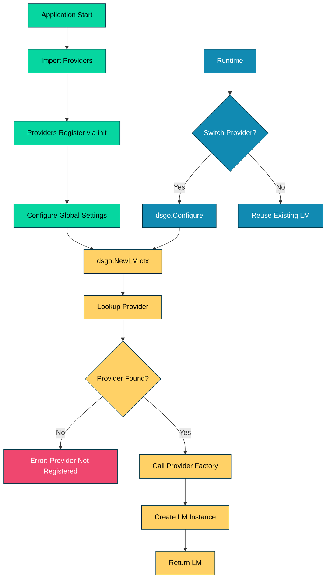

# 024_lm_factory - LM Factory Pattern

## Overview

Demonstrates DSGo's **LM factory pattern** for dynamic language model instantiation based on global configuration. Shows how to create LM instances using `dsgo.NewLM()`, switch providers at runtime, handle errors gracefully, and configure via environment variables.

## What it demonstrates

- **Factory-based LM creation** with `dsgo.NewLM(ctx)`
- **Dynamic provider switching** at runtime
- **Automatic provider registration** via `init()` functions
- **Environment variable configuration** (DSGO_PROVIDER, DSGO_MODEL)
- **Error handling** for missing/invalid configuration
- **Observability integration** with MemoryCollector
- Use cases: multi-provider applications, A/B testing, fallback strategies

## Usage

```bash
cd examples/024_lm_factory
go run main.go
```

### With Harness Flags

```bash
go run main.go -verbose -format=json
go run main.go -concurrency=1
```

### Environment Variables

```bash
export HARNESS_VERBOSE=true
export HARNESS_OUTPUT_FORMAT=json
go run main.go
```

## Expected Output

```
=== LM Factory Pattern ===
Demonstrates DSGo's LM factory for dynamic provider/model instantiation

--- Factory Features ---
✓ Dynamic LM creation with dsgo.NewLM()
✓ Provider switching at runtime
✓ Automatic provider registration
✓ Environment-based configuration
✓ Graceful error handling

────────────────────────────────────────────────────────────────────────────────

--- Example 1: Basic Factory Usage ---
Create LM using factory with global configuration

✓ Created instrumented LM: google/gemini-2.5-flash

Sentiment: positive
📊 Tokens used: 120

Collected History:
  ID: abc123...
  Model: google/gemini-2.5-flash
  Provider: openrouter
  Usage: 45 prompt tokens, 15 completion tokens
  Cost: $0.000120
  Latency: 342ms
  Response: The sentiment is positive because the text expr...

────────────────────────────────────────────────────────────────────────────────

--- Example 2: Dynamic Provider Switching ---
Switch between providers at runtime using dsgo.Configure()

✓ Created LM: google/gemini-2.5-flash (openrouter)
✓ Created LM: gpt-4 (openai)

────────────────────────────────────────────────────────────────────────────────

--- Example 3: Error Handling ---
Gracefully handle configuration errors

✓ Expected error (no provider): no default provider configured (use dsgo.Configure with dsgo.WithProvider)
✓ Expected error (no model): no default model configured for provider 'openai' (use dsgo.Configure with dsgo.WithModel)
✓ Expected error (unknown provider): provider 'nonexistent' not registered (available: [openai openrouter])

────────────────────────────────────────────────────────────────────────────────

--- Example 4: Environment Variables ---
Configure LM factory using environment variables

✓ Created LM from env vars: anthropic/claude-3.5-sonnet

────────────────────────────────────────────────────────────────────────────────

--- Example 5: Export History to JSON ---
Serialize collected history for observability

Sample History Entry (JSON):
{
  "id": "abc123...",
  "model": "google/gemini-2.5-flash",
  "provider": "openrouter",
  "usage": {
    "prompt_tokens": 45,
    "completion_tokens": 15,
    "total_tokens": 60,
    "cost": 0.00012,
    "latency": 342
  },
  "response": {
    "role": "assistant",
    "content": "The sentiment is positive..."
  }
}...

────────────────────────────────────────────────────────────────────────────────

--- LM Factory Pattern Benefits ---
✓ Centralized configuration management
✓ Easy provider switching without code changes
✓ Environment-based configuration for deployments
✓ Type-safe LM instantiation
✓ Automatic provider registration

=== Summary ===
LM Factory provides:
  ✓ Dynamic provider/model selection
  ✓ Global configuration with local overrides
  ✓ Graceful error handling
  ✓ Environment-based flexibility

📊 Total tokens used: 120
🔧 Total examples: 5
```

## Key Concepts

### 1. LM Factory Pattern

Create LM instances dynamically based on global configuration:

```go
import (
    "context"
    "github.com/assagman/dsgo"
)

func main() {
    // Configure globally
    dsgo.Configure(
        dsgo.WithProvider("openrouter"),
        dsgo.WithModel("google/gemini-2.5-flash"),
    )
    
    // Create LM from configuration
    ctx := context.Background()
    lm, err := dsgo.NewLM(ctx)
    if err != nil {
        log.Fatal(err)
    }
    
    // Use the LM
    fmt.Printf("Created LM: %s\n", lm.Name())
}
```

**Benefits:**
- **Centralized configuration** - Set provider/model once, use everywhere
- **Type safety** - Factory ensures correct LM types
- **Easy testing** - Switch providers for different test scenarios
- **Deployment flexibility** - Configure via environment variables

**When to use:**
- Applications supporting multiple LM providers
- A/B testing different models
- Fallback strategies (primary provider fails → switch to backup)
- Multi-tenant applications (different providers per tenant)

### 2. Automatic Provider Registration

Providers register themselves via `init()` functions:

```go
import (
    _ "github.com/assagman/dsgo/providers/openai"
    _ "github.com/assagman/dsgo/providers/openrouter"
)

// Providers automatically register on import
// No manual registration needed!
```

**How it works:**
1. Import provider package (blank import `_`)
2. Provider's `init()` function runs automatically
3. Provider registers with `dsgo.RegisterLMFactory()`
4. Factory available via `dsgo.NewLM()`

**Registered providers:**
- `openai` - OpenAI models (GPT-4, GPT-3.5, etc.)
- `openrouter` - OpenRouter multi-provider gateway

**Adding custom providers:**
```go
package myprovider

import "github.com/assagman/dsgo"

func init() {
    dsgo.RegisterLMFactory("myprovider", func(ctx context.Context) (dsgo.LM, error) {
        // Return your custom LM implementation
        return &MyLM{}, nil
    })
}
```

### 3. Dynamic Provider Switching

Switch providers at runtime without code changes:

```go
// Start with OpenRouter
dsgo.Configure(
    dsgo.WithProvider("openrouter"),
    dsgo.WithModel("google/gemini-2.5-flash"),
)
lm1, _ := dsgo.NewLM(ctx)
fmt.Printf("LM 1: %s\n", lm1.Name())  // google/gemini-2.5-flash

// Switch to OpenAI
dsgo.Configure(
    dsgo.WithProvider("openai"),
    dsgo.WithModel("gpt-4"),
)
lm2, _ := dsgo.NewLM(ctx)
fmt.Printf("LM 2: %s\n", lm2.Name())  // gpt-4
```

**Use cases:**
- **A/B testing** - Compare model performance
- **Cost optimization** - Switch to cheaper model for simple tasks
- **Fallback strategy** - Primary provider down → switch to backup
- **Multi-region** - Use different providers per region

**Pattern: Fallback chain**
```go
func createLMWithFallback(ctx context.Context) (dsgo.LM, error) {
    providers := []struct {
        name  string
        model string
    }{
        {"openrouter", "google/gemini-2.5-flash"},  // Try first
        {"openai", "gpt-3.5-turbo"},                // Fallback
    }
    
    for _, p := range providers {
        dsgo.Configure(
            dsgo.WithProvider(p.name),
            dsgo.WithModel(p.model),
        )
        
        lm, err := dsgo.NewLM(ctx)
        if err == nil {
            return lm, nil  // Success!
        }
        
        log.Printf("Provider %s failed: %v, trying next...", p.name, err)
    }
    
    return nil, errors.New("all providers failed")
}
```

### 4. Environment Variable Configuration

Configure via environment variables for deployment flexibility:

```bash
# Set environment variables
export DSGO_PROVIDER=openrouter
export DSGO_MODEL=anthropic/claude-3.5-sonnet
export DSGO_OPENROUTER_API_KEY=sk-or-...
```

```go
func main() {
    // Configure from environment
    dsgo.Configure()  // Reads DSGO_* env vars
    
    lm, err := dsgo.NewLM(ctx)
    if err != nil {
        log.Fatal(err)
    }
    
    // Uses provider/model from env vars
    fmt.Printf("LM: %s\n", lm.Name())
}
```

**Supported environment variables:**
- `DSGO_PROVIDER` - Default provider name
- `DSGO_MODEL` - Default model identifier
- `DSGO_OPENAI_API_KEY` or `OPENAI_API_KEY` - OpenAI API key
- `DSGO_OPENROUTER_API_KEY` or `OPENROUTER_API_KEY` - OpenRouter API key
- `DSGO_TIMEOUT` - Default timeout in seconds
- `DSGO_MAX_RETRIES` - Max retry attempts

**When to use:**
- **Multi-environment** - Dev/staging/prod with different providers
- **CI/CD** - Configure via pipeline secrets
- **Docker/Kubernetes** - ConfigMaps and Secrets
- **12-factor apps** - Store config in environment

### 5. Error Handling

Gracefully handle configuration errors:

```go
// Missing provider
dsgo.Configure(dsgo.WithModel("gpt-4"))
lm, err := dsgo.NewLM(ctx)
if err != nil {
    // Error: "no default provider configured (use dsgo.Configure with dsgo.WithProvider)"
}

// Missing model
dsgo.Configure(dsgo.WithProvider("openai"))
lm, err = dsgo.NewLM(ctx)
if err != nil {
    // Error: "no default model configured for provider 'openai' (use dsgo.Configure with dsgo.WithModel)"
}

// Unknown provider
dsgo.Configure(
    dsgo.WithProvider("nonexistent"),
    dsgo.WithModel("some-model"),
)
lm, err = dsgo.NewLM(ctx)
if err != nil {
    // Error: "provider 'nonexistent' not registered (available: [openai openrouter])"
}
```

**Error types:**
- **Missing provider** - No provider configured
- **Missing model** - Provider set but no model
- **Unknown provider** - Provider not registered
- **Invalid credentials** - API key missing/invalid
- **Network errors** - Provider unreachable

**Best practices:**
```go
func createLM(ctx context.Context) (dsgo.LM, error) {
    lm, err := dsgo.NewLM(ctx)
    if err != nil {
        // Log detailed error
        log.Printf("Failed to create LM: %v", err)
        
        // Check error type
        if strings.Contains(err.Error(), "not registered") {
            // Unknown provider - check available providers
            return nil, fmt.Errorf("invalid provider configuration: %w", err)
        }
        
        if strings.Contains(err.Error(), "no default") {
            // Missing configuration
            return nil, fmt.Errorf("incomplete configuration: %w", err)
        }
        
        return nil, err
    }
    
    return lm, nil
}
```

## Advanced Patterns

### Multi-Provider Application

Support multiple providers simultaneously:

```go
type MultiProviderApp struct {
    providers map[string]dsgo.LM
}

func NewMultiProviderApp(ctx context.Context) (*MultiProviderApp, error) {
    app := &MultiProviderApp{
        providers: make(map[string]dsgo.LM),
    }
    
    // Configure each provider
    configs := []struct {
        name  string
        model string
    }{
        {"openai", "gpt-4"},
        {"openrouter", "anthropic/claude-3.5-sonnet"},
    }
    
    for _, cfg := range configs {
        dsgo.Configure(
            dsgo.WithProvider(cfg.name),
            dsgo.WithModel(cfg.model),
        )
        
        lm, err := dsgo.NewLM(ctx)
        if err != nil {
            log.Printf("Warning: provider %s failed: %v", cfg.name, err)
            continue
        }
        
        app.providers[cfg.name] = lm
    }
    
    if len(app.providers) == 0 {
        return nil, errors.New("no providers available")
    }
    
    return app, nil
}

func (app *MultiProviderApp) GetLM(provider string) (dsgo.LM, error) {
    lm, ok := app.providers[provider]
    if !ok {
        return nil, fmt.Errorf("provider %s not available", provider)
    }
    return lm, nil
}
```

### Cost-Aware Model Selection

Choose models based on cost constraints:

```go
func selectModelByCost(ctx context.Context, maxCostPer1K float64) (dsgo.LM, error) {
    // Model costs (per 1K tokens)
    models := []struct {
        provider string
        model    string
        cost     float64
    }{
        {"openrouter", "google/gemini-2.5-flash", 0.0002},  // Cheapest
        {"openai", "gpt-3.5-turbo", 0.0015},
        {"openai", "gpt-4", 0.03},                          // Most expensive
    }
    
    // Find cheapest model within budget
    for _, m := range models {
        if m.cost <= maxCostPer1K {
            dsgo.Configure(
                dsgo.WithProvider(m.provider),
                dsgo.WithModel(m.model),
            )
            
            lm, err := dsgo.NewLM(ctx)
            if err == nil {
                log.Printf("Selected %s (cost: $%.4f/1K tokens)", m.model, m.cost)
                return lm, nil
            }
        }
    }
    
    return nil, errors.New("no model within budget")
}
```

### Provider Health Checks

Monitor provider availability:

```go
type HealthChecker struct {
    providers []string
}

func (hc *HealthChecker) CheckAll(ctx context.Context) map[string]bool {
    results := make(map[string]bool)
    
    for _, provider := range hc.providers {
        results[provider] = hc.checkProvider(ctx, provider)
    }
    
    return results
}

func (hc *HealthChecker) checkProvider(ctx context.Context, provider string) bool {
    dsgo.Configure(
        dsgo.WithProvider(provider),
        dsgo.WithModel("test-model"),
    )
    
    _, err := dsgo.NewLM(ctx)
    return err == nil
}
```

## Production Examples

### Docker Deployment

```dockerfile
FROM golang:1.23-alpine

WORKDIR /app
COPY . .

# Build application
RUN go build -o myapp

# Set default provider via ENV
ENV DSGO_PROVIDER=openrouter
ENV DSGO_MODEL=google/gemini-2.5-flash

# API key provided at runtime
CMD ["./myapp"]
```

```bash
# Run with API key
docker run -e DSGO_OPENROUTER_API_KEY=sk-or-... myapp
```

### Kubernetes ConfigMap

```yaml
apiVersion: v1
kind: ConfigMap
metadata:
  name: dsgo-config
data:
  DSGO_PROVIDER: "openrouter"
  DSGO_MODEL: "google/gemini-2.5-flash"
  DSGO_TIMEOUT: "60"
  DSGO_MAX_RETRIES: "3"
---
apiVersion: v1
kind: Secret
metadata:
  name: dsgo-secrets
type: Opaque
stringData:
  DSGO_OPENROUTER_API_KEY: "sk-or-..."
---
apiVersion: apps/v1
kind: Deployment
metadata:
  name: myapp
spec:
  template:
    spec:
      containers:
      - name: app
        envFrom:
        - configMapRef:
            name: dsgo-config
        - secretRef:
            name: dsgo-secrets
```

### Environment-Based Configuration

```go
// config/environments.go
package config

type Environment string

const (
    EnvDev     Environment = "dev"
    EnvStaging Environment = "staging"
    EnvProd    Environment = "prod"
)

func ConfigureForEnvironment(env Environment) {
    switch env {
    case EnvDev:
        dsgo.Configure(
            dsgo.WithProvider("openrouter"),
            dsgo.WithModel("google/gemini-2.5-flash"),  // Fast, cheap
            dsgo.WithTimeout(10*time.Second),           // Short timeout
        )
    case EnvStaging:
        dsgo.Configure(
            dsgo.WithProvider("openai"),
            dsgo.WithModel("gpt-3.5-turbo"),            // Production-like
            dsgo.WithTimeout(30*time.Second),
        )
    case EnvProd:
        dsgo.Configure(
            dsgo.WithProvider("openai"),
            dsgo.WithModel("gpt-4"),                    // Best quality
            dsgo.WithTimeout(60*time.Second),           // Longer timeout
            dsgo.WithMaxRetries(5),                     // More retries
        )
    }
}
```

## Troubleshooting

### Provider Not Registered

**Symptom:** `provider 'X' not registered`

**Diagnosis:**
```go
lm, err := dsgo.NewLM(ctx)
if err != nil {
    // Error: provider 'myProvider' not registered (available: [openai openrouter])
}
```

**Cause:** Provider package not imported

**Solution:**
```go
import (
    _ "github.com/assagman/dsgo/providers/openai"
    _ "github.com/assagman/dsgo/providers/openrouter"
    // Add your custom provider
    _ "github.com/mycompany/dsgo-myprovider"
)
```

### Missing Configuration

**Symptom:** `no default provider configured`

**Diagnosis:**
```go
lm, err := dsgo.NewLM(ctx)
if err != nil {
    // Error: no default provider configured (use dsgo.Configure with dsgo.WithProvider)
}
```

**Solutions:**
```go
// Option 1: Configure explicitly
dsgo.Configure(
    dsgo.WithProvider("openai"),
    dsgo.WithModel("gpt-4"),
)

// Option 2: Use environment variables
os.Setenv("DSGO_PROVIDER", "openai")
os.Setenv("DSGO_MODEL", "gpt-4")
dsgo.Configure()  // Reads from env
```

### API Key Not Found

**Symptom:** Authentication errors from provider

**Diagnosis:**
```bash
# Check if API key is set
echo $DSGO_OPENAI_API_KEY
echo $OPENAI_API_KEY
```

**Solution:**
```bash
# Set API key
export DSGO_OPENAI_API_KEY=sk-...

# Or use alternative name
export OPENAI_API_KEY=sk-...
```

### Stale Configuration

**Symptom:** Changes to `Configure()` not taking effect

**Cause:** Configuration cached, needs reset

**Solution:**
```go
// Reset before reconfiguring
dsgo.ResetConfig()
dsgo.Configure(
    dsgo.WithProvider("newProvider"),
    dsgo.WithModel("newModel"),
)
```

## Performance Considerations

### Factory Creation Overhead

**NewLM() cost:**
- First call: ~1ms (provider lookup + initialization)
- Subsequent calls: ~100μs (already initialized)
- Thread-safe (mutex protected)

**Best practices:**
- Create LM instances once, reuse
- Don't call `NewLM()` in hot loops
- Cache LM instances per provider

### Configuration Changes

**Configure() cost:**
- ~50μs (set global settings)
- Thread-safe (mutex protected)

**Recommendations:**
- Configure once at startup
- Avoid frequent reconfiguration
- Use `ResetConfig()` only when necessary

## Comparison with Alternatives

**vs. Direct provider instantiation:**
- **Factory**: Centralized, flexible
- **Direct**: More control, more verbose

**vs. Dependency injection:**
- **Factory**: Global configuration
- **DI**: More testable, more setup

**vs. Service locator:**
- **Factory**: Type-safe, compile-time checks
- **Service Locator**: Runtime resolution

## See Also

- [023_global_config](../023_global_config/) - Global configuration system
- [025_logging_tracing](../025_logging_tracing/) - Logging and tracing integration
- [026_observability](../026_observability/) - Observability patterns
- [001_predict](../001_predict/) - Basic prediction module
- [QUICKSTART.md](../../QUICKSTART.md) - Getting started guide

## Production Tips

1. **Configure Early**: Call `Configure()` in main() before creating modules
2. **Environment Files**: Use .env files for local dev
3. **Validate Configuration**: Check required settings at startup
4. **Provider Health Checks**: Monitor provider availability
5. **Fallback Strategies**: Have backup providers ready
6. **Cost Monitoring**: Track usage per provider
7. **Logging**: Log which provider/model is used
8. **Testing**: Use `ResetConfig()` to isolate tests
9. **Secrets Management**: Use secret managers for API keys
10. **Documentation**: Document available providers and models

## Architecture Notes

LM Factory flow:



**Design Principles:**
- **Registry pattern**: Providers register themselves
- **Factory method**: Provider-specific creation logic
- **Global configuration**: Centralized settings
- **Lazy initialization**: LM created on demand
- **Thread-safe**: Concurrent factory calls supported
