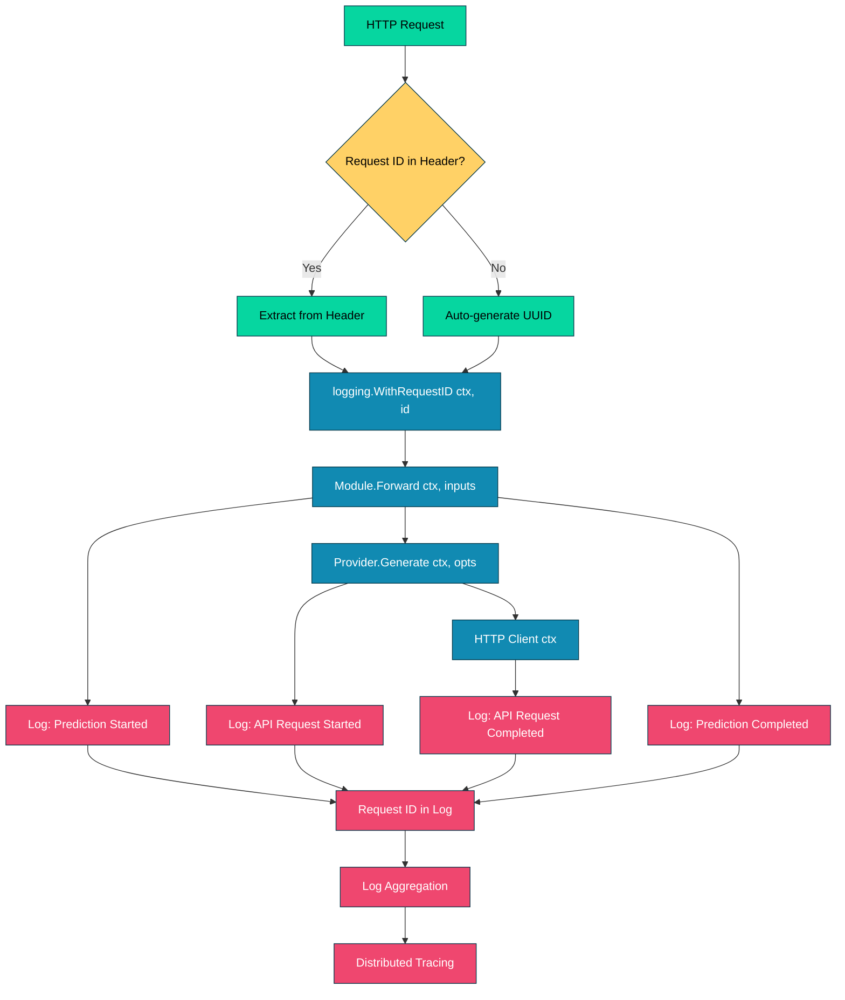

# 025_logging_tracing - Logging & Tracing with Request ID

## Overview

Demonstrates DSGo's **built-in logging and distributed tracing** capabilities with automatic Request ID propagation. Shows how to enable logging, set custom Request IDs, correlate multiple API calls, and control log verbosity for production observability.

## What it demonstrates

- **Automatic Request ID generation** for each prediction
- **Custom Request IDs** via `logging.WithRequestID()`
- **Request ID propagation** through the entire call chain
- **Structured logging** with contextual information (model, tokens, duration)
- **Configurable log levels** (DEBUG, INFO, WARN, ERROR)
- **Multiple calls with shared Request ID** for correlation
- Use cases: distributed tracing, debugging, performance monitoring, cost tracking

## Usage

```bash
cd examples/025_logging_tracing
go run main.go
```

### With Harness Flags

```bash
go run main.go -verbose -format=json
go run main.go -concurrency=1
```

### Environment Variables

```bash
export HARNESS_VERBOSE=true
export HARNESS_OUTPUT_FORMAT=json
go run main.go
```

## Expected Output

```
=== Logging & Tracing Example ===
Demonstrates DSGo's built-in logging and Request ID tracing for observability

--- Logging Features ---
✓ Automatic Request ID generation
✓ Custom Request ID propagation
✓ Structured logging with context
✓ Configurable log levels (DEBUG, INFO, WARN, ERROR)
✓ API request/response tracking

────────────────────────────────────────────────────────────────────────────────

--- Example 1: Automatic Request ID ---
Enable logging and observe auto-generated Request IDs

[DSGo] 2025-11-05 00:16:36.155 [INFO] [a1b2c3d4e5f6g7h8] API request started | model=google/gemini-2.5-flash prompt_length=120
[DSGo] 2025-11-05 00:16:36.655 [INFO] [a1b2c3d4e5f6g7h8] API request completed | status_code=200 duration_ms=500 prompt_tokens=100 completion_tokens=20 total_tokens=120

Sentiment: positive
📊 Tokens used: 120
✓ Check the logs above - note the auto-generated Request ID

────────────────────────────────────────────────────────────────────────────────

--- Example 2: Custom Request ID ---
Set your own Request ID for correlation across calls

[DSGo] 2025-11-05 00:16:37.155 [INFO] [user-request-12345] API request started | model=google/gemini-2.5-flash prompt_length=130
[DSGo] 2025-11-05 00:16:37.555 [INFO] [user-request-12345] API request completed | status_code=200 duration_ms=400 prompt_tokens=110 completion_tokens=15 total_tokens=125

Topic: technology
📊 Tokens used: 125
✓ All logs should show Request ID: [user-request-12345]

────────────────────────────────────────────────────────────────────────────────

--- Example 3: Multiple Calls with Same Request ID ---
Process multiple items with a shared Request ID for easy tracing

Processing 3 texts with Request ID: [batch-job-001]
[DSGo] 2025-11-05 00:16:38.155 [INFO] [batch-job-001] API request started | model=google/gemini-2.5-flash prompt_length=100
[DSGo] 2025-11-05 00:16:38.455 [INFO] [batch-job-001] API request completed | status_code=200 duration_ms=300 prompt_tokens=90 completion_tokens=10 total_tokens=100
Text 1: "I love this!" → positive
[DSGo] 2025-11-05 00:16:38.755 [INFO] [batch-job-001] API request started | model=google/gemini-2.5-flash prompt_length=105
[DSGo] 2025-11-05 00:16:39.055 [INFO] [batch-job-001] API request completed | status_code=200 duration_ms=300 prompt_tokens=95 completion_tokens=10 total_tokens=105
Text 2: "This is terrible." → negative
[DSGo] 2025-11-05 00:16:39.355 [INFO] [batch-job-001] API request started | model=google/gemini-2.5-flash prompt_length=110
[DSGo] 2025-11-05 00:16:39.655 [INFO] [batch-job-001] API request completed | status_code=200 duration_ms=300 prompt_tokens=100 completion_tokens=10 total_tokens=110
Text 3: "It's okay, I guess." → neutral
✓ All API calls above share the same Request ID for easy tracing

────────────────────────────────────────────────────────────────────────────────

--- Example 4: Log Levels ---
Control log verbosity with different levels

Setting log level to DEBUG to see all logs:
[DSGo] 2025-11-05 00:16:40.155 [DEBUG] [debug-example] Prediction started | module=Predict signature="Simple task"
[DSGo] 2025-11-05 00:16:40.155 [INFO] [debug-example] API request started | model=google/gemini-2.5-flash prompt_length=80
[DSGo] 2025-11-05 00:16:40.455 [INFO] [debug-example] API request completed | status_code=200 duration_ms=300 prompt_tokens=70 completion_tokens=10 total_tokens=80
[DSGo] 2025-11-05 00:16:40.455 [DEBUG] [debug-example] Prediction completed | duration_ms=300

✓ With DEBUG level, you see both DEBUG and INFO logs
  - DEBUG logs show prediction start/end
  - INFO logs show API request/response details

Setting log level to WARN (suppress INFO and DEBUG):
✓ With WARN level, you see minimal output (only warnings and errors)

────────────────────────────────────────────────────────────────────────────────

--- Logging & Tracing Benefits ---
✓ Automatic Request ID for distributed tracing
✓ Custom Request IDs for correlation
✓ Structured logs with contextual information
✓ Performance and cost monitoring
✓ Production debugging and observability

=== Summary ===
Logging & Tracing provides:
  ✓ Request ID propagation for tracing
  ✓ Configurable log levels
  ✓ API usage metrics (tokens, latency)
  ✓ Integration with external loggers

📊 Total tokens used: 540
🔧 Total examples: 4
```

## Key Concepts

### 1. Automatic Request ID

Every prediction automatically generates a unique Request ID for tracing:

```go
import (
    "context"
    "github.com/assagman/dsgo/logging"
    "github.com/assagman/dsgo/module"
)

func main() {
    // Enable logging
    logging.SetLogger(logging.NewDefaultLogger(logging.LevelInfo))
    
    ctx := context.Background()
    result, err := module.Forward(ctx, inputs)
    // Logs show auto-generated Request ID like [a1b2c3d4e5f6g7h8]
}
```

**Benefits:**
- **Zero configuration** - Works out of the box
- **Unique tracing** - Each request gets a unique identifier
- **Automatic propagation** - Request ID flows through entire call chain
- **Production debugging** - Trace specific requests through logs

**When to use:**
- Single prediction calls
- Default observability
- Simple applications
- When correlation isn't needed across calls

### 2. Custom Request ID

Set your own Request ID for correlation across multiple operations:

```go
import "github.com/assagman/dsgo/logging"

// Set custom Request ID
customID := "user-request-12345"
ctx := logging.WithRequestID(context.Background(), customID)

// All calls with this context will share the Request ID
result1, _ := module1.Forward(ctx, inputs1)
result2, _ := module2.Forward(ctx, inputs2)
// Both show [user-request-12345] in logs
```

**Benefits:**
- **Cross-service correlation** - Trace requests across microservices
- **User session tracking** - Link all operations to a user session
- **Batch job tracing** - Track all items in a batch job
- **External system integration** - Use same ID as upstream services

**Use cases:**
- **Multi-step workflows** - Track a request through multiple stages
- **Batch processing** - All items in batch share same ID
- **Distributed tracing** - Correlate logs across services
- **User sessions** - Track all operations for a user

**Pattern: Session-based Request ID**
```go
// Use session ID as Request ID
sessionID := getUserSession(r)
ctx := logging.WithRequestID(r.Context(), sessionID)

// All operations in this session share the Request ID
recommendation := recommender.Forward(ctx, userInput)
review := reviewer.Forward(ctx, recommendation.Outputs)
```

### 3. Log Levels

Control log verbosity with configurable levels:

```go
import "github.com/assagman/dsgo/logging"

// DEBUG - Most verbose (prediction flow + API details)
logging.SetLogger(logging.NewDefaultLogger(logging.LevelDebug))

// INFO - API request/response only (default for production)
logging.SetLogger(logging.NewDefaultLogger(logging.LevelInfo))

// WARN - Warnings and errors only
logging.SetLogger(logging.NewDefaultLogger(logging.LevelWarn))

// ERROR - Errors only
logging.SetLogger(logging.NewDefaultLogger(logging.LevelError))

// Disable logging
logging.SetLogger(nil)  // Reverts to NoOpLogger
```

**Log Level Details:**

| Level | Shows | Use Case |
|-------|-------|----------|
| DEBUG | Prediction start/end + API calls | Development, troubleshooting |
| INFO | API request/response | Production monitoring |
| WARN | Warnings + errors | Production (minimal logging) |
| ERROR | Errors only | Critical issues only |

**What gets logged:**

**DEBUG level:**
- Prediction started (module name, signature)
- Prediction completed (duration)
- API request started (model, prompt length, Request ID)
- API request completed (status, duration, tokens)

**INFO level:**
- API request started (model, prompt length, Request ID)
- API request completed (status, duration, tokens)

**WARN level:**
- Retry attempts
- Adapter fallbacks
- Non-critical errors

**ERROR level:**
- API failures
- Validation errors
- Critical system errors

### 4. Log Format

Structured logs with consistent format:

```
[Prefix] Timestamp [Level] [RequestID] Message | key=value key=value ...
```

**Example:**
```
[DSGo] 2025-11-05 00:16:36.155 [INFO] [a1b2c3d4e5f6g7h8] API request started | model=gpt-4 prompt_length=100
[DSGo] 2025-11-05 00:16:36.655 [INFO] [a1b2c3d4e5f6g7h8] API request completed | status_code=200 duration_ms=500 prompt_tokens=100 completion_tokens=50 total_tokens=150
```

**Fields logged:**
- `model` - Model name (e.g., gpt-4, google/gemini-2.5-flash)
- `prompt_length` - Length of prompt in characters
- `status_code` - HTTP status code (200, 429, 500, etc.)
- `duration_ms` - Request duration in milliseconds
- `prompt_tokens` - Number of prompt tokens
- `completion_tokens` - Number of completion tokens
- `total_tokens` - Total tokens used
- `cost` - Estimated cost (if available)
- `error` - Error message (if failed)

### 5. Custom Logger Integration

Implement your own logger to integrate with external logging libraries:

```go
package myapp

import (
    "context"
    "github.com/assagman/dsgo/logging"
    "go.uber.org/zap"
)

// Implement logging.Logger interface
type ZapLogger struct {
    logger *zap.Logger
}

func (z *ZapLogger) Debug(ctx context.Context, msg string, fields map[string]any) {
    z.logger.Debug(msg, toZapFields(ctx, fields)...)
}

func (z *ZapLogger) Info(ctx context.Context, msg string, fields map[string]any) {
    z.logger.Info(msg, toZapFields(ctx, fields)...)
}

func (z *ZapLogger) Warn(ctx context.Context, msg string, fields map[string]any) {
    z.logger.Warn(msg, toZapFields(ctx, fields)...)
}

func (z *ZapLogger) Error(ctx context.Context, msg string, fields map[string]any) {
    z.logger.Error(msg, toZapFields(ctx, fields)...)
}

func toZapFields(ctx context.Context, fields map[string]any) []zap.Field {
    zapFields := make([]zap.Field, 0, len(fields)+1)
    
    // Add Request ID
    if reqID := logging.GetRequestID(ctx); reqID != "" {
        zapFields = append(zapFields, zap.String("request_id", reqID))
    }
    
    // Add all fields
    for k, v := range fields {
        zapFields = append(zapFields, zap.Any(k, v))
    }
    
    return zapFields
}

// Set as global logger
func init() {
    zapLogger, _ := zap.NewProduction()
    logging.SetLogger(&ZapLogger{logger: zapLogger})
}
```

**Integration with popular libraries:**
- **zap** - Uber's high-performance logger
- **zerolog** - Zero-allocation JSON logger
- **logrus** - Structured logger with hooks
- **slog** - Go 1.21+ standard library logger

## Production Patterns

### Pattern 1: Request ID from HTTP Header

```go
// Extract Request ID from HTTP header
func withRequestIDFromHeader(r *http.Request, ctx context.Context) context.Context {
    // Try multiple header names
    headers := []string{"X-Request-ID", "X-Correlation-ID", "Request-ID"}
    
    for _, header := range headers {
        if id := r.Header.Get(header); id != "" {
            return logging.WithRequestID(ctx, id)
        }
    }
    
    // Fallback to auto-generated
    return ctx
}

// HTTP handler
func handleRequest(w http.ResponseWriter, r *http.Request) {
    ctx := withRequestIDFromHeader(r, r.Context())
    
    result, err := module.Forward(ctx, inputs)
    // All logs show the HTTP Request ID
}
```

### Pattern 2: Batch Processing with Shared Request ID

```go
func processBatch(ctx context.Context, items []Item) error {
    // Create Request ID for entire batch
    batchID := fmt.Sprintf("batch-%s-%d", time.Now().Format("20060102"), len(items))
    ctx = logging.WithRequestID(ctx, batchID)
    
    // All items in batch share the same Request ID
    for i, item := range items {
        result, err := module.Forward(ctx, map[string]any{"item": item})
        if err != nil {
            log.Printf("Item %d failed: %v", i, err)
            continue
        }
        // Process result
    }
    
    return nil
}
```

### Pattern 3: Hierarchical Request IDs

```go
func processWithSubRequests(ctx context.Context, mainInput any) {
    // Main request ID
    mainID := "main-request-001"
    ctx = logging.WithRequestID(ctx, mainID)
    
    // First stage
    stage1, _ := module1.Forward(ctx, map[string]any{"input": mainInput})
    
    // Sub-requests with hierarchical IDs
    for i, item := range stage1.GetSlice("items") {
        subID := fmt.Sprintf("%s.%d", mainID, i+1)
        subCtx := logging.WithRequestID(ctx, subID)
        
        module2.Forward(subCtx, map[string]any{"item": item})
        // Logs show: main-request-001.1, main-request-001.2, etc.
    }
}
```

### Pattern 4: Environment-Based Log Levels

```go
package config

import (
    "os"
    "github.com/assagman/dsgo/logging"
)

func ConfigureLogging() {
    env := os.Getenv("APP_ENV")
    
    switch env {
    case "development":
        logging.SetLogger(logging.NewDefaultLogger(logging.LevelDebug))
    case "staging":
        logging.SetLogger(logging.NewDefaultLogger(logging.LevelInfo))
    case "production":
        logging.SetLogger(logging.NewDefaultLogger(logging.LevelWarn))
    default:
        logging.SetLogger(nil)  // Disabled
    }
}
```

## Troubleshooting

### No Logs Appearing

**Symptom:** No log output when running predictions

**Diagnosis:**
```go
// Check if logger is set
// By default, DSGo uses NoOpLogger (logs nothing)
```

**Solution:**
```go
import "github.com/assagman/dsgo/logging"

// Enable logging
logging.SetLogger(logging.NewDefaultLogger(logging.LevelInfo))
```

### Request ID Not Propagating

**Symptom:** Different Request IDs in related calls

**Diagnosis:**
```go
// Make sure you're passing the same context
ctx1 := logging.WithRequestID(context.Background(), "my-id")
ctx2 := logging.WithRequestID(context.Background(), "my-id")  // ❌ Different context!
```

**Solution:**
```go
// Pass the same context to all related calls
ctx := logging.WithRequestID(context.Background(), "my-id")
result1, _ := module1.Forward(ctx, input1)  // ✓ Same context
result2, _ := module2.Forward(ctx, input2)  // ✓ Same context
```

### Too Many Logs

**Symptom:** Log spam in production

**Solution:**
```go
// Use WARN level in production (only warnings/errors)
logging.SetLogger(logging.NewDefaultLogger(logging.LevelWarn))

// Or INFO for moderate logging (API calls only)
logging.SetLogger(logging.NewDefaultLogger(logging.LevelInfo))
```

### Log Format Not Parsing

**Symptom:** Log aggregation tool can't parse DSGo logs

**Solution:** Implement custom logger with desired format (JSON, etc.)

```go
type JSONLogger struct{}

func (j *JSONLogger) Info(ctx context.Context, msg string, fields map[string]any) {
    entry := map[string]any{
        "timestamp": time.Now().Format(time.RFC3339),
        "level": "INFO",
        "message": msg,
        "request_id": logging.GetRequestID(ctx),
    }
    for k, v := range fields {
        entry[k] = v
    }
    
    json.NewEncoder(os.Stdout).Encode(entry)
}
// Implement other methods...

logging.SetLogger(&JSONLogger{})
```

## Performance Considerations

### Logging Overhead

**Impact:**
- DEBUG level: ~2-5% overhead (string formatting, function calls)
- INFO level: ~1-2% overhead (API calls only)
- WARN level: ~0.1% overhead (almost none)
- NoOpLogger: <0.01% overhead (effectively zero)

**Best practices:**
- Use WARN level in high-throughput production
- Use INFO level for normal production
- Use DEBUG level only for troubleshooting
- Disable logging in performance-critical paths

### Request ID Storage

**Memory:**
- Request ID stored in context: ~50 bytes
- No heap allocations for propagation
- Negligible memory overhead

## Comparison with Alternatives

**vs. Custom logging:**
- **DSGo Logging**: Integrated, automatic Request ID propagation
- **Custom**: More control, more setup

**vs. OpenTelemetry:**
- **DSGo Logging**: Simple, built-in
- **OpenTelemetry**: More features, more complexity

**vs. No logging:**
- **DSGo Logging**: Production observability
- **No logging**: Faster, no debugging capability

## See Also

- [023_global_config](../023_global_config/) - Global configuration system
- [024_lm_factory](../024_lm_factory/) - LM factory pattern
- [026_observability](../026_observability/) - Advanced observability patterns
- [022_caching](../022_caching/) - LM cache for performance
- [QUICKSTART.md](../../QUICKSTART.md) - Getting started guide

## Production Tips

1. **Set Log Level Early**: Configure in main() before any predictions
2. **Use Custom Request IDs**: Extract from HTTP headers for distributed tracing
3. **Environment-Based Levels**: DEBUG in dev, INFO in staging, WARN in prod
4. **Integrate with External Loggers**: Use zap/zerolog for production
5. **Monitor Token Usage**: Use INFO level to track API costs
6. **Correlate Across Services**: Propagate Request ID to downstream services
7. **Log Retention**: Configure log aggregation (Datadog, Splunk, etc.)
8. **Structured Logging**: Implement custom logger for JSON output
9. **Performance Testing**: Test with logging disabled vs enabled
10. **Error Debugging**: Switch to DEBUG level to troubleshoot issues

## Architecture Notes

Request ID flow:



**Design Principles:**
- **Context propagation** - Request ID flows through context.Context
- **Non-invasive** - Logging doesn't affect business logic
- **Pluggable** - Custom logger via interface
- **Structured** - Key-value pairs for easy parsing
- **Zero-config** - Works with defaults, customizable when needed
