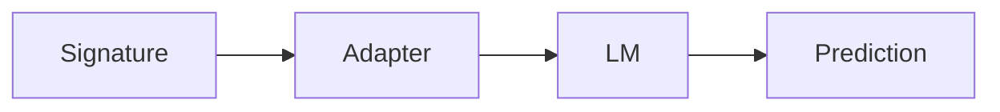

# internal/core

Primitives used by DSGo modules: signatures, adapters, prediction, LM interface, caching, history.

## Data flow



## Configuration precedence

```mermaid
flowchart TD
  E[Process env] --> C[Configure(...)]
  D[Defaults] --> C
  F[.env files] --> E
  C --> R[Final settings]
```

- `.env` loading lives in `internal/env`.
- Settings and configuration live in `internal/core`.

## Environment variables (common)

| Variable | Purpose |
|---|---|
| `DSGO_TIMEOUT` | Request timeout |
| `DSGO_MAX_RETRIES` | Retry attempts |
| `DSGO_CACHE` | Enable/disable caching |
| `DSGO_CACHE_MEMORY` | Memory cache capacity |
| `DSGO_CACHE_DISK` | Enable/disable disk cache |
| `DSGO_CACHEDIR` | Disk cache directory |
| `DSGO_CACHE_LIMIT` | Disk cache size limit |
| `DSGO_CACHE_TTL` | Cache TTL |
| `DSGO_COLLECTOR` | Collector selection |
| `DSGO_REQUEST_ID_HEADER` | Request id header name |
| `DSGO_DEBUG_PARSE` | Parse debug |
| `DSGO_DEBUG_MARKERS` | Streaming marker debug |
| `DSGO_SAVE_RAW_RESPONSES` | Save raw provider responses (where supported) |
| `DSGO_ARTIFACT_DIR` | Debug artifact directory |

## Key files

- `signature.go`: signature + field validation
- `adapter.go`: adapters and fallback parsing
- `prediction.go`: `Prediction` metadata and helpers
- `lm.go`: `LM` interface
- `history.go`: thread-safe conversation history
- `collector.go`: collectors for observability
- `settings.go` / `configure.go`: global configuration
