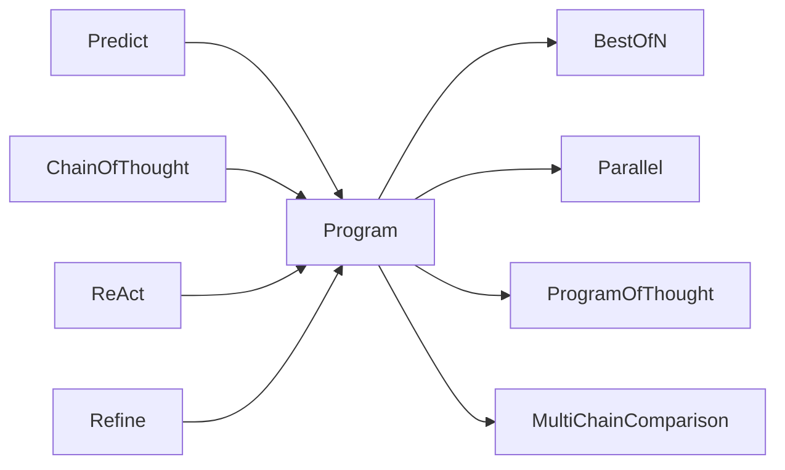

# module

High-level DSGo behaviors built on top of `core`.

## Composition patterns



## Tiny composition examples

### Program

```go
program := module.NewProgram("pipeline").
  AddModule(classifier).
  AddModule(generator)

pred, err := program.Forward(ctx, inputs)
```

### Parallel

```go
par := module.NewParallel(workerModule).WithMaxWorkers(10)

pred, err := par.Forward(ctx, inputs)
```

### BestOfN

```go
best := module.NewBestOfN(workerModule, 5).
  WithScorer(module.DefaultScorer()).
  WithParallel(true)

pred, err := best.Forward(ctx, inputs)
```

### Refine

```go
ref := module.NewRefine(sig, lm).WithMaxIterations(2)

// First pass
pred1, err := ref.Forward(ctx, inputs)

// Second pass (triggers refinement)
pred2, err := ref.Forward(ctx, map[string]any{
  "feedback": "Make it shorter",
  // ...plus original inputs as needed...
})
```

### ProgramOfThought

```go
pot := module.NewProgramOfThought(sig, lm, "python")

pred, err := pot.Forward(ctx, inputs)
```

### MultiChainComparison

```go
mcc := module.NewMultiChainComparison(sig, lm, 3)

pred, err := mcc.Forward(ctx, map[string]any{
  "completions": []any{predA.Outputs, predB.Outputs, predC.Outputs},
})
```

## Examples

Examples live alongside the repository docs when available.
